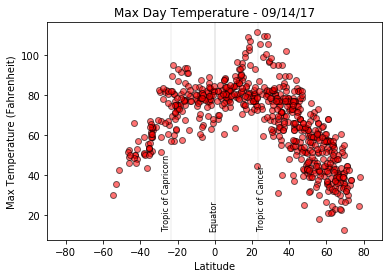
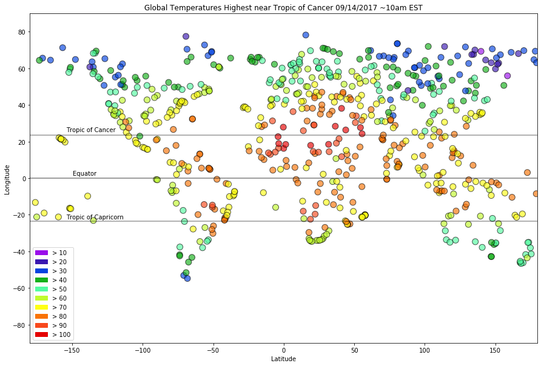
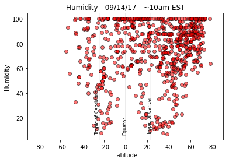
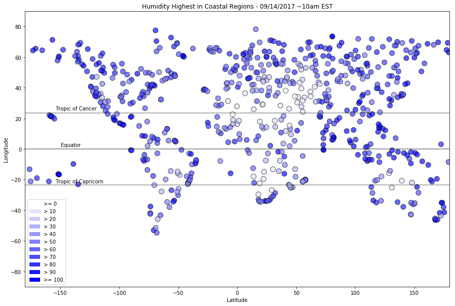
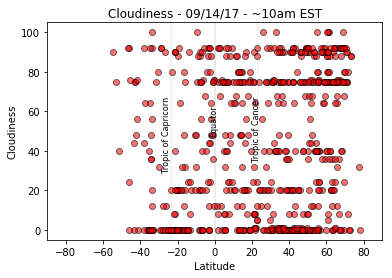
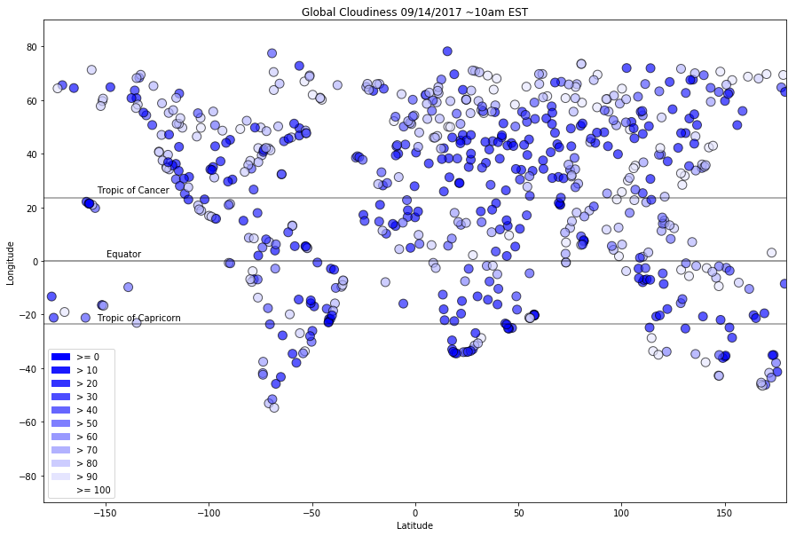
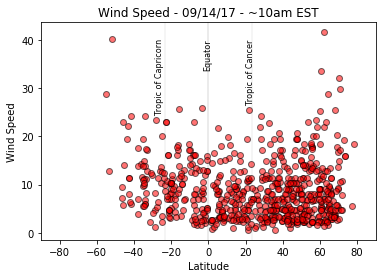
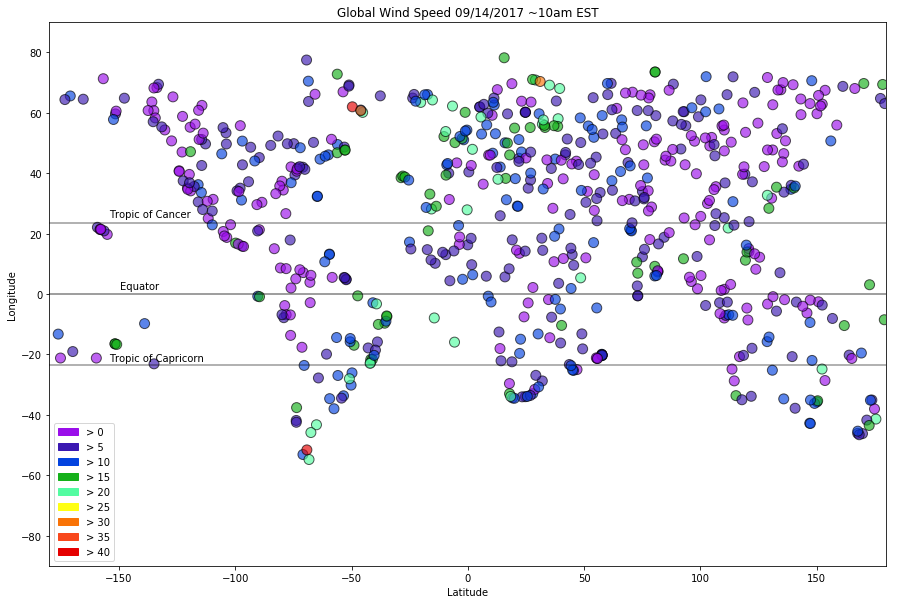

# WeatherPy
- The highest max temperatures for September 14, 2017 were near the Tropic of Cancer.
- The northern hemisphere had a larger range of temperatures than the southern hemisphere at this time. The lowest temperatures in the northern hemisphere were about 20 degrees Fahrenheit colder than the lowest temperatures in the southern hemisphere.
- At approximately 10am EST on September 14, 2017, the humidity was generally higher at the equator than at other lattitudes. The Tropics of Cancer and Capricorn had the highest variability in humidity at this time. Humidity at this time was highest in coastal regions.
- High winds are visible on the final figure - global wind speed by latitude and logitude - near the notoriously windy sailing route around Cape Horn.


```python
# import dedendencies
import random
from citipy import citipy 
import pandas as pd
import numpy as np
import time
import requests
import os
import matplotlib.pyplot as plt
import matplotlib.patches as mpatches
```


```python
# get random latitude and longitude
# increase sample count closer to the equater than the poles; equal count between east and west hemispheres 

coords = []
x = -90
y = -81
latCount = 15
rev = False

while x < y and y <90:
    for _ in range(latCount):
        lat = random.randrange(x,y)
        lng = random.randrange(-180,0)
        coords.append((lat,lng)) # adding as tuple
    for _ in range(latCount):
        lat = random.randrange(x,y)
        lng = random.randrange(0,181)
        coords.append((lat,lng)) # adding as tuple
    x= x + 10
    y = y + 10
    if latCount == 31:
        rev=True
    if rev:
        latCount -= 3
    else:
        latCount += 3
print(coords)
        
```

    [(-83, -8), (-89, -116), (-90, -98), (-86, -160), (-89, -120), (-90, -115), (-90, -95), (-88, -94), (-83, -156), (-89, -61), (-82, -86), (-85, -21), (-87, -90), (-89, -139), (-85, -44), (-82, 147), (-84, 160), (-82, 141), (-86, 164), (-82, 180), (-88, 43), (-88, 44), (-89, 170), (-87, 46), (-90, 57), (-85, 123), (-84, 91), (-90, 113), (-89, 14), (-85, 89), (-73, -70), (-73, -86), (-80, -96), (-80, -44), (-79, -23), (-79, -117), (-74, -174), (-77, -167), (-72, -2), (-74, -41), (-80, -59), (-75, -155), (-79, -112), (-75, -127), (-75, -9), (-80, -145), (-74, -73), (-80, -101), (-79, 125), (-73, 108), (-75, 66), (-75, 139), (-78, 144), (-76, 84), (-75, 63), (-73, 88), (-80, 175), (-75, 60), (-77, 86), (-77, 30), (-78, 81), (-75, 141), (-78, 19), (-79, 147), (-73, 44), (-76, 75), (-64, -48), (-62, -153), (-66, -51), (-68, -55), (-68, -163), (-70, -87), (-69, -57), (-65, -95), (-69, -132), (-70, -91), (-64, -5), (-67, -66), (-64, -43), (-64, -109), (-67, -112), (-62, -150), (-64, -106), (-64, -74), (-62, -85), (-63, -7), (-63, -89), (-67, 122), (-69, 123), (-67, 67), (-68, 139), (-66, 99), (-63, 159), (-67, 64), (-70, 116), (-68, 24), (-69, 139), (-64, 82), (-62, 27), (-66, 151), (-62, 172), (-68, 110), (-70, 159), (-67, 166), (-63, 95), (-65, 147), (-63, 8), (-68, 99), (-57, -12), (-56, -160), (-55, -124), (-53, -63), (-54, -38), (-59, -98), (-58, -172), (-59, -162), (-57, -168), (-59, -68), (-59, -108), (-58, -115), (-58, -90), (-57, -33), (-59, -125), (-57, -36), (-58, -75), (-52, -111), (-52, -83), (-56, -168), (-55, -11), (-56, -105), (-56, -54), (-53, -28), (-52, 136), (-55, 125), (-54, 32), (-55, 18), (-57, 17), (-59, 20), (-57, 165), (-60, 156), (-56, 125), (-59, 84), (-53, 70), (-54, 1), (-58, 55), (-56, 142), (-60, 20), (-53, 4), (-59, 111), (-60, 16), (-53, 21), (-60, 110), (-54, 7), (-54, 87), (-53, 116), (-57, 129), (-48, -175), (-43, -135), (-46, -101), (-46, -44), (-45, -152), (-42, -113), (-47, -130), (-44, -68), (-47, -94), (-47, -153), (-48, -156), (-49, -12), (-42, -75), (-43, -35), (-43, -167), (-45, -24), (-44, -92), (-50, -70), (-47, -157), (-42, -18), (-45, -177), (-47, -91), (-50, -124), (-46, -161), (-49, -58), (-44, -167), (-44, -113), (-45, 165), (-50, 143), (-49, 118), (-42, 99), (-49, 13), (-44, 73), (-44, 178), (-45, 128), (-45, 46), (-47, 127), (-46, 62), (-48, 104), (-48, 162), (-45, 35), (-45, 35), (-48, 150), (-45, 175), (-42, 60), (-48, 41), (-43, 177), (-43, 103), (-42, 112), (-45, 163), (-42, 129), (-45, 67), (-45, 122), (-42, 115), (-38, -102), (-38, -78), (-37, -100), (-34, -22), (-35, -169), (-32, -16), (-39, -165), (-33, -132), (-36, -159), (-33, -18), (-38, -170), (-32, -18), (-32, -170), (-39, -138), (-34, -91), (-35, -65), (-36, -86), (-33, -14), (-32, -30), (-36, -179), (-39, -95), (-38, -126), (-40, -45), (-37, -49), (-37, -45), (-32, -84), (-32, -27), (-32, -165), (-38, -119), (-37, -167), (-39, 153), (-34, 9), (-32, 29), (-33, 126), (-38, 52), (-34, 24), (-39, 25), (-38, 175), (-39, 94), (-37, 40), (-33, 165), (-40, 138), (-39, 82), (-40, 165), (-34, 69), (-40, 8), (-37, 149), (-35, 147), (-35, 24), (-36, 151), (-38, 80), (-40, 10), (-39, 167), (-38, 5), (-33, 112), (-32, 175), (-37, 114), (-34, 55), (-33, 38), (-32, 166), (-27, -37), (-27, -168), (-26, -39), (-27, -56), (-27, -155), (-26, -163), (-30, -131), (-24, -89), (-28, -136), (-24, -90), (-28, -115), (-23, -75), (-24, -127), (-23, -114), (-24, -73), (-29, -149), (-24, -147), (-29, -64), (-22, -35), (-27, -101), (-26, -50), (-23, -41), (-22, -153), (-26, -106), (-25, -109), (-28, -51), (-29, -117), (-26, -127), (-25, -105), (-28, -172), (-22, -167), (-24, -3), (-28, -104), (-24, 74), (-27, 90), (-26, 142), (-29, 155), (-29, 78), (-30, 106), (-29, 161), (-23, 61), (-28, 84), (-22, 120), (-24, 45), (-29, 97), (-25, 152), (-26, 162), (-29, 42), (-28, 89), (-22, 148), (-26, 116), (-22, 18), (-30, 103), (-27, 29), (-25, 121), (-23, 6), (-25, 140), (-30, 36), (-23, 66), (-27, 76), (-24, 55), (-23, 53), (-30, 18), (-29, 130), (-24, 42), (-28, 93), (-13, -112), (-18, -71), (-13, -29), (-15, -97), (-20, -37), (-18, -43), (-17, -157), (-14, -55), (-20, -112), (-18, -154), (-17, -126), (-20, -99), (-14, -52), (-16, -51), (-12, -127), (-14, -22), (-14, -6), (-14, -179), (-14, -173), (-20, -60), (-14, -141), (-14, -34), (-13, -32), (-17, -49), (-14, -152), (-20, -89), (-15, -19), (-16, -36), (-12, -179), (-18, -31), (-16, -151), (-16, -158), (-18, -85), (-16, -94), (-13, -1), (-15, -111), (-14, 58), (-13, 12), (-17, 161), (-20, 169), (-20, 113), (-19, 94), (-18, 41), (-19, 80), (-19, 23), (-12, 70), (-15, 128), (-16, 128), (-15, 84), (-12, 99), (-14, 63), (-14, 87), (-12, 127), (-12, 63), (-17, 117), (-20, 21), (-15, 161), (-12, 147), (-14, 177), (-19, 52), (-15, 69), (-13, 31), (-19, 111), (-15, 121), (-18, 12), (-16, 109), (-14, 36), (-20, 114), (-16, 22), (-17, 112), (-19, 58), (-18, 74), (-2, -146), (-4, -78), (-5, -23), (-6, -156), (-3, -118), (-3, -113), (-9, -3), (-7, -25), (-2, -140), (-10, -124), (-10, -38), (-7, -123), (-3, -8), (-9, -7), (-8, -129), (-10, -85), (-3, -145), (-2, -131), (-4, -136), (-4, -161), (-10, -129), (-2, -41), (-7, -78), (-2, -24), (-5, -160), (-8, -3), (-3, -122), (-3, -2), (-7, -130), (-10, -83), (-10, -145), (-3, -178), (-10, -122), (-4, -132), (-5, -170), (-7, -12), (-7, -76), (-6, -98), (-2, -67), (-3, 110), (-7, 121), (-6, 146), (-3, 108), (-6, 109), (-4, 25), (-2, 59), (-10, 72), (-4, 145), (-7, 174), (-7, 111), (-9, 69), (-8, 157), (-8, 174), (-2, 93), (-4, 70), (-10, 42), (-4, 85), (-4, 44), (-2, 35), (-2, 13), (-10, 57), (-6, 74), (-2, 38), (-5, 40), (-8, 49), (-8, 77), (-5, 8), (-6, 109), (-10, 92), (-9, 64), (-7, 115), (-8, 36), (-2, 129), (-4, 139), (-5, 134), (-4, 121), (-7, 25), (-3, 112), (6, -146), (6, -20), (5, -74), (2, -120), (5, -107), (1, -158), (1, -89), (3, -120), (2, -67), (5, -114), (5, -59), (5, -96), (4, -109), (7, -160), (8, -101), (7, -133), (2, -175), (1, -158), (6, -51), (4, -150), (1, -158), (3, -159), (1, -139), (6, -22), (3, -26), (5, -148), (4, -45), (1, -46), (7, -71), (8, -72), (3, -116), (2, -167), (4, -23), (2, -76), (1, -127), (4, -53), (8, -109), (7, -66), (2, -36), (5, -80), (6, -160), (3, -24), (2, 137), (3, 131), (4, 51), (5, 172), (3, 93), (6, 8), (0, 152), (8, 87), (2, 44), (6, 2), (8, 69), (0, 155), (0, 93), (3, 107), (8, 82), (7, 147), (2, 99), (5, 48), (5, 169), (6, 16), (6, 130), (6, 149), (3, 110), (2, 176), (2, 75), (0, 166), (3, 156), (1, 6), (5, 111), (8, 18), (1, 58), (6, 100), (4, 94), (3, 80), (4, 154), (4, 40), (2, 65), (7, 140), (2, 151), (5, 135), (8, 65), (2, 29), (15, -114), (11, -58), (14, -159), (11, -62), (15, -137), (17, -66), (10, -112), (17, -5), (17, -161), (14, -50), (16, -115), (14, -98), (11, -30), (15, -99), (11, -107), (15, -159), (15, -101), (11, -164), (11, -101), (15, -81), (16, -38), (11, -113), (14, -97), (14, -6), (11, -78), (14, -169), (10, -30), (16, -157), (14, -10), (17, -107), (13, -133), (14, -142), (14, -113), (11, -44), (13, -10), (15, -97), (16, -126), (14, -48), (11, -176), (15, -20), (12, -137), (16, -128), (17, -149), (10, -14), (17, -75), (10, 82), (11, 155), (18, 1), (16, 44), (15, 76), (13, 129), (14, 46), (12, 74), (16, 89), (16, 0), (16, 31), (17, 25), (18, 146), (12, 117), (15, 144), (15, 23), (12, 88), (18, 104), (10, 2), (14, 164), (18, 139), (16, 54), (15, 83), (12, 41), (18, 68), (10, 95), (12, 164), (10, 124), (10, 136), (11, 36), (15, 51), (15, 20), (14, 121), (13, 118), (18, 78), (12, 62), (14, 118), (18, 85), (17, 116), (16, 50), (18, 85), (17, 21), (10, 95), (13, 98), (11, 61), (21, -48), (22, -126), (27, -20), (26, -134), (27, -64), (21, -24), (27, -139), (28, -123), (26, -156), (23, -102), (24, -92), (25, -37), (23, -131), (25, -92), (28, -4), (28, -1), (27, -158), (27, -55), (23, -45), (20, -120), (26, -125), (21, -4), (20, -27), (20, -39), (22, -162), (28, -78), (26, -123), (24, -17), (20, -6), (26, -49), (22, -169), (27, -88), (28, -90), (25, -55), (23, -124), (27, -66), (27, -94), (24, -158), (28, -16), (26, -163), (24, -18), (25, -159), (26, -153), (21, -124), (27, -156), (28, -62), (28, -54), (25, -144), (24, 51), (22, 36), (23, 145), (24, 162), (25, 13), (27, 120), (23, 141), (21, 69), (21, 179), (23, 98), (27, 171), (22, 115), (24, 152), (24, 121), (21, 112), (21, 29), (24, 71), (28, 55), (26, 140), (25, 139), (26, 110), (25, 157), (27, 140), (20, 148), (23, 38), (22, 176), (20, 166), (20, 37), (24, 25), (24, 7), (21, 152), (23, 158), (23, 16), (22, 159), (26, 100), (24, 136), (23, 160), (25, 93), (23, 107), (21, 154), (27, 107), (23, 51), (24, 149), (26, 41), (21, 70), (27, 19), (20, 180), (28, 38), (36, -117), (36, -162), (38, -39), (30, -38), (30, -54), (35, -35), (36, -71), (33, -53), (32, -83), (35, -98), (31, -112), (37, -68), (31, -97), (32, -42), (33, -153), (36, -39), (31, -58), (31, -139), (31, -15), (34, -99), (34, -115), (34, -140), (38, -178), (36, -174), (33, -122), (32, -120), (35, -17), (33, -34), (37, -34), (32, -60), (38, -116), (34, -47), (37, -75), (30, -137), (35, -103), (33, -115), (30, -35), (37, -94), (33, -156), (34, -54), (33, -10), (38, -80), (34, -98), (34, -171), (36, -153), (31, -157), (36, -81), (38, -36), (38, -180), (34, -157), (38, -72), (31, 72), (32, 76), (31, 70), (36, 173), (31, 170), (32, 4), (36, 107), (36, 64), (37, 161), (36, 124), (38, 154), (34, 105), (37, 34), (33, 174), (34, 174), (38, 79), (35, 81), (31, 66), (37, 171), (37, 115), (34, 32), (30, 51), (36, 165), (34, 75), (34, 57), (37, 18), (35, 63), (35, 7), (31, 166), (35, 26), (36, 139), (35, 94), (38, 13), (32, 168), (37, 132), (36, 74), (37, 77), (37, 170), (30, 101), (38, 63), (38, 19), (30, 18), (34, 52), (38, 41), (34, 154), (33, 102), (32, 127), (32, 55), (36, 154), (31, 99), (35, 167), (42, -115), (41, -180), (46, -46), (41, -128), (44, -10), (41, -20), (47, -130), (42, -71), (47, -119), (46, -15), (40, -16), (47, -131), (48, -72), (48, -53), (43, -61), (44, -92), (48, -36), (44, -24), (43, -5), (41, -129), (40, -24), (43, -63), (41, -177), (44, -55), (40, -8), (47, -17), (42, -39), (46, -25), (43, -177), (40, -37), (47, -135), (43, -158), (40, -27), (41, -153), (43, -97), (48, -19), (40, -127), (47, -172), (45, -55), (42, -76), (47, -123), (48, -94), (42, -127), (40, -141), (42, -33), (40, -58), (46, -90), (45, -112), (40, -120), (44, -136), (42, -104), (47, -107), (46, -43), (42, -153), (48, 66), (42, 137), (44, 56), (45, 101), (44, 40), (44, 53), (43, 69), (46, 120), (45, 22), (40, 119), (45, 85), (42, 93), (40, 145), (45, 104), (45, 88), (48, 101), (47, 42), (46, 18), (46, 110), (41, 66), (41, 128), (46, 9), (48, 128), (43, 99), (40, 27), (42, 36), (43, 76), (46, 87), (42, 177), (43, 118), (48, 131), (44, 105), (43, 48), (45, 25), (44, 37), (48, 2), (44, 180), (46, 153), (44, 34), (42, 14), (40, 1), (46, 42), (41, 143), (40, 54), (41, 55), (43, 170), (48, 88), (43, 30), (47, 27), (43, 53), (47, 23), (44, 22), (48, 105), (46, 97), (56, -83), (56, -145), (54, -76), (56, -140), (52, -131), (52, -140), (50, -56), (58, -47), (57, -178), (58, -21), (50, -6), (55, -87), (58, -13), (57, -117), (58, -137), (50, -113), (56, -154), (50, -51), (54, -1), (51, -97), (57, -59), (58, -34), (57, -39), (50, -26), (54, -120), (56, -160), (53, -114), (54, -77), (51, -149), (51, -2), (50, -113), (53, -120), (55, -163), (50, -104), (52, -14), (58, -106), (54, -172), (51, -85), (53, -104), (55, -138), (51, -58), (55, -152), (51, -116), (57, -23), (57, -140), (51, -36), (58, -133), (51, -149), (55, -67), (54, -44), (54, -99), (51, -23), (54, -81), (50, -81), (51, -11), (52, -155), (56, -131), (55, 0), (56, 32), (55, 33), (58, 122), (50, 16), (50, 114), (58, 4), (53, 64), (58, 66), (51, 22), (51, 81), (50, 76), (56, 77), (56, 6), (50, 65), (55, 155), (55, 27), (50, 172), (57, 80), (55, 148), (56, 158), (50, 49), (52, 171), (50, 168), (54, 133), (52, 105), (54, 111), (58, 88), (56, 20), (53, 120), (53, 12), (57, 142), (50, 175), (56, 131), (56, 178), (50, 147), (58, 39), (56, 158), (53, 58), (57, 180), (51, 155), (56, 94), (53, 6), (56, 112), (57, 134), (53, 72), (57, 154), (58, 4), (52, 102), (56, 33), (50, 17), (56, 124), (57, 110), (56, 109), (50, 78), (53, 97), (52, 54), (61, -95), (68, -73), (60, -153), (63, -108), (60, -101), (65, -131), (63, -156), (67, -167), (64, -116), (67, -23), (64, -140), (67, -96), (68, -37), (66, -73), (65, -89), (65, -119), (61, -63), (68, -19), (62, -108), (67, -40), (68, -47), (66, -135), (67, -121), (65, -107), (68, -83), (68, -100), (64, -139), (60, -175), (63, -45), (66, -97), (65, -171), (68, -59), (65, -145), (65, -86), (66, -116), (66, -98), (66, -86), (64, -73), (61, -120), (61, -51), (67, -6), (64, -37), (62, -135), (64, -42), (66, -108), (63, -30), (67, -160), (60, -134), (68, -71), (68, -70), (60, -79), (62, -64), (66, -25), (67, -28), (62, -148), (62, -83), (65, -14), (68, -146), (66, -133), (61, -146), (68, 2), (61, 173), (61, 62), (63, 173), (60, 107), (61, 43), (61, 93), (68, 133), (68, 103), (64, 23), (61, 3), (62, 91), (66, 54), (67, 124), (67, 69), (65, 119), (61, 80), (60, 9), (61, 0), (64, 154), (68, 126), (64, 23), (68, 102), (66, 150), (68, 87), (64, 147), (60, 17), (65, 79), (60, 29), (60, 58), (67, 177), (63, 38), (63, 11), (62, 138), (60, 100), (67, 101), (63, 79), (67, 173), (63, 27), (62, 152), (61, 104), (62, 64), (62, 78), (62, 68), (67, 134), (68, 41), (64, 68), (62, 13), (61, 107), (66, 10), (63, 2), (68, 142), (62, 106), (60, 96), (68, 136), (60, 102), (66, 97), (65, 107), (66, 59), (65, 131), (75, -144), (72, -51), (71, -130), (77, -73), (78, -32), (74, -162), (74, -4), (76, -68), (71, -7), (74, -178), (75, -177), (70, -37), (78, -12), (74, -36), (75, -9), (75, -71), (74, -29), (75, -103), (77, -92), (75, -19), (70, -70), (72, -116), (77, -45), (77, -75), (72, -68), (78, -170), (74, -45), (76, -103), (78, -136), (75, -153), (70, -144), (73, -97), (73, -135), (74, -19), (75, -72), (75, -155), (73, -26), (72, -57), (71, -60), (74, -81), (73, -122), (78, -43), (72, -64), (75, -81), (74, -173), (72, -26), (76, -35), (70, -4), (77, -75), (73, -22), (71, -47), (78, -98), (73, -24), (75, -9), (71, -18), (76, -47), (73, -17), (73, -85), (72, -151), (74, -47), (72, -21), (71, -29), (72, -141), (70, 136), (78, 38), (72, 101), (73, 133), (77, 70), (72, 133), (76, 116), (74, 72), (73, 130), (76, 19), (74, 58), (75, 166), (78, 59), (76, 11), (71, 75), (70, 108), (76, 142), (78, 95), (77, 90), (74, 13), (77, 14), (77, 32), (72, 130), (72, 124), (75, 157), (70, 163), (70, 5), (77, 15), (73, 8), (74, 103), (71, 127), (70, 81), (77, 6), (77, 90), (72, 93), (73, 53), (77, 172), (75, 130), (75, 155), (70, 68), (73, 38), (77, 101), (70, 173), (72, 45), (73, 170), (73, 59), (74, 85), (74, 165), (77, 154), (74, 176), (73, 19), (78, 45), (75, 28), (70, 91), (77, 49), (71, 29), (78, 92), (73, 58), (70, 112), (73, 112), (74, 128), (74, 58), (74, 90), (83, -58), (85, -95), (81, -112), (86, -152), (88, -111), (88, -40), (88, -14), (88, -36), (81, -139), (84, -62), (88, -59), (87, -107), (86, -106), (88, -73), (85, -48), (82, -23), (80, -82), (85, -143), (88, -43), (87, -11), (80, -101), (82, -91), (82, -77), (84, -60), (80, -170), (85, -141), (81, -155), (86, -146), (84, -102), (82, -108), (81, -159), (80, -59), (81, -25), (80, -76), (85, -141), (85, -142), (81, -41), (86, -156), (83, -110), (86, -39), (82, -29), (82, -55), (84, -69), (81, -42), (83, -67), (88, -64), (82, -96), (83, -100), (81, -97), (88, -22), (88, -149), (88, -163), (82, -164), (86, -18), (81, -81), (86, -60), (80, -144), (84, -151), (87, -168), (86, -151), (80, -106), (82, -160), (84, -138), (81, -172), (82, -24), (84, -37), (86, 180), (81, 102), (80, 115), (80, 158), (80, 128), (86, 16), (84, 100), (82, 169), (86, 73), (87, 164), (87, 130), (84, 48), (82, 152), (85, 5), (81, 53), (80, 116), (88, 92), (88, 157), (85, 0), (84, 110), (88, 77), (88, 33), (86, 108), (83, 83), (85, 155), (86, 113), (88, 1), (86, 96), (86, 127), (84, 165), (86, 36), (82, 151), (87, 96), (88, 172), (82, 144), (85, 95), (80, 13), (87, 98), (80, 92), (84, 23), (83, 6), (80, 81), (87, 114), (81, 163), (83, 163), (88, 156), (86, 126), (87, 27), (84, 131), (80, 82), (84, 91), (83, 95), (88, 129), (81, 9), (83, 28), (84, 118), (87, 57), (86, 112), (81, 105), (86, 77), (85, 135), (83, 60), (86, 131), (81, 151), (88, 53), (88, 54)]
    


```python
len(coords)
```


    1458


```python
# check that the list is unique
uniqueCoords = set(coords)
len(uniqueCoords)
```


    1442


```python
# get the cities nearest these coordinates
cities = []
for coordinate_pair in uniqueCoords:
    lat, lon = coordinate_pair # tuple allows natural split
    cities.append(citipy.nearest_city(lat, lon))
    print(citipy.nearest_city(lat, lon).city_name + ", " +  citipy.nearest_city(lat,lon).country_code)
```

    puerto escondido, mx
    pitimbu, br
    thompson, ca
    narsaq, gl
    byron bay, au
    hamilton, bm
    katsiveli, ua
    ushuaia, ar
    illoqqortoormiut, gl
    port hedland, au
    puerto ayora, ec
    mahebourg, mu
    kapaa, us
    tuktoyaktuk, ca
    bafoulabe, ml
    avarua, ck
    antofagasta, cl
    kalmunai, lk
    bairiki, ki
    hilo, us
    aklavik, ca
    saskylakh, ru
    yellowknife, ca
    springbok, za
    hilo, us
    rikitea, pf
    listvyanka, ru
    dingle, ie
    barentsburg, sj
    punta arenas, cl
    coahuayana, mx
    halifax, ca
    angoche, mz
    karaul, ru
    tasiilaq, gl
    victoria, sc
    santiago del estero, ar
    hithadhoo, mv
    saint george, bm
    dubti, et
    hobart, au
    york, gb
    rikitea, pf
    dhidhdhoo, mv
    orotukan, ru
    victoria, sc
    mujiayingzi, cn
    mataura, pf
    upernavik, gl
    richards bay, za
    mehamn, no
    mugumu, tz
    guerrero negro, mx
    tiksi, ru
    qaanaaq, gl
    nipawin, ca
    bonavista, ca
    aklavik, ca
    rikitea, pf
    henties bay, na
    rocha, uy
    kawhia, nz
    illoqqortoormiut, gl
    codrington, ag
    chokurdakh, ru
    illoqqortoormiut, gl
    christchurch, nz
    marzuq, ly
    solnechnyy, ru
    kapaa, us
    pangnirtung, ca
    erdenet, mn
    saint george, bm
    nanortalik, gl
    husavik, is
    kununurra, au
    shingu, jp
    mozarlandia, br
    fare, pf
    leningradskiy, ru
    butaritari, ki
    cabo san lucas, mx
    atuona, pf
    ituni, gy
    vaini, to
    peniche, pt
    nikolskoye, ru
    rikitea, pf
    batemans bay, au
    aleksandrov gay, ru
    kalabo, zm
    port-gentil, ga
    barrow, us
    taolanaro, mg
    castro, cl
    bacuit, ph
    kaeo, nz
    atuona, pf
    tasiilaq, gl
    provideniya, ru
    tabas, ir
    bubaque, gw
    kapaa, us
    thompson, ca
    ilulissat, gl
    kita, ml
    teguldet, ru
    illoqqortoormiut, gl
    thompson, ca
    busselton, au
    nikolskoye, ru
    ahipara, nz
    oktyabrskoye, ru
    nanortalik, gl
    itamarandiba, br
    talnakh, ru
    mataura, pf
    tiksi, ru
    kavieng, pg
    labuhan, id
    tromso, no
    kapaa, us
    chicama, pe
    tral, in
    attawapiskat, ca
    port hardy, ca
    ushuaia, ar
    isangel, vu
    praia da vitoria, pt
    bredasdorp, za
    albany, au
    galdar, es
    kapaa, us
    rikitea, pf
    kruisfontein, za
    grand gaube, mu
    miles city, us
    rikitea, pf
    lorengau, pg
    vestmannaeyjar, is
    jamestown, sh
    qaanaaq, gl
    illoqqortoormiut, gl
    klyuchevskiy, ru
    serenje, zm
    hermanus, za
    celendin, pe
    hithadhoo, mv
    lebu, cl
    morant bay, jm
    barrow, us
    toliary, mg
    jamestown, sh
    chumikan, ru
    abu samrah, qa
    wabana, ca
    seymchan, ru
    lasa, cn
    belmonte, br
    cayenne, gf
    butaritari, ki
    port lincoln, au
    hollins, us
    cabra, ph
    qaanaaq, gl
    bubaque, gw
    norman wells, ca
    busselton, au
    castro, cl
    arauca, co
    zhigansk, ru
    haines junction, ca
    katsuura, jp
    carnarvon, au
    rikitea, pf
    haflong, in
    ushuaia, ar
    abu samrah, qa
    verkhoyansk, ru
    bugaan, ph
    hasaki, jp
    punta arenas, cl
    severo-kurilsk, ru
    salalah, om
    kapaa, us
    clarin, ph
    tura, ru
    sisimiut, gl
    mucurapo, tt
    estrela, br
    ribeira grande, pt
    olafsvik, is
    olga, ru
    bure, et
    balkanabat, tm
    danshui, cn
    eureka, us
    mys shmidta, ru
    toamasina, mg
    illoqqortoormiut, gl
    chichibu, jp
    dingle, ie
    pevek, ru
    yellowknife, ca
    la ronge, ca
    bluff, nz
    mayor pablo lagerenza, py
    thompson, ca
    waipawa, nz
    bredasdorp, za
    bafq, ir
    pochutla, mx
    avera, pf
    albany, au
    tarko-sale, ru
    talnakh, ru
    mahebourg, mu
    barentsburg, sj
    jamestown, sh
    kainantu, pg
    hilo, us
    eureka, us
    illoqqortoormiut, gl
    half moon bay, us
    yaan, cn
    barrow, us
    kodiak, us
    butaritari, ki
    punta arenas, cl
    high rock, bs
    ribeira grande, pt
    pelym, ru
    severobaykalsk, ru
    amahai, id
    barrow, us
    carnarvon, au
    mataura, pf
    khatanga, ru
    heerenveen, nl
    seka, th
    tasiilaq, gl
    tasiilaq, gl
    provideniya, ru
    jamestown, sh
    taolanaro, mg
    tonantins, br
    kudahuvadhoo, mv
    bela vista de goias, br
    puerto ayora, ec
    mount isa, au
    upernavik, gl
    new norfolk, au
    baykit, ru
    pisco, pe
    puerto escondido, mx
    yerbogachen, ru
    illoqqortoormiut, gl
    saskylakh, ru
    lebu, cl
    butaritari, ki
    sao joao da barra, br
    ushuaia, ar
    mar del plata, ar
    airai, pw
    trairi, br
    bredasdorp, za
    longyearbyen, sj
    atuona, pf
    illoqqortoormiut, gl
    sept-iles, ca
    ilulissat, gl
    waipawa, nz
    provideniya, ru
    homer, us
    zhigansk, ru
    quatre cocos, mu
    bluff, nz
    atuona, pf
    rikitea, pf
    san patricio, mx
    djougou, bj
    tiksi, ru
    lashio, mm
    yellowknife, ca
    vaini, to
    iisalmi, fi
    lahij, ye
    pangody, ru
    palasa, in
    faanui, pf
    dikson, ru
    cherskiy, ru
    carnarvon, au
    pevek, ru
    carthage, us
    saskylakh, ru
    bafra, tr
    vermillion, us
    mataura, pf
    hilo, us
    titesti, ro
    whitehorse, ca
    cidreira, br
    kloulklubed, pw
    alofi, nu
    teya, ru
    dikson, ru
    punta arenas, cl
    puli, tw
    rikitea, pf
    cherskiy, ru
    rikitea, pf
    nyurba, ru
    hilo, us
    barrow, us
    barrow, us
    yatou, cn
    bambous virieux, mu
    safonovo, ru
    tigre, pa
    desbiens, ca
    castanheira de pera, pt
    garh maharaja, pk
    fairbanks, us
    cuiluan, cn
    barentsburg, sj
    fukue, jp
    kapaa, us
    temple, us
    dikson, ru
    provideniya, ru
    sitka, us
    puerto escondido, mx
    tangshan, cn
    faanui, pf
    arraial do cabo, br
    pimentel, pe
    surt, ly
    belushya guba, ru
    richards bay, za
    vaini, to
    rapar, in
    jeremoabo, br
    salinopolis, br
    meulaboh, id
    codrington, ag
    hilo, us
    nouadhibou, mr
    llanes, es
    ilulissat, gl
    pahrump, us
    cape town, za
    enkoping, se
    bambous virieux, mu
    ushuaia, ar
    severo-kurilsk, ru
    kaitangata, nz
    karangampel, id
    baijiantan, cn
    lompoc, us
    barrow, us
    busselton, au
    ribeira grande, pt
    ponta do sol, cv
    sao filipe, cv
    bredasdorp, za
    berlevag, no
    avera, pf
    arman, ru
    westport, ie
    khatanga, ru
    ponta do sol, cv
    saint george, bm
    vaitupu, wf
    ust-kuyga, ru
    qostanay, kz
    lerwick, gb
    beyneu, kz
    lavrentiya, ru
    kungurtug, ru
    ilulissat, gl
    opole lubelskie, pl
    mercedes, ar
    fortuna, us
    hovd, mn
    ribeira grande, pt
    qaanaaq, gl
    saskylakh, ru
    sabla, bg
    saint-leu, re
    yellowknife, ca
    sibolga, id
    varhaug, no
    yangjiang, cn
    okhotsk, ru
    cape town, za
    kapaa, us
    mys shmidta, ru
    khatanga, ru
    beaverlodge, ca
    pastavy, by
    houma, us
    busselton, au
    ushuaia, ar
    fairbanks, us
    ponta do sol, cv
    fort nelson, ca
    cap malheureux, mu
    kodiak, us
    prince rupert, ca
    clyde river, ca
    illoqqortoormiut, gl
    asfi, ma
    antofagasta, cl
    qaqortoq, gl
    westport, nz
    madimba, tz
    yellowknife, ca
    yellowknife, ca
    oktyabrskiy, ru
    abrau-dyurso, ru
    ushuaia, ar
    salalah, om
    georgetown, sh
    punta arenas, cl
    bluff, nz
    batticaloa, lk
    avarua, ck
    saint george, bm
    kodiak, us
    szentlorinc, hu
    rikitea, pf
    bengkulu, id
    san policarpo, ph
    rawson, ar
    thompson, ca
    ilulissat, gl
    esperance, au
    port hueneme, us
    chokurdakh, ru
    rikitea, pf
    eureka, us
    raudeberg, no
    nikolskoye, ru
    iralaya, hn
    yulara, au
    khatanga, ru
    puerto ayora, ec
    acapulco, mx
    castro, cl
    changli, cn
    port hawkesbury, ca
    holice, cz
    ushuaia, ar
    umm durman, sd
    lebu, cl
    hobart, au
    cabo san lucas, mx
    ushuaia, ar
    taolanaro, mg
    cap malheureux, mu
    te anau, nz
    pisco, pe
    hay river, ca
    illoqqortoormiut, gl
    sorong, id
    beringovskiy, ru
    nokaneng, bw
    zolotinka, ru
    port keats, au
    illoqqortoormiut, gl
    vardo, no
    saskylakh, ru
    nizhnyaya tavda, ru
    butaritari, ki
    rikitea, pf
    kannangad, in
    dawlatabad, af
    airai, pw
    new norfolk, au
    hithadhoo, mv
    yellowknife, ca
    busselton, au
    sinnamary, gf
    saldanha, za
    plettenberg bay, za
    dikson, ru
    mafra, br
    qaanaaq, gl
    khatanga, ru
    hilo, us
    ahipara, nz
    camocim, br
    berlevag, no
    olafsvik, is
    camacha, pt
    namatanai, pg
    deputatskiy, ru
    vila velha, br
    georgetown, sh
    carballo, es
    lavrentiya, ru
    sagna, ro
    yellowknife, ca
    yellowknife, ca
    saleaula, ws
    chaman, pk
    constantine, dz
    kuching, my
    yellowknife, ca
    san juan de colon, ve
    fortuna, us
    avarua, ck
    asau, tv
    veraval, in
    barrow, us
    barrow, us
    kapaa, us
    tasiilaq, gl
    tuktoyaktuk, ca
    sibolga, id
    faya, td
    port alfred, za
    leningradskiy, ru
    cape town, za
    nikolskoye, ru
    qaanaaq, gl
    adrar, dz
    urengoy, ru
    rikitea, pf
    sun valley, us
    tianpeng, cn
    punta arenas, cl
    komsomolskiy, ru
    bluff, nz
    longyearbyen, sj
    esperance, au
    belushya guba, ru
    busselton, au
    songjianghe, cn
    marzuq, ly
    khatanga, ru
    saint-joseph, re
    semey, kz
    lagoa, pt
    zhanaozen, kz
    pevek, ru
    san patricio, mx
    shimoda, jp
    nouadhibou, mr
    bridgewater, us
    ahuimanu, us
    port blair, in
    khatanga, ru
    armacao dos buzios, br
    pevek, ru
    hasaki, jp
    nikolskoye, ru
    kavieng, pg
    ilulissat, gl
    dakar, sn
    mataura, pf
    kapaa, us
    jiddah, sa
    atuona, pf
    belushya guba, ru
    balkanabat, tm
    weyburn, ca
    cidreira, br
    busselton, au
    dingle, ie
    fortuna, us
    san isidro, ph
    nanortalik, gl
    ancud, cl
    khani, ru
    punta arenas, cl
    castro, cl
    attawapiskat, ca
    qasigiannguit, gl
    aksha, ru
    qaanaaq, gl
    tiksi, ru
    lebu, cl
    yantzaza, ec
    avarua, ck
    progreso, mx
    aksu, kz
    hithadhoo, mv
    rikitea, pf
    vestmannaeyjar, is
    myaundzha, ru
    khatanga, ru
    rikitea, pf
    hobart, au
    dillon, us
    bambous virieux, mu
    ushuaia, ar
    ulladulla, au
    bintulu, my
    ahuimanu, us
    atuona, pf
    saint-philippe, re
    nome, us
    lar, ir
    sentyabrskiy, ru
    khonuu, ru
    butaritari, ki
    port elizabeth, za
    vaini, to
    nokaneng, bw
    yellowknife, ca
    albany, au
    kyren, ru
    vaini, to
    port alfred, za
    busselton, au
    qaanaaq, gl
    chokurdakh, ru
    matsanga, cg
    bengkulu, id
    cherskiy, ru
    bundaberg, au
    albany, au
    kokkola, fi
    mergui, mm
    chokurdakh, ru
    butaritari, ki
    belushya guba, ru
    olafsvik, is
    talnakh, ru
    vanimo, pg
    tiksi, ru
    busselton, au
    sitka, us
    clyde river, ca
    anadyr, ru
    pevek, ru
    izumo, jp
    yerbogachen, ru
    kavaratti, in
    vikyrovice, cz
    attawapiskat, ca
    qaanaaq, gl
    kodiak, us
    araouane, ml
    dikson, ru
    virginia beach, us
    cape town, za
    thompson, ca
    ancud, cl
    hilo, us
    hermanus, za
    pangkalanbuun, id
    conde, br
    gizo, sb
    ilulissat, gl
    pascagoula, us
    inta, ru
    wote, ke
    vaini, to
    albany, au
    bethel, us
    kalianget, id
    tual, id
    mys shmidta, ru
    iracoubo, gf
    amderma, ru
    springdale, ca
    katsuura, jp
    iqaluit, ca
    mount isa, au
    san quintin, mx
    ilulissat, gl
    cape town, za
    alofi, nu
    boffa, gn
    talnakh, ru
    constitucion, mx
    port shepstone, za
    hornepayne, ca
    mataura, pf
    bethel, us
    veseloyarsk, ru
    illoqqortoormiut, gl
    qaanaaq, gl
    nizhneyansk, ru
    te anau, nz
    mangrol, in
    mandalgovi, mn
    khatanga, ru
    byron bay, au
    taolanaro, mg
    saint george, bm
    mangochi, mw
    penzance, gb
    los zacatones, mx
    puerto ayora, ec
    maloy, no
    punta arenas, cl
    rawannawi, ki
    punta arenas, cl
    atuona, pf
    vila franca do campo, pt
    atuona, pf
    severo-kurilsk, ru
    busselton, au
    hell, no
    san patricio, mx
    toora-khem, ru
    ilo, pe
    pitiquito, mx
    taolanaro, mg
    attawapiskat, ca
    endicott, us
    busselton, au
    plettenberg bay, za
    hilo, us
    zelenoborsk, ru
    kashan, ir
    vaitape, pf
    bur gabo, so
    vaitupu, wf
    belushya guba, ru
    nikolskoye, ru
    lebyazhye, ru
    hobart, au
    albany, au
    albany, au
    kemin, kg
    rikitea, pf
    rikitea, pf
    wagga wagga, au
    tiksi, ru
    makakilo city, us
    chokurdakh, ru
    yerbogachen, ru
    pangnirtung, ca
    tuktoyaktuk, ca
    puerto baquerizo moreno, ec
    busselton, au
    amalapuram, in
    severo-kurilsk, ru
    zapadnaya dvina, ru
    ribeira grande, pt
    avarua, ck
    salinopolis, br
    chokurdakh, ru
    mataura, pf
    saint-augustin, ca
    teguise, es
    moissala, td
    klaksvik, fo
    achisay, kz
    banff, ca
    barentsburg, sj
    moses lake, us
    beloha, mg
    port hardy, ca
    kaniama, cd
    rio gallegos, ar
    vila franca do campo, pt
    barrow, us
    banda aceh, id
    maloshuyka, ru
    ushuaia, ar
    cooma, au
    kununurra, au
    wichita falls, us
    iqaluit, ca
    comodoro rivadavia, ar
    ilulissat, gl
    ixtapa, mx
    tasiilaq, gl
    nikolskoye, ru
    pingliang, cn
    ushuaia, ar
    klaksvik, fo
    derzhavinsk, kz
    ushuaia, ar
    hobart, au
    saint george, bm
    salalah, om
    bubaque, gw
    standerton, za
    carnarvon, au
    ushuaia, ar
    betioky, mg
    bambous virieux, mu
    rikitea, pf
    yellowknife, ca
    castro, cl
    avarua, ck
    vengerovo, ru
    saint-pierre, pm
    rikitea, pf
    barentsburg, sj
    shache, cn
    qaanaaq, gl
    thompson, ca
    attawapiskat, ca
    mataura, pf
    punta arenas, cl
    cherskiy, ru
    guiyang, cn
    darhan, mn
    new norfolk, au
    saskylakh, ru
    khatanga, ru
    esperance, au
    attawapiskat, ca
    hithadhoo, mv
    buluang, ph
    ushuaia, ar
    narsaq, gl
    celestun, mx
    kapaa, us
    kamennomostskiy, ru
    biltine, td
    belushya guba, ru
    merrill, us
    belushya guba, ru
    maceio, br
    itapirapua, br
    bluff, nz
    changji, cn
    bolungarvik, is
    viganello, ch
    sayyan, ye
    sentyabrskiy, ru
    rikitea, pf
    jamestown, sh
    atuona, pf
    busselton, au
    wulanhaote, cn
    ushuaia, ar
    hami, cn
    peace river, ca
    port alfred, za
    algodones, mx
    talnakh, ru
    lavrentiya, ru
    tasiilaq, gl
    victoria, sc
    hilo, us
    niono, ml
    lompoc, us
    harper, lr
    talnakh, ru
    temyasovo, ru
    benicarlo, es
    cochrane, ca
    port hedland, au
    hermanus, za
    yanchukan, ru
    jalu, ly
    winona, us
    illoqqortoormiut, gl
    mataura, pf
    yaan, cn
    airai, pw
    lixourion, gr
    naze, jp
    kodinsk, ru
    punta arenas, cl
    poum, nc
    nanakuli, us
    namatanai, pg
    tuktoyaktuk, ca
    vardo, no
    sao joao da barra, br
    puerto ayora, ec
    saint-philippe, re
    roros, no
    busselton, au
    atuona, pf
    te anau, nz
    perleberg, de
    tuktoyaktuk, ca
    butaritari, ki
    mataura, pf
    bluff, nz
    micheweni, tz
    ridgecrest, us
    hermanus, za
    thompson, ca
    qaanaaq, gl
    chokurdakh, ru
    kruisfontein, za
    alcamo, it
    jiayuguan, cn
    hobart, au
    buraydah, sa
    bredasdorp, za
    karratha, au
    vostok, ru
    tiksi, ru
    dingle, ie
    angoram, pg
    buciumi, ro
    barrow, us
    dikson, ru
    kodiak, us
    cidreira, br
    albany, au
    yar-sale, ru
    nizhneyansk, ru
    lompoc, us
    tiksi, ru
    punta arenas, cl
    porbandar, in
    qaanaaq, gl
    kapaa, us
    ribeira grande, pt
    provideniya, ru
    punta arenas, cl
    gobabis, na
    rorvik, no
    dikson, ru
    brigantine, us
    kutum, sd
    puerto ayora, ec
    arraial do cabo, br
    bozovici, ro
    longyearbyen, sj
    avarua, ck
    douglas, us
    pemangkat, id
    murgab, tm
    shingu, jp
    la palma, pa
    karratha, au
    narsaq, gl
    barrow, us
    hamilton, bm
    sitka, us
    harpanahalli, in
    weligama, lk
    shimoda, jp
    atuona, pf
    tsihombe, mg
    port alfred, za
    atuona, pf
    jamestown, sh
    amderma, ru
    statesville, us
    yellowknife, ca
    bengkulu, id
    silvan, tr
    adrar, dz
    amurzet, ru
    jamestown, sh
    cherskiy, ru
    blythe, us
    vaini, to
    benguela, ao
    kichera, ru
    illoqqortoormiut, gl
    saint-pierre, pm
    provideniya, ru
    beringovskiy, ru
    mullaitivu, lk
    bluff, nz
    airai, pw
    belyy, ru
    clyde river, ca
    karkaralinsk, kz
    avarua, ck
    punta arenas, cl
    poya, nc
    geraldton, au
    macaboboni, ph
    severo-kurilsk, ru
    port hardy, ca
    shizunai, jp
    punta arenas, cl
    paradwip, in
    bereda, so
    lebu, cl
    atuona, pf
    khatanga, ru
    puerto ayora, ec
    tokur, ru
    dalvik, is
    sulmona, it
    bud, no
    yar-sale, ru
    katsuura, jp
    rikitea, pf
    port moresby, pg
    punta arenas, cl
    yellowknife, ca
    port hedland, au
    guerrero negro, mx
    lebu, cl
    busselton, au
    hamilton, bm
    sentyabrskiy, ru
    tiksi, ru
    chapais, ca
    illoqqortoormiut, gl
    conceicao da barra, br
    barentsburg, sj
    hovd, mn
    tiksi, ru
    mar del plata, ar
    klaksvik, fo
    narsaq, gl
    qaanaaq, gl
    ponta do sol, cv
    ostrovnoy, ru
    pevek, ru
    yellowknife, ca
    jamestown, sh
    saskylakh, ru
    hobart, au
    carnarvon, au
    grindavik, is
    hobyo, so
    salalah, om
    saint george, bm
    adre, td
    atuona, pf
    maragogi, br
    bambous virieux, mu
    oistins, bb
    borogontsy, ru
    batagay, ru
    puerto ayora, ec
    hilo, us
    rikitea, pf
    haines junction, ca
    hanyang, cn
    twin falls, us
    longyearbyen, sj
    illoqqortoormiut, gl
    san patricio, mx
    clyde river, ca
    punta arenas, cl
    tiksi, ru
    ilulissat, gl
    axim, gh
    hermanus, za
    hambantota, lk
    ribeira grande, pt
    can, tr
    atuona, pf
    inuvik, ca
    hasaki, jp
    bathsheba, bb
    vaini, to
    hithadhoo, mv
    narsaq, gl
    karratha, au
    tumannyy, ru
    salisbury, gb
    chuy, uy
    thompson, ca
    mys shmidta, ru
    one hundred mile house, ca
    kahului, us
    khatanga, ru
    barrow, us
    moyale, et
    zhezkazgan, kz
    port blair, in
    bluff, nz
    rybinsk, ru
    bogovina, rs
    severo-kurilsk, ru
    chuy, uy
    pisco, pe
    talnakh, ru
    albany, au
    rikitea, pf
    lompoc, us
    ixtapa, mx
    georgetown, sh
    cayenne, gf
    rikitea, pf
    arraial do cabo, br
    ribeira grande, pt
    hobyo, so
    upernavik, gl
    guerrero negro, mx
    albany, au
    coahuayana, mx
    aksarka, ru
    vaitupu, wf
    halalo, wf
    grand river south east, mu
    sao filipe, cv
    manggar, id
    tasiilaq, gl
    tiksi, ru
    tuktoyaktuk, ca
    saleaula, ws
    tuatapere, nz
    gorodovikovsk, ru
    ribeira grande, pt
    do gonbadan, ir
    nantucket, us
    bethel, us
    norman wells, ca
    barentsburg, sj
    bone, id
    faanui, pf
    aksarka, ru
    port alfred, za
    bluff, nz
    ribeira grande, pt
    karratha, au
    jamestown, sh
    gao, ml
    broome, au
    attawapiskat, ca
    hilo, us
    hvide sande, dk
    vaini, to
    chokurdakh, ru
    koutsouras, gr
    clyde river, ca
    cape town, za
    east london, za
    hithadhoo, mv
    zipaquira, co
    saint-philippe, re
    whitehorse, ca
    narsaq, gl
    gilgit, pk
    esso, ru
    pafos, cy
    hobart, au
    kapaa, us
    zhob, pk
    rjukan, no
    albany, au
    diamantino, br
    sao filipe, cv
    barrow, us
    aklavik, ca
    moron, mn
    kapaa, us
    shache, cn
    kavieng, pg
    sawakin, sd
    paamiut, gl
    primore, ru
    hilo, us
    karaul, ru
    pangkalanbuun, id
    atuona, pf
    clovis, us
    biak, id
    punta arenas, cl
    thompson, ca
    igarka, ru
    tumwater, us
    kargasok, ru
    praia da vitoria, pt
    kapaa, us
    jamestown, sh
    hofn, is
    anadyr, ru
    moranbah, au
    bathsheba, bb
    warqla, dz
    faanui, pf
    yellowknife, ca
    chickasha, us
    barrow, us
    palmer, us
    acapulco, mx
    ambilobe, mg
    orlovskiy, ru
    vaini, to
    qaanaaq, gl
    ponta do sol, cv
    albany, au
    nizhneyansk, ru
    hasaki, jp
    nikolskoye, ru
    arroyo, us
    kapaa, us
    hilo, us
    illoqqortoormiut, gl
    lolua, tv
    ushuaia, ar
    herat, af
    belmonte, br
    norman wells, ca
    mount gambier, au
    atuona, pf
    los llanos de aridane, es
    kodiak, us
    sobolevo, ru
    barrow, us
    san quintin, mx
    tuatapere, nz
    yellowknife, ca
    aras, no
    tura, ru
    sawakin, sd
    kushiro, jp
    ushuaia, ar
    grand river south east, mu
    baoro, cf
    katsuura, jp
    illoqqortoormiut, gl
    guilin, cn
    hithadhoo, mv
    mataura, pf
    tiksi, ru
    atuona, pf
    katsuura, jp
    opuwo, na
    cabo san lucas, mx
    chuy, uy
    severnyy-kospashskiy, ru
    new norfolk, au
    kamenka, ru
    thompson, ca
    san patricio, mx
    torrington, us
    sentyabrskiy, ru
    mount gambier, au
    clyde river, ca
    tasiilaq, gl
    barentsburg, sj
    ouidah, bj
    bambous virieux, mu
    louisbourg, ca
    kidal, ml
    ribeira grande, pt
    albany, au
    pevek, ru
    rikitea, pf
    amderma, ru
    nurota, uz
    awjilah, ly
    upernavik, gl
    klaksvik, fo
    marawi, sd
    tumannyy, ru
    verkhoyansk, ru
    goundam, ml
    hithadhoo, mv
    mataura, pf
    mayo, ca
    hermanus, za
    barentsburg, sj
    clyde river, ca
    avarua, ck
    saskylakh, ru
    calmar, ca
    lompoc, us
    talwara, in
    punta arenas, cl
    ushuaia, ar
    saskylakh, ru
    punta arenas, cl
    punta arenas, cl
    hobart, au
    albany, au
    kuala kedah, my
    upernavik, gl
    butaritari, ki
    belushya guba, ru
    ahuimanu, us
    yellowknife, ca
    chagda, ru
    atuona, pf
    victoria, sc
    fairbanks, us
    avarua, ck
    saint-augustin, ca
    taolanaro, mg
    falealupo, ws
    grand gaube, mu
    puerto ayora, ec
    vanavara, ru
    mataura, pf
    taolanaro, mg
    hilo, us
    mehamn, no
    amderma, ru
    arraial do cabo, br
    samusu, ws
    nikolskoye, ru
    nikolskoye, ru
    purwodadi, id
    jamestown, sh
    cao bang, vn
    tuktoyaktuk, ca
    ribeira grande, pt
    lorengau, pg
    thompson, ca
    shchelyayur, ru
    erdemli, tr
    katsuura, jp
    tasiilaq, gl
    pisco, pe
    kedrovyy, ru
    hobart, au
    atuona, pf
    saskylakh, ru
    mataura, pf
    barawe, so
    srednekolymsk, ru
    freeport, us
    ushuaia, ar
    barrow, us
    torbay, ca
    ruteng, id
    butaritari, ki
    bredasdorp, za
    rikitea, pf
    punta arenas, cl
    kavieng, pg
    medak, in
    punta arenas, cl
    lolua, tv
    kapaa, us
    bambanglipuro, id
    khatanga, ru
    torbay, ca
    severo-yeniseyskiy, ru
    palmer, us
    torbay, ca
    kindu, cd
    illoqqortoormiut, gl
    ushuaia, ar
    san patricio, mx
    punta arenas, cl
    ilula, tz
    nanortalik, gl
    port alfred, za
    umtata, za
    nikolskoye, ru
    saint-philippe, re
    upernavik, gl
    oktyabrskoye, ru
    anadyr, ru
    bilibino, ru
    kenai, us
    saint-philippe, re
    tuktoyaktuk, ca
    tecoanapa, mx
    qaanaaq, gl
    inirida, co
    severo-kurilsk, ru
    ketchikan, us
    praia da vitoria, pt
    port hardy, ca
    yellowknife, ca
    kaspiysk, ru
    palmer, us
    barentsburg, sj
    kurumkan, ru
    atuona, pf
    geraldton, au
    puerto ayora, ec
    vanavara, ru
    strezhevoy, ru
    saladoblanco, co
    grand river south east, mu
    fortuna, us
    hilo, us
    khatanga, ru
    cape town, za
    juneau, us
    nikolskoye, ru
    saldanha, za
    ribeira grande, pt
    san quintin, mx
    barentsburg, sj
    leh, in
    meulaboh, id
    airai, pw
    bredasdorp, za
    muros, es
    khatanga, ru
    avarua, ck
    georgetown, sh
    vernon, us
    saint-jean-de-braye, fr
    fram, py
    perevolotskiy, ru
    cape town, za
    busselton, au
    fort frances, ca
    zyryanka, ru
    brigantine, us
    hobart, au
    komsomolskiy, ru
    illoqqortoormiut, gl
    dali, cn
    picota, pe
    gimli, ca
    wamba, cd
    new norfolk, au
    matagami, ca
    scarborough, gb
    upernavik, gl
    tabuk, sa
    roura, gf
    albany, au
    east london, za
    lethbridge, ca
    albany, au
    zhanaozen, kz
    cape town, za
    sorland, no
    sitka, us
    siderno, it
    georgetown, sh
    puerto carreno, co
    yerbogachen, ru
    fairbanks, us
    afikpo, ng
    kodiak, us
    taoudenni, ml
    taolanaro, mg
    bubaque, gw
    vaini, to
    altay, cn
    illoqqortoormiut, gl
    busselton, au
    thompson, ca
    beidao, cn
    mataura, pf
    bredasdorp, za
    aykhal, ru
    jamestown, sh
    kirakira, sb
    sobolevo, ru
    pisco, pe
    gamba, ga
    amderma, ru
    shalinskoye, ru
    gat, ly
    kuytun, cn
    


```python
# ensure we have at least 500 cities
uniqueCities = set(cities)
len(uniqueCities)
```


    668


```python
# create a df using list comprehensions
df = pd.DataFrame({'city_name': [c.city_name for c in uniqueCities], 'country_code': [c.country_code for c in uniqueCities]})
df.head()
```


<div>
<style>
    .dataframe thead tr:only-child th {
        text-align: right;
    }

    .dataframe thead th {
        text-align: left;
    }

    .dataframe tbody tr th {
        vertical-align: top;
    }
</style>
<table border="1" class="dataframe">
  <thead>
    <tr style="text-align: right;">
      <th></th>
      <th>city_name</th>
      <th>country_code</th>
    </tr>
  </thead>
  <tbody>
    <tr>
      <th>0</th>
      <td>cap malheureux</td>
      <td>mu</td>
    </tr>
    <tr>
      <th>1</th>
      <td>myaundzha</td>
      <td>ru</td>
    </tr>
    <tr>
      <th>2</th>
      <td>erdenet</td>
      <td>mn</td>
    </tr>
    <tr>
      <th>3</th>
      <td>maceio</td>
      <td>br</td>
    </tr>
    <tr>
      <th>4</th>
      <td>viganello</td>
      <td>ch</td>
    </tr>
  </tbody>
</table>
</div>


```python
# add the columns we will obtain
df["latitude"] = ""
df["longitude"] = ""
df["maxtemp"] = ""
df["humidity"] = ""
df["clouds"] = ""
df["wind"] = ""
df.head()
```


<div>
<style>
    .dataframe thead tr:only-child th {
        text-align: right;
    }

    .dataframe thead th {
        text-align: left;
    }

    .dataframe tbody tr th {
        vertical-align: top;
    }
</style>
<table border="1" class="dataframe">
  <thead>
    <tr style="text-align: right;">
      <th></th>
      <th>city_name</th>
      <th>country_code</th>
      <th>latitude</th>
      <th>longitude</th>
      <th>maxtemp</th>
      <th>humidity</th>
      <th>clouds</th>
      <th>wind</th>
    </tr>
  </thead>
  <tbody>
    <tr>
      <th>0</th>
      <td>cap malheureux</td>
      <td>mu</td>
      <td></td>
      <td></td>
      <td></td>
      <td></td>
      <td></td>
      <td></td>
    </tr>
    <tr>
      <th>1</th>
      <td>myaundzha</td>
      <td>ru</td>
      <td></td>
      <td></td>
      <td></td>
      <td></td>
      <td></td>
      <td></td>
    </tr>
    <tr>
      <th>2</th>
      <td>erdenet</td>
      <td>mn</td>
      <td></td>
      <td></td>
      <td></td>
      <td></td>
      <td></td>
      <td></td>
    </tr>
    <tr>
      <th>3</th>
      <td>maceio</td>
      <td>br</td>
      <td></td>
      <td></td>
      <td></td>
      <td></td>
      <td></td>
      <td></td>
    </tr>
    <tr>
      <th>4</th>
      <td>viganello</td>
      <td>ch</td>
      <td></td>
      <td></td>
      <td></td>
      <td></td>
      <td></td>
      <td></td>
    </tr>
  </tbody>
</table>
</div>


```python
# start with single record to ensure it works, then increase # of records, then test just over 1 set, (using wait)
test = 0
recordCount = 1
maxCalls = 50 # max 60 calls per minute
setCount = 1

api_key="fa175c2789ea78e45896267c2a85aa5c"
url = "http://api.openweathermap.org/data/2.5/weather?"
units = "imperial" # for Fahrenheit 

queryUrl = url + "appid=" + api_key + "&units=" + units + "&q="


print("Beginning API calls...")

for index, row in df.iterrows():
    if recordCount == maxCalls:
        print("-----------------------------------------------------------")
        print("sleep called for 60 seconds...")
        time.sleep(60) # wait a minute to call next set of records to be called
        setCount += 1
#         reset recordCount
        recordCount = 1
    if setCount == test:
        break
    else:
    #     get the weather for this city
        print("Call " + str(recordCount) + " of set " + str(setCount) + " - " + row["city_name"] + ", " + row["country_code"])
        print(queryUrl+row["city_name"]+","+row["country_code"])
        try:
            response = requests.get(queryUrl+row["city_name"]+","+row["country_code"]).json()
        except:
            print(row["city_name"]+", "+row["country_code"]+ " not found in openweatherAPI")
        try:
            df.set_value(index, "maxtemp", response["main"]["temp_max"])    
            df.set_value(index, "humidity", response["main"]["humidity"])
            df.set_value(index, "clouds", response["clouds"]["all"])
            df.set_value(index, "wind", response["wind"]["speed"])
            df.set_value(index, "latitude", response["coord"]["lat"])
            df.set_value(index, "longitude", response["coord"]["lon"])
        except:
            print("missing data for " + row["city_name"]+", "+row["country_code"])
        recordCount += 1
print("-----------------------------------------------------------")        
print("Finished calling API!")
print("-----------------------------------------------------------")
df.head()
```

    Beginning API calls...
    Call 1 of set 1 - cap malheureux, mu
    http://api.openweathermap.org/data/2.5/weather?appid=fa175c2789ea78e45896267c2a85aa5c&units=imperial&q=cap malheureux,mu
    Call 2 of set 1 - myaundzha, ru
    http://api.openweathermap.org/data/2.5/weather?appid=fa175c2789ea78e45896267c2a85aa5c&units=imperial&q=myaundzha,ru
    Call 3 of set 1 - erdenet, mn
    http://api.openweathermap.org/data/2.5/weather?appid=fa175c2789ea78e45896267c2a85aa5c&units=imperial&q=erdenet,mn
    Call 4 of set 1 - maceio, br
    http://api.openweathermap.org/data/2.5/weather?appid=fa175c2789ea78e45896267c2a85aa5c&units=imperial&q=maceio,br
    Call 5 of set 1 - viganello, ch
    http://api.openweathermap.org/data/2.5/weather?appid=fa175c2789ea78e45896267c2a85aa5c&units=imperial&q=viganello,ch
    Call 6 of set 1 - batemans bay, au
    http://api.openweathermap.org/data/2.5/weather?appid=fa175c2789ea78e45896267c2a85aa5c&units=imperial&q=batemans bay,au
    Call 7 of set 1 - hovd, mn
    http://api.openweathermap.org/data/2.5/weather?appid=fa175c2789ea78e45896267c2a85aa5c&units=imperial&q=hovd,mn
    Call 8 of set 1 - zipaquira, co
    http://api.openweathermap.org/data/2.5/weather?appid=fa175c2789ea78e45896267c2a85aa5c&units=imperial&q=zipaquira,co
    Call 9 of set 1 - los zacatones, mx
    http://api.openweathermap.org/data/2.5/weather?appid=fa175c2789ea78e45896267c2a85aa5c&units=imperial&q=los zacatones,mx
    Call 10 of set 1 - hilo, us
    http://api.openweathermap.org/data/2.5/weather?appid=fa175c2789ea78e45896267c2a85aa5c&units=imperial&q=hilo,us
    Call 11 of set 1 - mandalgovi, mn
    http://api.openweathermap.org/data/2.5/weather?appid=fa175c2789ea78e45896267c2a85aa5c&units=imperial&q=mandalgovi,mn
    Call 12 of set 1 - kalmunai, lk
    http://api.openweathermap.org/data/2.5/weather?appid=fa175c2789ea78e45896267c2a85aa5c&units=imperial&q=kalmunai,lk
    Call 13 of set 1 - mayo, ca
    http://api.openweathermap.org/data/2.5/weather?appid=fa175c2789ea78e45896267c2a85aa5c&units=imperial&q=mayo,ca
    Call 14 of set 1 - mys shmidta, ru
    http://api.openweathermap.org/data/2.5/weather?appid=fa175c2789ea78e45896267c2a85aa5c&units=imperial&q=mys shmidta,ru
    Call 15 of set 1 - bengkulu, id
    http://api.openweathermap.org/data/2.5/weather?appid=fa175c2789ea78e45896267c2a85aa5c&units=imperial&q=bengkulu,id
    Call 16 of set 1 - moron, mn
    http://api.openweathermap.org/data/2.5/weather?appid=fa175c2789ea78e45896267c2a85aa5c&units=imperial&q=moron,mn
    Call 17 of set 1 - beaverlodge, ca
    http://api.openweathermap.org/data/2.5/weather?appid=fa175c2789ea78e45896267c2a85aa5c&units=imperial&q=beaverlodge,ca
    Call 18 of set 1 - gimli, ca
    http://api.openweathermap.org/data/2.5/weather?appid=fa175c2789ea78e45896267c2a85aa5c&units=imperial&q=gimli,ca
    Call 19 of set 1 - lethbridge, ca
    http://api.openweathermap.org/data/2.5/weather?appid=fa175c2789ea78e45896267c2a85aa5c&units=imperial&q=lethbridge,ca
    Call 20 of set 1 - galdar, es
    http://api.openweathermap.org/data/2.5/weather?appid=fa175c2789ea78e45896267c2a85aa5c&units=imperial&q=galdar,es
    Call 21 of set 1 - mafra, br
    http://api.openweathermap.org/data/2.5/weather?appid=fa175c2789ea78e45896267c2a85aa5c&units=imperial&q=mafra,br
    Call 22 of set 1 - mount gambier, au
    http://api.openweathermap.org/data/2.5/weather?appid=fa175c2789ea78e45896267c2a85aa5c&units=imperial&q=mount gambier,au
    Call 23 of set 1 - baoro, cf
    http://api.openweathermap.org/data/2.5/weather?appid=fa175c2789ea78e45896267c2a85aa5c&units=imperial&q=baoro,cf
    Call 24 of set 1 - kahului, us
    http://api.openweathermap.org/data/2.5/weather?appid=fa175c2789ea78e45896267c2a85aa5c&units=imperial&q=kahului,us
    Call 25 of set 1 - vostok, ru
    http://api.openweathermap.org/data/2.5/weather?appid=fa175c2789ea78e45896267c2a85aa5c&units=imperial&q=vostok,ru
    Call 26 of set 1 - isangel, vu
    http://api.openweathermap.org/data/2.5/weather?appid=fa175c2789ea78e45896267c2a85aa5c&units=imperial&q=isangel,vu
    Call 27 of set 1 - mount isa, au
    http://api.openweathermap.org/data/2.5/weather?appid=fa175c2789ea78e45896267c2a85aa5c&units=imperial&q=mount isa,au
    Call 28 of set 1 - gao, ml
    http://api.openweathermap.org/data/2.5/weather?appid=fa175c2789ea78e45896267c2a85aa5c&units=imperial&q=gao,ml
    Call 29 of set 1 - esperance, au
    http://api.openweathermap.org/data/2.5/weather?appid=fa175c2789ea78e45896267c2a85aa5c&units=imperial&q=esperance,au
    Call 30 of set 1 - kuching, my
    http://api.openweathermap.org/data/2.5/weather?appid=fa175c2789ea78e45896267c2a85aa5c&units=imperial&q=kuching,my
    Call 31 of set 1 - biak, id
    http://api.openweathermap.org/data/2.5/weather?appid=fa175c2789ea78e45896267c2a85aa5c&units=imperial&q=biak,id
    Call 32 of set 1 - chapais, ca
    http://api.openweathermap.org/data/2.5/weather?appid=fa175c2789ea78e45896267c2a85aa5c&units=imperial&q=chapais,ca
    Call 33 of set 1 - clarin, ph
    http://api.openweathermap.org/data/2.5/weather?appid=fa175c2789ea78e45896267c2a85aa5c&units=imperial&q=clarin,ph
    Call 34 of set 1 - qostanay, kz
    http://api.openweathermap.org/data/2.5/weather?appid=fa175c2789ea78e45896267c2a85aa5c&units=imperial&q=qostanay,kz
    Call 35 of set 1 - shalinskoye, ru
    http://api.openweathermap.org/data/2.5/weather?appid=fa175c2789ea78e45896267c2a85aa5c&units=imperial&q=shalinskoye,ru
    Call 36 of set 1 - punta arenas, cl
    http://api.openweathermap.org/data/2.5/weather?appid=fa175c2789ea78e45896267c2a85aa5c&units=imperial&q=punta arenas,cl
    Call 37 of set 1 - richards bay, za
    http://api.openweathermap.org/data/2.5/weather?appid=fa175c2789ea78e45896267c2a85aa5c&units=imperial&q=richards bay,za
    Call 38 of set 1 - goundam, ml
    http://api.openweathermap.org/data/2.5/weather?appid=fa175c2789ea78e45896267c2a85aa5c&units=imperial&q=goundam,ml
    Call 39 of set 1 - abrau-dyurso, ru
    http://api.openweathermap.org/data/2.5/weather?appid=fa175c2789ea78e45896267c2a85aa5c&units=imperial&q=abrau-dyurso,ru
    Call 40 of set 1 - benicarlo, es
    http://api.openweathermap.org/data/2.5/weather?appid=fa175c2789ea78e45896267c2a85aa5c&units=imperial&q=benicarlo,es
    Call 41 of set 1 - torrington, us
    http://api.openweathermap.org/data/2.5/weather?appid=fa175c2789ea78e45896267c2a85aa5c&units=imperial&q=torrington,us
    Call 42 of set 1 - koutsouras, gr
    http://api.openweathermap.org/data/2.5/weather?appid=fa175c2789ea78e45896267c2a85aa5c&units=imperial&q=koutsouras,gr
    Call 43 of set 1 - hornepayne, ca
    http://api.openweathermap.org/data/2.5/weather?appid=fa175c2789ea78e45896267c2a85aa5c&units=imperial&q=hornepayne,ca
    Call 44 of set 1 - ruteng, id
    http://api.openweathermap.org/data/2.5/weather?appid=fa175c2789ea78e45896267c2a85aa5c&units=imperial&q=ruteng,id
    Call 45 of set 1 - kapaa, us
    http://api.openweathermap.org/data/2.5/weather?appid=fa175c2789ea78e45896267c2a85aa5c&units=imperial&q=kapaa,us
    Call 46 of set 1 - komsomolskiy, ru
    http://api.openweathermap.org/data/2.5/weather?appid=fa175c2789ea78e45896267c2a85aa5c&units=imperial&q=komsomolskiy,ru
    Call 47 of set 1 - jiayuguan, cn
    http://api.openweathermap.org/data/2.5/weather?appid=fa175c2789ea78e45896267c2a85aa5c&units=imperial&q=jiayuguan,cn
    Call 48 of set 1 - desbiens, ca
    http://api.openweathermap.org/data/2.5/weather?appid=fa175c2789ea78e45896267c2a85aa5c&units=imperial&q=desbiens,ca
    Call 49 of set 1 - saldanha, za
    http://api.openweathermap.org/data/2.5/weather?appid=fa175c2789ea78e45896267c2a85aa5c&units=imperial&q=saldanha,za
    -----------------------------------------------------------
    sleep called for 60 seconds...
    Call 1 of set 2 - semey, kz
    http://api.openweathermap.org/data/2.5/weather?appid=fa175c2789ea78e45896267c2a85aa5c&units=imperial&q=semey,kz
    Call 2 of set 2 - kidal, ml
    http://api.openweathermap.org/data/2.5/weather?appid=fa175c2789ea78e45896267c2a85aa5c&units=imperial&q=kidal,ml
    Call 3 of set 2 - broome, au
    http://api.openweathermap.org/data/2.5/weather?appid=fa175c2789ea78e45896267c2a85aa5c&units=imperial&q=broome,au
    Call 4 of set 2 - shimoda, jp
    http://api.openweathermap.org/data/2.5/weather?appid=fa175c2789ea78e45896267c2a85aa5c&units=imperial&q=shimoda,jp
    Call 5 of set 2 - makakilo city, us
    http://api.openweathermap.org/data/2.5/weather?appid=fa175c2789ea78e45896267c2a85aa5c&units=imperial&q=makakilo city,us
    Call 6 of set 2 - penzance, gb
    http://api.openweathermap.org/data/2.5/weather?appid=fa175c2789ea78e45896267c2a85aa5c&units=imperial&q=penzance,gb
    Call 7 of set 2 - geraldton, au
    http://api.openweathermap.org/data/2.5/weather?appid=fa175c2789ea78e45896267c2a85aa5c&units=imperial&q=geraldton,au
    Call 8 of set 2 - halalo, wf
    http://api.openweathermap.org/data/2.5/weather?appid=fa175c2789ea78e45896267c2a85aa5c&units=imperial&q=halalo,wf
    Call 9 of set 2 - bugaan, ph
    http://api.openweathermap.org/data/2.5/weather?appid=fa175c2789ea78e45896267c2a85aa5c&units=imperial&q=bugaan,ph
    Call 10 of set 2 - kurumkan, ru
    http://api.openweathermap.org/data/2.5/weather?appid=fa175c2789ea78e45896267c2a85aa5c&units=imperial&q=kurumkan,ru
    Call 11 of set 2 - kita, ml
    http://api.openweathermap.org/data/2.5/weather?appid=fa175c2789ea78e45896267c2a85aa5c&units=imperial&q=kita,ml
    Call 12 of set 2 - chuy, uy
    http://api.openweathermap.org/data/2.5/weather?appid=fa175c2789ea78e45896267c2a85aa5c&units=imperial&q=chuy,uy
    Call 13 of set 2 - nanakuli, us
    http://api.openweathermap.org/data/2.5/weather?appid=fa175c2789ea78e45896267c2a85aa5c&units=imperial&q=nanakuli,us
    Call 14 of set 2 - borogontsy, ru
    http://api.openweathermap.org/data/2.5/weather?appid=fa175c2789ea78e45896267c2a85aa5c&units=imperial&q=borogontsy,ru
    Call 15 of set 2 - bundaberg, au
    http://api.openweathermap.org/data/2.5/weather?appid=fa175c2789ea78e45896267c2a85aa5c&units=imperial&q=bundaberg,au
    Call 16 of set 2 - karaul, ru
    http://api.openweathermap.org/data/2.5/weather?appid=fa175c2789ea78e45896267c2a85aa5c&units=imperial&q=karaul,ru
    Call 17 of set 2 - new norfolk, au
    http://api.openweathermap.org/data/2.5/weather?appid=fa175c2789ea78e45896267c2a85aa5c&units=imperial&q=new norfolk,au
    Call 18 of set 2 - palasa, in
    http://api.openweathermap.org/data/2.5/weather?appid=fa175c2789ea78e45896267c2a85aa5c&units=imperial&q=palasa,in
    Call 19 of set 2 - inuvik, ca
    http://api.openweathermap.org/data/2.5/weather?appid=fa175c2789ea78e45896267c2a85aa5c&units=imperial&q=inuvik,ca
    Call 20 of set 2 - manggar, id
    http://api.openweathermap.org/data/2.5/weather?appid=fa175c2789ea78e45896267c2a85aa5c&units=imperial&q=manggar,id
    Call 21 of set 2 - shingu, jp
    http://api.openweathermap.org/data/2.5/weather?appid=fa175c2789ea78e45896267c2a85aa5c&units=imperial&q=shingu,jp
    Call 22 of set 2 - yaan, cn
    http://api.openweathermap.org/data/2.5/weather?appid=fa175c2789ea78e45896267c2a85aa5c&units=imperial&q=yaan,cn
    Call 23 of set 2 - vaitupu, wf
    http://api.openweathermap.org/data/2.5/weather?appid=fa175c2789ea78e45896267c2a85aa5c&units=imperial&q=vaitupu,wf
    Call 24 of set 2 - vengerovo, ru
    http://api.openweathermap.org/data/2.5/weather?appid=fa175c2789ea78e45896267c2a85aa5c&units=imperial&q=vengerovo,ru
    Call 25 of set 2 - bone, id
    http://api.openweathermap.org/data/2.5/weather?appid=fa175c2789ea78e45896267c2a85aa5c&units=imperial&q=bone,id
    Call 26 of set 2 - louisbourg, ca
    http://api.openweathermap.org/data/2.5/weather?appid=fa175c2789ea78e45896267c2a85aa5c&units=imperial&q=louisbourg,ca
    Call 27 of set 2 - wulanhaote, cn
    http://api.openweathermap.org/data/2.5/weather?appid=fa175c2789ea78e45896267c2a85aa5c&units=imperial&q=wulanhaote,cn
    Call 28 of set 2 - busselton, au
    http://api.openweathermap.org/data/2.5/weather?appid=fa175c2789ea78e45896267c2a85aa5c&units=imperial&q=busselton,au
    Call 29 of set 2 - nizhnyaya tavda, ru
    http://api.openweathermap.org/data/2.5/weather?appid=fa175c2789ea78e45896267c2a85aa5c&units=imperial&q=nizhnyaya tavda,ru
    Call 30 of set 2 - iqaluit, ca
    http://api.openweathermap.org/data/2.5/weather?appid=fa175c2789ea78e45896267c2a85aa5c&units=imperial&q=iqaluit,ca
    Call 31 of set 2 - byron bay, au
    http://api.openweathermap.org/data/2.5/weather?appid=fa175c2789ea78e45896267c2a85aa5c&units=imperial&q=byron bay,au
    Call 32 of set 2 - moyale, et
    http://api.openweathermap.org/data/2.5/weather?appid=fa175c2789ea78e45896267c2a85aa5c&units=imperial&q=moyale,et
    Call 33 of set 2 - talnakh, ru
    http://api.openweathermap.org/data/2.5/weather?appid=fa175c2789ea78e45896267c2a85aa5c&units=imperial&q=talnakh,ru
    Call 34 of set 2 - salisbury, gb
    http://api.openweathermap.org/data/2.5/weather?appid=fa175c2789ea78e45896267c2a85aa5c&units=imperial&q=salisbury,gb
    Call 35 of set 2 - falealupo, ws
    http://api.openweathermap.org/data/2.5/weather?appid=fa175c2789ea78e45896267c2a85aa5c&units=imperial&q=falealupo,ws
    missing data for falealupo, ws
    Call 36 of set 2 - mugumu, tz
    http://api.openweathermap.org/data/2.5/weather?appid=fa175c2789ea78e45896267c2a85aa5c&units=imperial&q=mugumu,tz
    Call 37 of set 2 - springbok, za
    http://api.openweathermap.org/data/2.5/weather?appid=fa175c2789ea78e45896267c2a85aa5c&units=imperial&q=springbok,za
    Call 38 of set 2 - tuatapere, nz
    http://api.openweathermap.org/data/2.5/weather?appid=fa175c2789ea78e45896267c2a85aa5c&units=imperial&q=tuatapere,nz
    Call 39 of set 2 - sisimiut, gl
    http://api.openweathermap.org/data/2.5/weather?appid=fa175c2789ea78e45896267c2a85aa5c&units=imperial&q=sisimiut,gl
    Call 40 of set 2 - asau, tv
    http://api.openweathermap.org/data/2.5/weather?appid=fa175c2789ea78e45896267c2a85aa5c&units=imperial&q=asau,tv
    Call 41 of set 2 - eureka, us
    http://api.openweathermap.org/data/2.5/weather?appid=fa175c2789ea78e45896267c2a85aa5c&units=imperial&q=eureka,us
    Call 42 of set 2 - mangrol, in
    http://api.openweathermap.org/data/2.5/weather?appid=fa175c2789ea78e45896267c2a85aa5c&units=imperial&q=mangrol,in
    Call 43 of set 2 - lolua, tv
    http://api.openweathermap.org/data/2.5/weather?appid=fa175c2789ea78e45896267c2a85aa5c&units=imperial&q=lolua,tv
    Call 44 of set 2 - kuytun, cn
    http://api.openweathermap.org/data/2.5/weather?appid=fa175c2789ea78e45896267c2a85aa5c&units=imperial&q=kuytun,cn
    Call 45 of set 2 - tasiilaq, gl
    http://api.openweathermap.org/data/2.5/weather?appid=fa175c2789ea78e45896267c2a85aa5c&units=imperial&q=tasiilaq,gl
    Call 46 of set 2 - bereda, so
    http://api.openweathermap.org/data/2.5/weather?appid=fa175c2789ea78e45896267c2a85aa5c&units=imperial&q=bereda,so
    Call 47 of set 2 - upernavik, gl
    http://api.openweathermap.org/data/2.5/weather?appid=fa175c2789ea78e45896267c2a85aa5c&units=imperial&q=upernavik,gl
    Call 48 of set 2 - hobart, au
    http://api.openweathermap.org/data/2.5/weather?appid=fa175c2789ea78e45896267c2a85aa5c&units=imperial&q=hobart,au
    Call 49 of set 2 - constantine, dz
    http://api.openweathermap.org/data/2.5/weather?appid=fa175c2789ea78e45896267c2a85aa5c&units=imperial&q=constantine,dz
    -----------------------------------------------------------
    sleep called for 60 seconds...
    Call 1 of set 3 - teguldet, ru
    http://api.openweathermap.org/data/2.5/weather?appid=fa175c2789ea78e45896267c2a85aa5c&units=imperial&q=teguldet,ru
    Call 2 of set 3 - kainantu, pg
    http://api.openweathermap.org/data/2.5/weather?appid=fa175c2789ea78e45896267c2a85aa5c&units=imperial&q=kainantu,pg
    Call 3 of set 3 - sibolga, id
    http://api.openweathermap.org/data/2.5/weather?appid=fa175c2789ea78e45896267c2a85aa5c&units=imperial&q=sibolga,id
    Call 4 of set 3 - kruisfontein, za
    http://api.openweathermap.org/data/2.5/weather?appid=fa175c2789ea78e45896267c2a85aa5c&units=imperial&q=kruisfontein,za
    Call 5 of set 3 - bintulu, my
    http://api.openweathermap.org/data/2.5/weather?appid=fa175c2789ea78e45896267c2a85aa5c&units=imperial&q=bintulu,my
    Call 6 of set 3 - klyuchevskiy, ru
    http://api.openweathermap.org/data/2.5/weather?appid=fa175c2789ea78e45896267c2a85aa5c&units=imperial&q=klyuchevskiy,ru
    Call 7 of set 3 - yulara, au
    http://api.openweathermap.org/data/2.5/weather?appid=fa175c2789ea78e45896267c2a85aa5c&units=imperial&q=yulara,au
    Call 8 of set 3 - bur gabo, so
    http://api.openweathermap.org/data/2.5/weather?appid=fa175c2789ea78e45896267c2a85aa5c&units=imperial&q=bur gabo,so
    Call 9 of set 3 - sulmona, it
    http://api.openweathermap.org/data/2.5/weather?appid=fa175c2789ea78e45896267c2a85aa5c&units=imperial&q=sulmona,it
    Call 10 of set 3 - aras, no
    http://api.openweathermap.org/data/2.5/weather?appid=fa175c2789ea78e45896267c2a85aa5c&units=imperial&q=aras,no
    Call 11 of set 3 - urengoy, ru
    http://api.openweathermap.org/data/2.5/weather?appid=fa175c2789ea78e45896267c2a85aa5c&units=imperial&q=urengoy,ru
    Call 12 of set 3 - oktyabrskoye, ru
    http://api.openweathermap.org/data/2.5/weather?appid=fa175c2789ea78e45896267c2a85aa5c&units=imperial&q=oktyabrskoye,ru
    Call 13 of set 3 - kavieng, pg
    http://api.openweathermap.org/data/2.5/weather?appid=fa175c2789ea78e45896267c2a85aa5c&units=imperial&q=kavieng,pg
    Call 14 of set 3 - progreso, mx
    http://api.openweathermap.org/data/2.5/weather?appid=fa175c2789ea78e45896267c2a85aa5c&units=imperial&q=progreso,mx
    Call 15 of set 3 - iralaya, hn
    http://api.openweathermap.org/data/2.5/weather?appid=fa175c2789ea78e45896267c2a85aa5c&units=imperial&q=iralaya,hn
    Call 16 of set 3 - hollins, us
    http://api.openweathermap.org/data/2.5/weather?appid=fa175c2789ea78e45896267c2a85aa5c&units=imperial&q=hollins,us
    Call 17 of set 3 - heerenveen, nl
    http://api.openweathermap.org/data/2.5/weather?appid=fa175c2789ea78e45896267c2a85aa5c&units=imperial&q=heerenveen,nl
    Call 18 of set 3 - pangkalanbuun, id
    http://api.openweathermap.org/data/2.5/weather?appid=fa175c2789ea78e45896267c2a85aa5c&units=imperial&q=pangkalanbuun,id
    Call 19 of set 3 - pahrump, us
    http://api.openweathermap.org/data/2.5/weather?appid=fa175c2789ea78e45896267c2a85aa5c&units=imperial&q=pahrump,us
    Call 20 of set 3 - djougou, bj
    http://api.openweathermap.org/data/2.5/weather?appid=fa175c2789ea78e45896267c2a85aa5c&units=imperial&q=djougou,bj
    Call 21 of set 3 - awjilah, ly
    http://api.openweathermap.org/data/2.5/weather?appid=fa175c2789ea78e45896267c2a85aa5c&units=imperial&q=awjilah,ly
    Call 22 of set 3 - veraval, in
    http://api.openweathermap.org/data/2.5/weather?appid=fa175c2789ea78e45896267c2a85aa5c&units=imperial&q=veraval,in
    Call 23 of set 3 - porbandar, in
    http://api.openweathermap.org/data/2.5/weather?appid=fa175c2789ea78e45896267c2a85aa5c&units=imperial&q=porbandar,in
    Call 24 of set 3 - constitucion, mx
    http://api.openweathermap.org/data/2.5/weather?appid=fa175c2789ea78e45896267c2a85aa5c&units=imperial&q=constitucion,mx
    Call 25 of set 3 - kashan, ir
    http://api.openweathermap.org/data/2.5/weather?appid=fa175c2789ea78e45896267c2a85aa5c&units=imperial&q=kashan,ir
    Call 26 of set 3 - srednekolymsk, ru
    http://api.openweathermap.org/data/2.5/weather?appid=fa175c2789ea78e45896267c2a85aa5c&units=imperial&q=srednekolymsk,ru
    Call 27 of set 3 - ribeira grande, pt
    http://api.openweathermap.org/data/2.5/weather?appid=fa175c2789ea78e45896267c2a85aa5c&units=imperial&q=ribeira grande,pt
    Call 28 of set 3 - waipawa, nz
    http://api.openweathermap.org/data/2.5/weather?appid=fa175c2789ea78e45896267c2a85aa5c&units=imperial&q=waipawa,nz
    Call 29 of set 3 - buraydah, sa
    http://api.openweathermap.org/data/2.5/weather?appid=fa175c2789ea78e45896267c2a85aa5c&units=imperial&q=buraydah,sa
    Call 30 of set 3 - rybinsk, ru
    http://api.openweathermap.org/data/2.5/weather?appid=fa175c2789ea78e45896267c2a85aa5c&units=imperial&q=rybinsk,ru
    Call 31 of set 3 - esso, ru
    http://api.openweathermap.org/data/2.5/weather?appid=fa175c2789ea78e45896267c2a85aa5c&units=imperial&q=esso,ru
    Call 32 of set 3 - llanes, es
    http://api.openweathermap.org/data/2.5/weather?appid=fa175c2789ea78e45896267c2a85aa5c&units=imperial&q=llanes,es
    Call 33 of set 3 - nyurba, ru
    http://api.openweathermap.org/data/2.5/weather?appid=fa175c2789ea78e45896267c2a85aa5c&units=imperial&q=nyurba,ru
    Call 34 of set 3 - port blair, in
    http://api.openweathermap.org/data/2.5/weather?appid=fa175c2789ea78e45896267c2a85aa5c&units=imperial&q=port blair,in
    Call 35 of set 3 - jiddah, sa
    http://api.openweathermap.org/data/2.5/weather?appid=fa175c2789ea78e45896267c2a85aa5c&units=imperial&q=jiddah,sa
    Call 36 of set 3 - karratha, au
    http://api.openweathermap.org/data/2.5/weather?appid=fa175c2789ea78e45896267c2a85aa5c&units=imperial&q=karratha,au
    Call 37 of set 3 - kokkola, fi
    http://api.openweathermap.org/data/2.5/weather?appid=fa175c2789ea78e45896267c2a85aa5c&units=imperial&q=kokkola,fi
    Call 38 of set 3 - pangnirtung, ca
    http://api.openweathermap.org/data/2.5/weather?appid=fa175c2789ea78e45896267c2a85aa5c&units=imperial&q=pangnirtung,ca
    Call 39 of set 3 - tral, in
    http://api.openweathermap.org/data/2.5/weather?appid=fa175c2789ea78e45896267c2a85aa5c&units=imperial&q=tral,in
    Call 40 of set 3 - hobyo, so
    http://api.openweathermap.org/data/2.5/weather?appid=fa175c2789ea78e45896267c2a85aa5c&units=imperial&q=hobyo,so
    Call 41 of set 3 - sun valley, us
    http://api.openweathermap.org/data/2.5/weather?appid=fa175c2789ea78e45896267c2a85aa5c&units=imperial&q=sun valley,us
    Call 42 of set 3 - temyasovo, ru
    http://api.openweathermap.org/data/2.5/weather?appid=fa175c2789ea78e45896267c2a85aa5c&units=imperial&q=temyasovo,ru
    Call 43 of set 3 - warqla, dz
    http://api.openweathermap.org/data/2.5/weather?appid=fa175c2789ea78e45896267c2a85aa5c&units=imperial&q=warqla,dz
    Call 44 of set 3 - arroyo, us
    http://api.openweathermap.org/data/2.5/weather?appid=fa175c2789ea78e45896267c2a85aa5c&units=imperial&q=arroyo,us
    Call 45 of set 3 - pingliang, cn
    http://api.openweathermap.org/data/2.5/weather?appid=fa175c2789ea78e45896267c2a85aa5c&units=imperial&q=pingliang,cn
    Call 46 of set 3 - gat, ly
    http://api.openweathermap.org/data/2.5/weather?appid=fa175c2789ea78e45896267c2a85aa5c&units=imperial&q=gat,ly
    Call 47 of set 3 - fortuna, us
    http://api.openweathermap.org/data/2.5/weather?appid=fa175c2789ea78e45896267c2a85aa5c&units=imperial&q=fortuna,us
    Call 48 of set 3 - lasa, cn
    http://api.openweathermap.org/data/2.5/weather?appid=fa175c2789ea78e45896267c2a85aa5c&units=imperial&q=lasa,cn
    Call 49 of set 3 - sao joao da barra, br
    http://api.openweathermap.org/data/2.5/weather?appid=fa175c2789ea78e45896267c2a85aa5c&units=imperial&q=sao joao da barra,br
    -----------------------------------------------------------
    sleep called for 60 seconds...
    Call 1 of set 4 - pitimbu, br
    http://api.openweathermap.org/data/2.5/weather?appid=fa175c2789ea78e45896267c2a85aa5c&units=imperial&q=pitimbu,br
    Call 2 of set 4 - chichibu, jp
    http://api.openweathermap.org/data/2.5/weather?appid=fa175c2789ea78e45896267c2a85aa5c&units=imperial&q=chichibu,jp
    Call 3 of set 4 - olga, ru
    http://api.openweathermap.org/data/2.5/weather?appid=fa175c2789ea78e45896267c2a85aa5c&units=imperial&q=olga,ru
    Call 4 of set 4 - guilin, cn
    http://api.openweathermap.org/data/2.5/weather?appid=fa175c2789ea78e45896267c2a85aa5c&units=imperial&q=guilin,cn
    Call 5 of set 4 - itamarandiba, br
    http://api.openweathermap.org/data/2.5/weather?appid=fa175c2789ea78e45896267c2a85aa5c&units=imperial&q=itamarandiba,br
    Call 6 of set 4 - airai, pw
    http://api.openweathermap.org/data/2.5/weather?appid=fa175c2789ea78e45896267c2a85aa5c&units=imperial&q=airai,pw
    Call 7 of set 4 - kloulklubed, pw
    http://api.openweathermap.org/data/2.5/weather?appid=fa175c2789ea78e45896267c2a85aa5c&units=imperial&q=kloulklubed,pw
    Call 8 of set 4 - puerto escondido, mx
    http://api.openweathermap.org/data/2.5/weather?appid=fa175c2789ea78e45896267c2a85aa5c&units=imperial&q=puerto escondido,mx
    Call 9 of set 4 - jeremoabo, br
    http://api.openweathermap.org/data/2.5/weather?appid=fa175c2789ea78e45896267c2a85aa5c&units=imperial&q=jeremoabo,br
    Call 10 of set 4 - springdale, ca
    http://api.openweathermap.org/data/2.5/weather?appid=fa175c2789ea78e45896267c2a85aa5c&units=imperial&q=springdale,ca
    Call 11 of set 4 - lorengau, pg
    http://api.openweathermap.org/data/2.5/weather?appid=fa175c2789ea78e45896267c2a85aa5c&units=imperial&q=lorengau,pg
    Call 12 of set 4 - ouidah, bj
    http://api.openweathermap.org/data/2.5/weather?appid=fa175c2789ea78e45896267c2a85aa5c&units=imperial&q=ouidah,bj
    Call 13 of set 4 - kununurra, au
    http://api.openweathermap.org/data/2.5/weather?appid=fa175c2789ea78e45896267c2a85aa5c&units=imperial&q=kununurra,au
    Call 14 of set 4 - guiyang, cn
    http://api.openweathermap.org/data/2.5/weather?appid=fa175c2789ea78e45896267c2a85aa5c&units=imperial&q=guiyang,cn
    Call 15 of set 4 - jalu, ly
    http://api.openweathermap.org/data/2.5/weather?appid=fa175c2789ea78e45896267c2a85aa5c&units=imperial&q=jalu,ly
    Call 16 of set 4 - inirida, co
    http://api.openweathermap.org/data/2.5/weather?appid=fa175c2789ea78e45896267c2a85aa5c&units=imperial&q=inirida,co
    Call 17 of set 4 - holice, cz
    http://api.openweathermap.org/data/2.5/weather?appid=fa175c2789ea78e45896267c2a85aa5c&units=imperial&q=holice,cz
    Call 18 of set 4 - angoche, mz
    http://api.openweathermap.org/data/2.5/weather?appid=fa175c2789ea78e45896267c2a85aa5c&units=imperial&q=angoche,mz
    Call 19 of set 4 - gorodovikovsk, ru
    http://api.openweathermap.org/data/2.5/weather?appid=fa175c2789ea78e45896267c2a85aa5c&units=imperial&q=gorodovikovsk,ru
    Call 20 of set 4 - hvide sande, dk
    http://api.openweathermap.org/data/2.5/weather?appid=fa175c2789ea78e45896267c2a85aa5c&units=imperial&q=hvide sande,dk
    Call 21 of set 4 - marzuq, ly
    http://api.openweathermap.org/data/2.5/weather?appid=fa175c2789ea78e45896267c2a85aa5c&units=imperial&q=marzuq,ly
    Call 22 of set 4 - peace river, ca
    http://api.openweathermap.org/data/2.5/weather?appid=fa175c2789ea78e45896267c2a85aa5c&units=imperial&q=peace river,ca
    Call 23 of set 4 - klaksvik, fo
    http://api.openweathermap.org/data/2.5/weather?appid=fa175c2789ea78e45896267c2a85aa5c&units=imperial&q=klaksvik,fo
    Call 24 of set 4 - shache, cn
    http://api.openweathermap.org/data/2.5/weather?appid=fa175c2789ea78e45896267c2a85aa5c&units=imperial&q=shache,cn
    Call 25 of set 4 - bafra, tr
    http://api.openweathermap.org/data/2.5/weather?appid=fa175c2789ea78e45896267c2a85aa5c&units=imperial&q=bafra,tr
    Call 26 of set 4 - kodinsk, ru
    http://api.openweathermap.org/data/2.5/weather?appid=fa175c2789ea78e45896267c2a85aa5c&units=imperial&q=kodinsk,ru
    Call 27 of set 4 - scarborough, gb
    http://api.openweathermap.org/data/2.5/weather?appid=fa175c2789ea78e45896267c2a85aa5c&units=imperial&q=scarborough,gb
    Call 28 of set 4 - los llanos de aridane, es
    http://api.openweathermap.org/data/2.5/weather?appid=fa175c2789ea78e45896267c2a85aa5c&units=imperial&q=los llanos de aridane,es
    Call 29 of set 4 - inta, ru
    http://api.openweathermap.org/data/2.5/weather?appid=fa175c2789ea78e45896267c2a85aa5c&units=imperial&q=inta,ru
    Call 30 of set 4 - bonavista, ca
    http://api.openweathermap.org/data/2.5/weather?appid=fa175c2789ea78e45896267c2a85aa5c&units=imperial&q=bonavista,ca
    Call 31 of set 4 - weyburn, ca
    http://api.openweathermap.org/data/2.5/weather?appid=fa175c2789ea78e45896267c2a85aa5c&units=imperial&q=weyburn,ca
    Call 32 of set 4 - lavrentiya, ru
    http://api.openweathermap.org/data/2.5/weather?appid=fa175c2789ea78e45896267c2a85aa5c&units=imperial&q=lavrentiya,ru
    Call 33 of set 4 - yanchukan, ru
    http://api.openweathermap.org/data/2.5/weather?appid=fa175c2789ea78e45896267c2a85aa5c&units=imperial&q=yanchukan,ru
    Call 34 of set 4 - listvyanka, ru
    http://api.openweathermap.org/data/2.5/weather?appid=fa175c2789ea78e45896267c2a85aa5c&units=imperial&q=listvyanka,ru
    Call 35 of set 4 - arauca, co
    http://api.openweathermap.org/data/2.5/weather?appid=fa175c2789ea78e45896267c2a85aa5c&units=imperial&q=arauca,co
    Call 36 of set 4 - kaniama, cd
    http://api.openweathermap.org/data/2.5/weather?appid=fa175c2789ea78e45896267c2a85aa5c&units=imperial&q=kaniama,cd
    Call 37 of set 4 - bairiki, ki
    http://api.openweathermap.org/data/2.5/weather?appid=fa175c2789ea78e45896267c2a85aa5c&units=imperial&q=bairiki,ki
    missing data for bairiki, ki
    Call 38 of set 4 - celestun, mx
    http://api.openweathermap.org/data/2.5/weather?appid=fa175c2789ea78e45896267c2a85aa5c&units=imperial&q=celestun,mx
    Call 39 of set 4 - kamenka, ru
    http://api.openweathermap.org/data/2.5/weather?appid=fa175c2789ea78e45896267c2a85aa5c&units=imperial&q=kamenka,ru
    Call 40 of set 4 - changji, cn
    http://api.openweathermap.org/data/2.5/weather?appid=fa175c2789ea78e45896267c2a85aa5c&units=imperial&q=changji,cn
    Call 41 of set 4 - whitehorse, ca
    http://api.openweathermap.org/data/2.5/weather?appid=fa175c2789ea78e45896267c2a85aa5c&units=imperial&q=whitehorse,ca
    Call 42 of set 4 - acapulco, mx
    http://api.openweathermap.org/data/2.5/weather?appid=fa175c2789ea78e45896267c2a85aa5c&units=imperial&q=acapulco,mx
    Call 43 of set 4 - altay, cn
    http://api.openweathermap.org/data/2.5/weather?appid=fa175c2789ea78e45896267c2a85aa5c&units=imperial&q=altay,cn
    Call 44 of set 4 - east london, za
    http://api.openweathermap.org/data/2.5/weather?appid=fa175c2789ea78e45896267c2a85aa5c&units=imperial&q=east london,za
    Call 45 of set 4 - changli, cn
    http://api.openweathermap.org/data/2.5/weather?appid=fa175c2789ea78e45896267c2a85aa5c&units=imperial&q=changli,cn
    Call 46 of set 4 - kedrovyy, ru
    http://api.openweathermap.org/data/2.5/weather?appid=fa175c2789ea78e45896267c2a85aa5c&units=imperial&q=kedrovyy,ru
    Call 47 of set 4 - butaritari, ki
    http://api.openweathermap.org/data/2.5/weather?appid=fa175c2789ea78e45896267c2a85aa5c&units=imperial&q=butaritari,ki
    Call 48 of set 4 - dhidhdhoo, mv
    http://api.openweathermap.org/data/2.5/weather?appid=fa175c2789ea78e45896267c2a85aa5c&units=imperial&q=dhidhdhoo,mv
    Call 49 of set 4 - vermillion, us
    http://api.openweathermap.org/data/2.5/weather?appid=fa175c2789ea78e45896267c2a85aa5c&units=imperial&q=vermillion,us
    -----------------------------------------------------------
    sleep called for 60 seconds...
    Call 1 of set 5 - lahij, ye
    http://api.openweathermap.org/data/2.5/weather?appid=fa175c2789ea78e45896267c2a85aa5c&units=imperial&q=lahij,ye
    Call 2 of set 5 - algodones, mx
    http://api.openweathermap.org/data/2.5/weather?appid=fa175c2789ea78e45896267c2a85aa5c&units=imperial&q=algodones,mx
    Call 3 of set 5 - berlevag, no
    http://api.openweathermap.org/data/2.5/weather?appid=fa175c2789ea78e45896267c2a85aa5c&units=imperial&q=berlevag,no
    Call 4 of set 5 - rawannawi, ki
    http://api.openweathermap.org/data/2.5/weather?appid=fa175c2789ea78e45896267c2a85aa5c&units=imperial&q=rawannawi,ki
    Call 5 of set 5 - sayyan, ye
    http://api.openweathermap.org/data/2.5/weather?appid=fa175c2789ea78e45896267c2a85aa5c&units=imperial&q=sayyan,ye
    Call 6 of set 5 - bridgewater, us
    http://api.openweathermap.org/data/2.5/weather?appid=fa175c2789ea78e45896267c2a85aa5c&units=imperial&q=bridgewater,us
    Call 7 of set 5 - bozovici, ro
    http://api.openweathermap.org/data/2.5/weather?appid=fa175c2789ea78e45896267c2a85aa5c&units=imperial&q=bozovici,ro
    Call 8 of set 5 - amahai, id
    http://api.openweathermap.org/data/2.5/weather?appid=fa175c2789ea78e45896267c2a85aa5c&units=imperial&q=amahai,id
    Call 9 of set 5 - kindu, cd
    http://api.openweathermap.org/data/2.5/weather?appid=fa175c2789ea78e45896267c2a85aa5c&units=imperial&q=kindu,cd
    Call 10 of set 5 - dakar, sn
    http://api.openweathermap.org/data/2.5/weather?appid=fa175c2789ea78e45896267c2a85aa5c&units=imperial&q=dakar,sn
    Call 11 of set 5 - santiago del estero, ar
    http://api.openweathermap.org/data/2.5/weather?appid=fa175c2789ea78e45896267c2a85aa5c&units=imperial&q=santiago del estero,ar
    Call 12 of set 5 - dillon, us
    http://api.openweathermap.org/data/2.5/weather?appid=fa175c2789ea78e45896267c2a85aa5c&units=imperial&q=dillon,us
    Call 13 of set 5 - port-gentil, ga
    http://api.openweathermap.org/data/2.5/weather?appid=fa175c2789ea78e45896267c2a85aa5c&units=imperial&q=port-gentil,ga
    Call 14 of set 5 - ituni, gy
    http://api.openweathermap.org/data/2.5/weather?appid=fa175c2789ea78e45896267c2a85aa5c&units=imperial&q=ituni,gy
    Call 15 of set 5 - hithadhoo, mv
    http://api.openweathermap.org/data/2.5/weather?appid=fa175c2789ea78e45896267c2a85aa5c&units=imperial&q=hithadhoo,mv
    Call 16 of set 5 - lebyazhye, ru
    http://api.openweathermap.org/data/2.5/weather?appid=fa175c2789ea78e45896267c2a85aa5c&units=imperial&q=lebyazhye,ru
    Call 17 of set 5 - brigantine, us
    http://api.openweathermap.org/data/2.5/weather?appid=fa175c2789ea78e45896267c2a85aa5c&units=imperial&q=brigantine,us
    Call 18 of set 5 - hithadhoo, mv
    http://api.openweathermap.org/data/2.5/weather?appid=fa175c2789ea78e45896267c2a85aa5c&units=imperial&q=hithadhoo,mv
    Call 19 of set 5 - shizunai, jp
    http://api.openweathermap.org/data/2.5/weather?appid=fa175c2789ea78e45896267c2a85aa5c&units=imperial&q=shizunai,jp
    Call 20 of set 5 - balkanabat, tm
    http://api.openweathermap.org/data/2.5/weather?appid=fa175c2789ea78e45896267c2a85aa5c&units=imperial&q=balkanabat,tm
    Call 21 of set 5 - umm durman, sd
    http://api.openweathermap.org/data/2.5/weather?appid=fa175c2789ea78e45896267c2a85aa5c&units=imperial&q=umm durman,sd
    Call 22 of set 5 - kudahuvadhoo, mv
    http://api.openweathermap.org/data/2.5/weather?appid=fa175c2789ea78e45896267c2a85aa5c&units=imperial&q=kudahuvadhoo,mv
    Call 23 of set 5 - cidreira, br
    http://api.openweathermap.org/data/2.5/weather?appid=fa175c2789ea78e45896267c2a85aa5c&units=imperial&q=cidreira,br
    Call 24 of set 5 - kaeo, nz
    http://api.openweathermap.org/data/2.5/weather?appid=fa175c2789ea78e45896267c2a85aa5c&units=imperial&q=kaeo,nz
    Call 25 of set 5 - yantzaza, ec
    http://api.openweathermap.org/data/2.5/weather?appid=fa175c2789ea78e45896267c2a85aa5c&units=imperial&q=yantzaza,ec
    Call 26 of set 5 - zhob, pk
    http://api.openweathermap.org/data/2.5/weather?appid=fa175c2789ea78e45896267c2a85aa5c&units=imperial&q=zhob,pk
    Call 27 of set 5 - douglas, us
    http://api.openweathermap.org/data/2.5/weather?appid=fa175c2789ea78e45896267c2a85aa5c&units=imperial&q=douglas,us
    Call 28 of set 5 - leningradskiy, ru
    http://api.openweathermap.org/data/2.5/weather?appid=fa175c2789ea78e45896267c2a85aa5c&units=imperial&q=leningradskiy,ru
    Call 29 of set 5 - kamennomostskiy, ru
    http://api.openweathermap.org/data/2.5/weather?appid=fa175c2789ea78e45896267c2a85aa5c&units=imperial&q=kamennomostskiy,ru
    Call 30 of set 5 - tumannyy, ru
    http://api.openweathermap.org/data/2.5/weather?appid=fa175c2789ea78e45896267c2a85aa5c&units=imperial&q=tumannyy,ru
    Call 31 of set 5 - kaitangata, nz
    http://api.openweathermap.org/data/2.5/weather?appid=fa175c2789ea78e45896267c2a85aa5c&units=imperial&q=kaitangata,nz
    Call 32 of set 5 - zolotinka, ru
    http://api.openweathermap.org/data/2.5/weather?appid=fa175c2789ea78e45896267c2a85aa5c&units=imperial&q=zolotinka,ru
    Call 33 of set 5 - rocha, uy
    http://api.openweathermap.org/data/2.5/weather?appid=fa175c2789ea78e45896267c2a85aa5c&units=imperial&q=rocha,uy
    Call 34 of set 5 - bacuit, ph
    http://api.openweathermap.org/data/2.5/weather?appid=fa175c2789ea78e45896267c2a85aa5c&units=imperial&q=bacuit,ph
    Call 35 of set 5 - tangshan, cn
    http://api.openweathermap.org/data/2.5/weather?appid=fa175c2789ea78e45896267c2a85aa5c&units=imperial&q=tangshan,cn
    Call 36 of set 5 - ushuaia, ar
    http://api.openweathermap.org/data/2.5/weather?appid=fa175c2789ea78e45896267c2a85aa5c&units=imperial&q=ushuaia,ar
    Call 37 of set 5 - castanheira de pera, pt
    http://api.openweathermap.org/data/2.5/weather?appid=fa175c2789ea78e45896267c2a85aa5c&units=imperial&q=castanheira de pera,pt
    Call 38 of set 5 - yar-sale, ru
    http://api.openweathermap.org/data/2.5/weather?appid=fa175c2789ea78e45896267c2a85aa5c&units=imperial&q=yar-sale,ru
    Call 39 of set 5 - do gonbadan, ir
    http://api.openweathermap.org/data/2.5/weather?appid=fa175c2789ea78e45896267c2a85aa5c&units=imperial&q=do gonbadan,ir
    Call 40 of set 5 - aksarka, ru
    http://api.openweathermap.org/data/2.5/weather?appid=fa175c2789ea78e45896267c2a85aa5c&units=imperial&q=aksarka,ru
    Call 41 of set 5 - kawhia, nz
    http://api.openweathermap.org/data/2.5/weather?appid=fa175c2789ea78e45896267c2a85aa5c&units=imperial&q=kawhia,nz
    Call 42 of set 5 - miles city, us
    http://api.openweathermap.org/data/2.5/weather?appid=fa175c2789ea78e45896267c2a85aa5c&units=imperial&q=miles city,us
    Call 43 of set 5 - codrington, ag
    http://api.openweathermap.org/data/2.5/weather?appid=fa175c2789ea78e45896267c2a85aa5c&units=imperial&q=codrington,ag
    Call 44 of set 5 - saint-jean-de-braye, fr
    http://api.openweathermap.org/data/2.5/weather?appid=fa175c2789ea78e45896267c2a85aa5c&units=imperial&q=saint-jean-de-braye,fr
    Call 45 of set 5 - pevek, ru
    http://api.openweathermap.org/data/2.5/weather?appid=fa175c2789ea78e45896267c2a85aa5c&units=imperial&q=pevek,ru
    Call 46 of set 5 - grand gaube, mu
    http://api.openweathermap.org/data/2.5/weather?appid=fa175c2789ea78e45896267c2a85aa5c&units=imperial&q=grand gaube,mu
    Call 47 of set 5 - namatanai, pg
    http://api.openweathermap.org/data/2.5/weather?appid=fa175c2789ea78e45896267c2a85aa5c&units=imperial&q=namatanai,pg
    Call 48 of set 5 - aykhal, ru
    http://api.openweathermap.org/data/2.5/weather?appid=fa175c2789ea78e45896267c2a85aa5c&units=imperial&q=aykhal,ru
    Call 49 of set 5 - beyneu, kz
    http://api.openweathermap.org/data/2.5/weather?appid=fa175c2789ea78e45896267c2a85aa5c&units=imperial&q=beyneu,kz
    -----------------------------------------------------------
    sleep called for 60 seconds...
    Call 1 of set 6 - opuwo, na
    http://api.openweathermap.org/data/2.5/weather?appid=fa175c2789ea78e45896267c2a85aa5c&units=imperial&q=opuwo,na
    Call 2 of set 6 - husavik, is
    http://api.openweathermap.org/data/2.5/weather?appid=fa175c2789ea78e45896267c2a85aa5c&units=imperial&q=husavik,is
    Call 3 of set 6 - san isidro, ph
    http://api.openweathermap.org/data/2.5/weather?appid=fa175c2789ea78e45896267c2a85aa5c&units=imperial&q=san isidro,ph
    Call 4 of set 6 - standerton, za
    http://api.openweathermap.org/data/2.5/weather?appid=fa175c2789ea78e45896267c2a85aa5c&units=imperial&q=standerton,za
    Call 5 of set 6 - clyde river, ca
    http://api.openweathermap.org/data/2.5/weather?appid=fa175c2789ea78e45896267c2a85aa5c&units=imperial&q=clyde river,ca
    Call 6 of set 6 - grand river south east, mu
    http://api.openweathermap.org/data/2.5/weather?appid=fa175c2789ea78e45896267c2a85aa5c&units=imperial&q=grand river south east,mu
    Call 7 of set 6 - veseloyarsk, ru
    http://api.openweathermap.org/data/2.5/weather?appid=fa175c2789ea78e45896267c2a85aa5c&units=imperial&q=veseloyarsk,ru
    Call 8 of set 6 - severnyy-kospashskiy, ru
    http://api.openweathermap.org/data/2.5/weather?appid=fa175c2789ea78e45896267c2a85aa5c&units=imperial&q=severnyy-kospashskiy,ru
    Call 9 of set 6 - tuktoyaktuk, ca
    http://api.openweathermap.org/data/2.5/weather?appid=fa175c2789ea78e45896267c2a85aa5c&units=imperial&q=tuktoyaktuk,ca
    Call 10 of set 6 - westport, nz
    http://api.openweathermap.org/data/2.5/weather?appid=fa175c2789ea78e45896267c2a85aa5c&units=imperial&q=westport,nz
    Call 11 of set 6 - yangjiang, cn
    http://api.openweathermap.org/data/2.5/weather?appid=fa175c2789ea78e45896267c2a85aa5c&units=imperial&q=yangjiang,cn
    Call 12 of set 6 - hamilton, bm
    http://api.openweathermap.org/data/2.5/weather?appid=fa175c2789ea78e45896267c2a85aa5c&units=imperial&q=hamilton,bm
    Call 13 of set 6 - mergui, mm
    http://api.openweathermap.org/data/2.5/weather?appid=fa175c2789ea78e45896267c2a85aa5c&units=imperial&q=mergui,mm
    Call 14 of set 6 - carnarvon, au
    http://api.openweathermap.org/data/2.5/weather?appid=fa175c2789ea78e45896267c2a85aa5c&units=imperial&q=carnarvon,au
    Call 15 of set 6 - igarka, ru
    http://api.openweathermap.org/data/2.5/weather?appid=fa175c2789ea78e45896267c2a85aa5c&units=imperial&q=igarka,ru
    Call 16 of set 6 - yellowknife, ca
    http://api.openweathermap.org/data/2.5/weather?appid=fa175c2789ea78e45896267c2a85aa5c&units=imperial&q=yellowknife,ca
    Call 17 of set 6 - puerto carreno, co
    http://api.openweathermap.org/data/2.5/weather?appid=fa175c2789ea78e45896267c2a85aa5c&units=imperial&q=puerto carreno,co
    Call 18 of set 6 - saint george, bm
    http://api.openweathermap.org/data/2.5/weather?appid=fa175c2789ea78e45896267c2a85aa5c&units=imperial&q=saint george,bm
    Call 19 of set 6 - seka, th
    http://api.openweathermap.org/data/2.5/weather?appid=fa175c2789ea78e45896267c2a85aa5c&units=imperial&q=seka,th
    Call 20 of set 6 - fram, py
    http://api.openweathermap.org/data/2.5/weather?appid=fa175c2789ea78e45896267c2a85aa5c&units=imperial&q=fram,py
    Call 21 of set 6 - katsuura, jp
    http://api.openweathermap.org/data/2.5/weather?appid=fa175c2789ea78e45896267c2a85aa5c&units=imperial&q=katsuura,jp
    Call 22 of set 6 - port moresby, pg
    http://api.openweathermap.org/data/2.5/weather?appid=fa175c2789ea78e45896267c2a85aa5c&units=imperial&q=port moresby,pg
    Call 23 of set 6 - adre, td
    http://api.openweathermap.org/data/2.5/weather?appid=fa175c2789ea78e45896267c2a85aa5c&units=imperial&q=adre,td
    Call 24 of set 6 - saskylakh, ru
    http://api.openweathermap.org/data/2.5/weather?appid=fa175c2789ea78e45896267c2a85aa5c&units=imperial&q=saskylakh,ru
    Call 25 of set 6 - olafsvik, is
    http://api.openweathermap.org/data/2.5/weather?appid=fa175c2789ea78e45896267c2a85aa5c&units=imperial&q=olafsvik,is
    Call 26 of set 6 - cochrane, ca
    http://api.openweathermap.org/data/2.5/weather?appid=fa175c2789ea78e45896267c2a85aa5c&units=imperial&q=cochrane,ca
    Call 27 of set 6 - severobaykalsk, ru
    http://api.openweathermap.org/data/2.5/weather?appid=fa175c2789ea78e45896267c2a85aa5c&units=imperial&q=severobaykalsk,ru
    Call 28 of set 6 - port hueneme, us
    http://api.openweathermap.org/data/2.5/weather?appid=fa175c2789ea78e45896267c2a85aa5c&units=imperial&q=port hueneme,us
    Call 29 of set 6 - khonuu, ru
    http://api.openweathermap.org/data/2.5/weather?appid=fa175c2789ea78e45896267c2a85aa5c&units=imperial&q=khonuu,ru
    Call 30 of set 6 - nurota, uz
    http://api.openweathermap.org/data/2.5/weather?appid=fa175c2789ea78e45896267c2a85aa5c&units=imperial&q=nurota,uz
    Call 31 of set 6 - bure, et
    http://api.openweathermap.org/data/2.5/weather?appid=fa175c2789ea78e45896267c2a85aa5c&units=imperial&q=bure,et
    Call 32 of set 6 - surt, ly
    http://api.openweathermap.org/data/2.5/weather?appid=fa175c2789ea78e45896267c2a85aa5c&units=imperial&q=surt,ly
    Call 33 of set 6 - derzhavinsk, kz
    http://api.openweathermap.org/data/2.5/weather?appid=fa175c2789ea78e45896267c2a85aa5c&units=imperial&q=derzhavinsk,kz
    Call 34 of set 6 - severo-kurilsk, ru
    http://api.openweathermap.org/data/2.5/weather?appid=fa175c2789ea78e45896267c2a85aa5c&units=imperial&q=severo-kurilsk,ru
    Call 35 of set 6 - bilibino, ru
    http://api.openweathermap.org/data/2.5/weather?appid=fa175c2789ea78e45896267c2a85aa5c&units=imperial&q=bilibino,ru
    Call 36 of set 6 - attawapiskat, ca
    http://api.openweathermap.org/data/2.5/weather?appid=fa175c2789ea78e45896267c2a85aa5c&units=imperial&q=attawapiskat,ca
    Call 37 of set 6 - tumwater, us
    http://api.openweathermap.org/data/2.5/weather?appid=fa175c2789ea78e45896267c2a85aa5c&units=imperial&q=tumwater,us
    Call 38 of set 6 - shchelyayur, ru
    http://api.openweathermap.org/data/2.5/weather?appid=fa175c2789ea78e45896267c2a85aa5c&units=imperial&q=shchelyayur,ru
    Call 39 of set 6 - vanimo, pg
    http://api.openweathermap.org/data/2.5/weather?appid=fa175c2789ea78e45896267c2a85aa5c&units=imperial&q=vanimo,pg
    Call 40 of set 6 - saladoblanco, co
    http://api.openweathermap.org/data/2.5/weather?appid=fa175c2789ea78e45896267c2a85aa5c&units=imperial&q=saladoblanco,co
    Call 41 of set 6 - mahebourg, mu
    http://api.openweathermap.org/data/2.5/weather?appid=fa175c2789ea78e45896267c2a85aa5c&units=imperial&q=mahebourg,mu
    Call 42 of set 6 - bela vista de goias, br
    http://api.openweathermap.org/data/2.5/weather?appid=fa175c2789ea78e45896267c2a85aa5c&units=imperial&q=bela vista de goias,br
    Call 43 of set 6 - saint-pierre, pm
    http://api.openweathermap.org/data/2.5/weather?appid=fa175c2789ea78e45896267c2a85aa5c&units=imperial&q=saint-pierre,pm
    Call 44 of set 6 - sobolevo, ru
    http://api.openweathermap.org/data/2.5/weather?appid=fa175c2789ea78e45896267c2a85aa5c&units=imperial&q=sobolevo,ru
    Call 45 of set 6 - izumo, jp
    http://api.openweathermap.org/data/2.5/weather?appid=fa175c2789ea78e45896267c2a85aa5c&units=imperial&q=izumo,jp
    Call 46 of set 6 - leh, in
    http://api.openweathermap.org/data/2.5/weather?appid=fa175c2789ea78e45896267c2a85aa5c&units=imperial&q=leh,in
    Call 47 of set 6 - muros, es
    http://api.openweathermap.org/data/2.5/weather?appid=fa175c2789ea78e45896267c2a85aa5c&units=imperial&q=muros,es
    Call 48 of set 6 - cayenne, gf
    http://api.openweathermap.org/data/2.5/weather?appid=fa175c2789ea78e45896267c2a85aa5c&units=imperial&q=cayenne,gf
    Call 49 of set 6 - vestmannaeyjar, is
    http://api.openweathermap.org/data/2.5/weather?appid=fa175c2789ea78e45896267c2a85aa5c&units=imperial&q=vestmannaeyjar,is
    -----------------------------------------------------------
    sleep called for 60 seconds...
    Call 1 of set 7 - serenje, zm
    http://api.openweathermap.org/data/2.5/weather?appid=fa175c2789ea78e45896267c2a85aa5c&units=imperial&q=serenje,zm
    Call 2 of set 7 - meulaboh, id
    http://api.openweathermap.org/data/2.5/weather?appid=fa175c2789ea78e45896267c2a85aa5c&units=imperial&q=meulaboh,id
    Call 3 of set 7 - high rock, bs
    http://api.openweathermap.org/data/2.5/weather?appid=fa175c2789ea78e45896267c2a85aa5c&units=imperial&q=high rock,bs
    Call 4 of set 7 - chagda, ru
    http://api.openweathermap.org/data/2.5/weather?appid=fa175c2789ea78e45896267c2a85aa5c&units=imperial&q=chagda,ru
    Call 5 of set 7 - severo-yeniseyskiy, ru
    http://api.openweathermap.org/data/2.5/weather?appid=fa175c2789ea78e45896267c2a85aa5c&units=imperial&q=severo-yeniseyskiy,ru
    Call 6 of set 7 - iracoubo, gf
    http://api.openweathermap.org/data/2.5/weather?appid=fa175c2789ea78e45896267c2a85aa5c&units=imperial&q=iracoubo,gf
    Call 7 of set 7 - peniche, pt
    http://api.openweathermap.org/data/2.5/weather?appid=fa175c2789ea78e45896267c2a85aa5c&units=imperial&q=peniche,pt
    Call 8 of set 7 - tromso, no
    http://api.openweathermap.org/data/2.5/weather?appid=fa175c2789ea78e45896267c2a85aa5c&units=imperial&q=tromso,no
    Call 9 of set 7 - biltine, td
    http://api.openweathermap.org/data/2.5/weather?appid=fa175c2789ea78e45896267c2a85aa5c&units=imperial&q=biltine,td
    Call 10 of set 7 - chaman, pk
    http://api.openweathermap.org/data/2.5/weather?appid=fa175c2789ea78e45896267c2a85aa5c&units=imperial&q=chaman,pk
    Call 11 of set 7 - cooma, au
    http://api.openweathermap.org/data/2.5/weather?appid=fa175c2789ea78e45896267c2a85aa5c&units=imperial&q=cooma,au
    Call 12 of set 7 - perleberg, de
    http://api.openweathermap.org/data/2.5/weather?appid=fa175c2789ea78e45896267c2a85aa5c&units=imperial&q=perleberg,de
    Call 13 of set 7 - buciumi, ro
    http://api.openweathermap.org/data/2.5/weather?appid=fa175c2789ea78e45896267c2a85aa5c&units=imperial&q=buciumi,ro
    Call 14 of set 7 - yatou, cn
    http://api.openweathermap.org/data/2.5/weather?appid=fa175c2789ea78e45896267c2a85aa5c&units=imperial&q=yatou,cn
    Call 15 of set 7 - banff, ca
    http://api.openweathermap.org/data/2.5/weather?appid=fa175c2789ea78e45896267c2a85aa5c&units=imperial&q=banff,ca
    Call 16 of set 7 - ixtapa, mx
    http://api.openweathermap.org/data/2.5/weather?appid=fa175c2789ea78e45896267c2a85aa5c&units=imperial&q=ixtapa,mx
    Call 17 of set 7 - chickasha, us
    http://api.openweathermap.org/data/2.5/weather?appid=fa175c2789ea78e45896267c2a85aa5c&units=imperial&q=chickasha,us
    Call 18 of set 7 - seymchan, ru
    http://api.openweathermap.org/data/2.5/weather?appid=fa175c2789ea78e45896267c2a85aa5c&units=imperial&q=seymchan,ru
    Call 19 of set 7 - belmonte, br
    http://api.openweathermap.org/data/2.5/weather?appid=fa175c2789ea78e45896267c2a85aa5c&units=imperial&q=belmonte,br
    Call 20 of set 7 - naze, jp
    http://api.openweathermap.org/data/2.5/weather?appid=fa175c2789ea78e45896267c2a85aa5c&units=imperial&q=naze,jp
    Call 21 of set 7 - barentsburg, sj
    http://api.openweathermap.org/data/2.5/weather?appid=fa175c2789ea78e45896267c2a85aa5c&units=imperial&q=barentsburg,sj
    missing data for barentsburg, sj
    Call 22 of set 7 - coahuayana, mx
    http://api.openweathermap.org/data/2.5/weather?appid=fa175c2789ea78e45896267c2a85aa5c&units=imperial&q=coahuayana,mx
    Call 23 of set 7 - mar del plata, ar
    http://api.openweathermap.org/data/2.5/weather?appid=fa175c2789ea78e45896267c2a85aa5c&units=imperial&q=mar del plata,ar
    Call 24 of set 7 - tarko-sale, ru
    http://api.openweathermap.org/data/2.5/weather?appid=fa175c2789ea78e45896267c2a85aa5c&units=imperial&q=tarko-sale,ru
    Call 25 of set 7 - longyearbyen, sj
    http://api.openweathermap.org/data/2.5/weather?appid=fa175c2789ea78e45896267c2a85aa5c&units=imperial&q=longyearbyen,sj
    Call 26 of set 7 - salalah, om
    http://api.openweathermap.org/data/2.5/weather?appid=fa175c2789ea78e45896267c2a85aa5c&units=imperial&q=salalah,om
    Call 27 of set 7 - wote, ke
    http://api.openweathermap.org/data/2.5/weather?appid=fa175c2789ea78e45896267c2a85aa5c&units=imperial&q=wote,ke
    Call 28 of set 7 - roura, gf
    http://api.openweathermap.org/data/2.5/weather?appid=fa175c2789ea78e45896267c2a85aa5c&units=imperial&q=roura,gf
    Call 29 of set 7 - rapar, in
    http://api.openweathermap.org/data/2.5/weather?appid=fa175c2789ea78e45896267c2a85aa5c&units=imperial&q=rapar,in
    Call 30 of set 7 - sinnamary, gf
    http://api.openweathermap.org/data/2.5/weather?appid=fa175c2789ea78e45896267c2a85aa5c&units=imperial&q=sinnamary,gf
    Call 31 of set 7 - ostrovnoy, ru
    http://api.openweathermap.org/data/2.5/weather?appid=fa175c2789ea78e45896267c2a85aa5c&units=imperial&q=ostrovnoy,ru
    Call 32 of set 7 - asfi, ma
    http://api.openweathermap.org/data/2.5/weather?appid=fa175c2789ea78e45896267c2a85aa5c&units=imperial&q=asfi,ma
    Call 33 of set 7 - umtata, za
    http://api.openweathermap.org/data/2.5/weather?appid=fa175c2789ea78e45896267c2a85aa5c&units=imperial&q=umtata,za
    Call 34 of set 7 - mercedes, ar
    http://api.openweathermap.org/data/2.5/weather?appid=fa175c2789ea78e45896267c2a85aa5c&units=imperial&q=mercedes,ar
    Call 35 of set 7 - teguise, es
    http://api.openweathermap.org/data/2.5/weather?appid=fa175c2789ea78e45896267c2a85aa5c&units=imperial&q=teguise,es
    Call 36 of set 7 - dubti, et
    http://api.openweathermap.org/data/2.5/weather?appid=fa175c2789ea78e45896267c2a85aa5c&units=imperial&q=dubti,et
    Call 37 of set 7 - batagay, ru
    http://api.openweathermap.org/data/2.5/weather?appid=fa175c2789ea78e45896267c2a85aa5c&units=imperial&q=batagay,ru
    Call 38 of set 7 - faya, td
    http://api.openweathermap.org/data/2.5/weather?appid=fa175c2789ea78e45896267c2a85aa5c&units=imperial&q=faya,td
    Call 39 of set 7 - ahuimanu, us
    http://api.openweathermap.org/data/2.5/weather?appid=fa175c2789ea78e45896267c2a85aa5c&units=imperial&q=ahuimanu,us
    Call 40 of set 7 - pemangkat, id
    http://api.openweathermap.org/data/2.5/weather?appid=fa175c2789ea78e45896267c2a85aa5c&units=imperial&q=pemangkat,id
    Call 41 of set 7 - tabuk, sa
    http://api.openweathermap.org/data/2.5/weather?appid=fa175c2789ea78e45896267c2a85aa5c&units=imperial&q=tabuk,sa
    Call 42 of set 7 - mullaitivu, lk
    http://api.openweathermap.org/data/2.5/weather?appid=fa175c2789ea78e45896267c2a85aa5c&units=imperial&q=mullaitivu,lk
    Call 43 of set 7 - tura, ru
    http://api.openweathermap.org/data/2.5/weather?appid=fa175c2789ea78e45896267c2a85aa5c&units=imperial&q=tura,ru
    Call 44 of set 7 - raudeberg, no
    http://api.openweathermap.org/data/2.5/weather?appid=fa175c2789ea78e45896267c2a85aa5c&units=imperial&q=raudeberg,no
    Call 45 of set 7 - kalabo, zm
    http://api.openweathermap.org/data/2.5/weather?appid=fa175c2789ea78e45896267c2a85aa5c&units=imperial&q=kalabo,zm
    Call 46 of set 7 - yerbogachen, ru
    http://api.openweathermap.org/data/2.5/weather?appid=fa175c2789ea78e45896267c2a85aa5c&units=imperial&q=yerbogachen,ru
    Call 47 of set 7 - zelenoborsk, ru
    http://api.openweathermap.org/data/2.5/weather?appid=fa175c2789ea78e45896267c2a85aa5c&units=imperial&q=zelenoborsk,ru
    Call 48 of set 7 - niono, ml
    http://api.openweathermap.org/data/2.5/weather?appid=fa175c2789ea78e45896267c2a85aa5c&units=imperial&q=niono,ml
    Call 49 of set 7 - garh maharaja, pk
    http://api.openweathermap.org/data/2.5/weather?appid=fa175c2789ea78e45896267c2a85aa5c&units=imperial&q=garh maharaja,pk
    -----------------------------------------------------------
    sleep called for 60 seconds...
    Call 1 of set 8 - baijiantan, cn
    http://api.openweathermap.org/data/2.5/weather?appid=fa175c2789ea78e45896267c2a85aa5c&units=imperial&q=baijiantan,cn
    Call 2 of set 8 - zapadnaya dvina, ru
    http://api.openweathermap.org/data/2.5/weather?appid=fa175c2789ea78e45896267c2a85aa5c&units=imperial&q=zapadnaya dvina,ru
    Call 3 of set 8 - pelym, ru
    http://api.openweathermap.org/data/2.5/weather?appid=fa175c2789ea78e45896267c2a85aa5c&units=imperial&q=pelym,ru
    Call 4 of set 8 - sabla, bg
    http://api.openweathermap.org/data/2.5/weather?appid=fa175c2789ea78e45896267c2a85aa5c&units=imperial&q=sabla,bg
    Call 5 of set 8 - kargasok, ru
    http://api.openweathermap.org/data/2.5/weather?appid=fa175c2789ea78e45896267c2a85aa5c&units=imperial&q=kargasok,ru
    Call 6 of set 8 - abu samrah, qa
    http://api.openweathermap.org/data/2.5/weather?appid=fa175c2789ea78e45896267c2a85aa5c&units=imperial&q=abu samrah,qa
    Call 7 of set 8 - sorland, no
    http://api.openweathermap.org/data/2.5/weather?appid=fa175c2789ea78e45896267c2a85aa5c&units=imperial&q=sorland,no
    Call 8 of set 8 - halifax, ca
    http://api.openweathermap.org/data/2.5/weather?appid=fa175c2789ea78e45896267c2a85aa5c&units=imperial&q=halifax,ca
    Call 9 of set 8 - safonovo, ru
    http://api.openweathermap.org/data/2.5/weather?appid=fa175c2789ea78e45896267c2a85aa5c&units=imperial&q=safonovo,ru
    Call 10 of set 8 - haines junction, ca
    http://api.openweathermap.org/data/2.5/weather?appid=fa175c2789ea78e45896267c2a85aa5c&units=imperial&q=haines junction,ca
    Call 11 of set 8 - san patricio, mx
    http://api.openweathermap.org/data/2.5/weather?appid=fa175c2789ea78e45896267c2a85aa5c&units=imperial&q=san patricio,mx
    Call 12 of set 8 - bambanglipuro, id
    http://api.openweathermap.org/data/2.5/weather?appid=fa175c2789ea78e45896267c2a85aa5c&units=imperial&q=bambanglipuro,id
    Call 13 of set 8 - port hedland, au
    http://api.openweathermap.org/data/2.5/weather?appid=fa175c2789ea78e45896267c2a85aa5c&units=imperial&q=port hedland,au
    Call 14 of set 8 - georgetown, sh
    http://api.openweathermap.org/data/2.5/weather?appid=fa175c2789ea78e45896267c2a85aa5c&units=imperial&q=georgetown,sh
    Call 15 of set 8 - lar, ir
    http://api.openweathermap.org/data/2.5/weather?appid=fa175c2789ea78e45896267c2a85aa5c&units=imperial&q=lar,ir
    Call 16 of set 8 - endicott, us
    http://api.openweathermap.org/data/2.5/weather?appid=fa175c2789ea78e45896267c2a85aa5c&units=imperial&q=endicott,us
    Call 17 of set 8 - blythe, us
    http://api.openweathermap.org/data/2.5/weather?appid=fa175c2789ea78e45896267c2a85aa5c&units=imperial&q=blythe,us
    Call 18 of set 8 - nikolskoye, ru
    http://api.openweathermap.org/data/2.5/weather?appid=fa175c2789ea78e45896267c2a85aa5c&units=imperial&q=nikolskoye,ru
    Call 19 of set 8 - nouadhibou, mr
    http://api.openweathermap.org/data/2.5/weather?appid=fa175c2789ea78e45896267c2a85aa5c&units=imperial&q=nouadhibou,mr
    Call 20 of set 8 - jamestown, sh
    http://api.openweathermap.org/data/2.5/weather?appid=fa175c2789ea78e45896267c2a85aa5c&units=imperial&q=jamestown,sh
    Call 21 of set 8 - port keats, au
    http://api.openweathermap.org/data/2.5/weather?appid=fa175c2789ea78e45896267c2a85aa5c&units=imperial&q=port keats,au
    Call 22 of set 8 - san juan de colon, ve
    http://api.openweathermap.org/data/2.5/weather?appid=fa175c2789ea78e45896267c2a85aa5c&units=imperial&q=san juan de colon,ve
    Call 23 of set 8 - banda aceh, id
    http://api.openweathermap.org/data/2.5/weather?appid=fa175c2789ea78e45896267c2a85aa5c&units=imperial&q=banda aceh,id
    Call 24 of set 8 - gilgit, pk
    http://api.openweathermap.org/data/2.5/weather?appid=fa175c2789ea78e45896267c2a85aa5c&units=imperial&q=gilgit,pk
    Call 25 of set 8 - batticaloa, lk
    http://api.openweathermap.org/data/2.5/weather?appid=fa175c2789ea78e45896267c2a85aa5c&units=imperial&q=batticaloa,lk
    Call 26 of set 8 - twin falls, us
    http://api.openweathermap.org/data/2.5/weather?appid=fa175c2789ea78e45896267c2a85aa5c&units=imperial&q=twin falls,us
    Call 27 of set 8 - lerwick, gb
    http://api.openweathermap.org/data/2.5/weather?appid=fa175c2789ea78e45896267c2a85aa5c&units=imperial&q=lerwick,gb
    Call 28 of set 8 - gizo, sb
    http://api.openweathermap.org/data/2.5/weather?appid=fa175c2789ea78e45896267c2a85aa5c&units=imperial&q=gizo,sb
    Call 29 of set 8 - tual, id
    http://api.openweathermap.org/data/2.5/weather?appid=fa175c2789ea78e45896267c2a85aa5c&units=imperial&q=tual,id
    Call 30 of set 8 - szentlorinc, hu
    http://api.openweathermap.org/data/2.5/weather?appid=fa175c2789ea78e45896267c2a85aa5c&units=imperial&q=szentlorinc,hu
    Call 31 of set 8 - taoudenni, ml
    http://api.openweathermap.org/data/2.5/weather?appid=fa175c2789ea78e45896267c2a85aa5c&units=imperial&q=taoudenni,ml
    Call 32 of set 8 - mataura, pf
    http://api.openweathermap.org/data/2.5/weather?appid=fa175c2789ea78e45896267c2a85aa5c&units=imperial&q=mataura,pf
    Call 33 of set 8 - port lincoln, au
    http://api.openweathermap.org/data/2.5/weather?appid=fa175c2789ea78e45896267c2a85aa5c&units=imperial&q=port lincoln,au
    Call 34 of set 8 - bambous virieux, mu
    http://api.openweathermap.org/data/2.5/weather?appid=fa175c2789ea78e45896267c2a85aa5c&units=imperial&q=bambous virieux,mu
    Call 35 of set 8 - kirakira, sb
    http://api.openweathermap.org/data/2.5/weather?appid=fa175c2789ea78e45896267c2a85aa5c&units=imperial&q=kirakira,sb
    Call 36 of set 8 - san quintin, mx
    http://api.openweathermap.org/data/2.5/weather?appid=fa175c2789ea78e45896267c2a85aa5c&units=imperial&q=san quintin,mx
    Call 37 of set 8 - rjukan, no
    http://api.openweathermap.org/data/2.5/weather?appid=fa175c2789ea78e45896267c2a85aa5c&units=imperial&q=rjukan,no
    Call 38 of set 8 - ilula, tz
    http://api.openweathermap.org/data/2.5/weather?appid=fa175c2789ea78e45896267c2a85aa5c&units=imperial&q=ilula,tz
    Call 39 of set 8 - victoria, sc
    http://api.openweathermap.org/data/2.5/weather?appid=fa175c2789ea78e45896267c2a85aa5c&units=imperial&q=victoria,sc
    Call 40 of set 8 - albany, au
    http://api.openweathermap.org/data/2.5/weather?appid=fa175c2789ea78e45896267c2a85aa5c&units=imperial&q=albany,au
    Call 41 of set 8 - matsanga, cg
    http://api.openweathermap.org/data/2.5/weather?appid=fa175c2789ea78e45896267c2a85aa5c&units=imperial&q=matsanga,cg
    Call 42 of set 8 - amderma, ru
    http://api.openweathermap.org/data/2.5/weather?appid=fa175c2789ea78e45896267c2a85aa5c&units=imperial&q=amderma,ru
    Call 43 of set 8 - iisalmi, fi
    http://api.openweathermap.org/data/2.5/weather?appid=fa175c2789ea78e45896267c2a85aa5c&units=imperial&q=iisalmi,fi
    Call 44 of set 8 - hami, cn
    http://api.openweathermap.org/data/2.5/weather?appid=fa175c2789ea78e45896267c2a85aa5c&units=imperial&q=hami,cn
    Call 45 of set 8 - perevolotskiy, ru
    http://api.openweathermap.org/data/2.5/weather?appid=fa175c2789ea78e45896267c2a85aa5c&units=imperial&q=perevolotskiy,ru
    Call 46 of set 8 - titesti, ro
    http://api.openweathermap.org/data/2.5/weather?appid=fa175c2789ea78e45896267c2a85aa5c&units=imperial&q=titesti,ro
    Call 47 of set 8 - cherskiy, ru
    http://api.openweathermap.org/data/2.5/weather?appid=fa175c2789ea78e45896267c2a85aa5c&units=imperial&q=cherskiy,ru
    Call 48 of set 8 - kannangad, in
    http://api.openweathermap.org/data/2.5/weather?appid=fa175c2789ea78e45896267c2a85aa5c&units=imperial&q=kannangad,in
    Call 49 of set 8 - dawlatabad, af
    http://api.openweathermap.org/data/2.5/weather?appid=fa175c2789ea78e45896267c2a85aa5c&units=imperial&q=dawlatabad,af
    -----------------------------------------------------------
    sleep called for 60 seconds...
    Call 1 of set 9 - strezhevoy, ru
    http://api.openweathermap.org/data/2.5/weather?appid=fa175c2789ea78e45896267c2a85aa5c&units=imperial&q=strezhevoy,ru
    Call 2 of set 9 - maloy, no
    http://api.openweathermap.org/data/2.5/weather?appid=fa175c2789ea78e45896267c2a85aa5c&units=imperial&q=maloy,no
    Call 3 of set 9 - micheweni, tz
    http://api.openweathermap.org/data/2.5/weather?appid=fa175c2789ea78e45896267c2a85aa5c&units=imperial&q=micheweni,tz
    Call 4 of set 9 - roros, no
    http://api.openweathermap.org/data/2.5/weather?appid=fa175c2789ea78e45896267c2a85aa5c&units=imperial&q=roros,no
    Call 5 of set 9 - siderno, it
    http://api.openweathermap.org/data/2.5/weather?appid=fa175c2789ea78e45896267c2a85aa5c&units=imperial&q=siderno,it
    Call 6 of set 9 - kushiro, jp
    http://api.openweathermap.org/data/2.5/weather?appid=fa175c2789ea78e45896267c2a85aa5c&units=imperial&q=kushiro,jp
    Call 7 of set 9 - tecoanapa, mx
    http://api.openweathermap.org/data/2.5/weather?appid=fa175c2789ea78e45896267c2a85aa5c&units=imperial&q=tecoanapa,mx
    Call 8 of set 9 - maragogi, br
    http://api.openweathermap.org/data/2.5/weather?appid=fa175c2789ea78e45896267c2a85aa5c&units=imperial&q=maragogi,br
    Call 9 of set 9 - rorvik, no
    http://api.openweathermap.org/data/2.5/weather?appid=fa175c2789ea78e45896267c2a85aa5c&units=imperial&q=rorvik,no
    Call 10 of set 9 - benguela, ao
    http://api.openweathermap.org/data/2.5/weather?appid=fa175c2789ea78e45896267c2a85aa5c&units=imperial&q=benguela,ao
    Call 11 of set 9 - weligama, lk
    http://api.openweathermap.org/data/2.5/weather?appid=fa175c2789ea78e45896267c2a85aa5c&units=imperial&q=weligama,lk
    Call 12 of set 9 - statesville, us
    http://api.openweathermap.org/data/2.5/weather?appid=fa175c2789ea78e45896267c2a85aa5c&units=imperial&q=statesville,us
    Call 13 of set 9 - amurzet, ru
    http://api.openweathermap.org/data/2.5/weather?appid=fa175c2789ea78e45896267c2a85aa5c&units=imperial&q=amurzet,ru
    Call 14 of set 9 - nizhneyansk, ru
    http://api.openweathermap.org/data/2.5/weather?appid=fa175c2789ea78e45896267c2a85aa5c&units=imperial&q=nizhneyansk,ru
    Call 15 of set 9 - hambantota, lk
    http://api.openweathermap.org/data/2.5/weather?appid=fa175c2789ea78e45896267c2a85aa5c&units=imperial&q=hambantota,lk
    Call 16 of set 9 - morant bay, jm
    http://api.openweathermap.org/data/2.5/weather?appid=fa175c2789ea78e45896267c2a85aa5c&units=imperial&q=morant bay,jm
    Call 17 of set 9 - itapirapua, br
    http://api.openweathermap.org/data/2.5/weather?appid=fa175c2789ea78e45896267c2a85aa5c&units=imperial&q=itapirapua,br
    Call 18 of set 9 - hanyang, cn
    http://api.openweathermap.org/data/2.5/weather?appid=fa175c2789ea78e45896267c2a85aa5c&units=imperial&q=hanyang,cn
    Call 19 of set 9 - bathsheba, bb
    http://api.openweathermap.org/data/2.5/weather?appid=fa175c2789ea78e45896267c2a85aa5c&units=imperial&q=bathsheba,bb
    Call 20 of set 9 - wamba, cd
    http://api.openweathermap.org/data/2.5/weather?appid=fa175c2789ea78e45896267c2a85aa5c&units=imperial&q=wamba,cd
    Call 21 of set 9 - achisay, kz
    http://api.openweathermap.org/data/2.5/weather?appid=fa175c2789ea78e45896267c2a85aa5c&units=imperial&q=achisay,kz
    Call 22 of set 9 - mehamn, no
    http://api.openweathermap.org/data/2.5/weather?appid=fa175c2789ea78e45896267c2a85aa5c&units=imperial&q=mehamn,no
    Call 23 of set 9 - san policarpo, ph
    http://api.openweathermap.org/data/2.5/weather?appid=fa175c2789ea78e45896267c2a85aa5c&units=imperial&q=san policarpo,ph
    Call 24 of set 9 - anadyr, ru
    http://api.openweathermap.org/data/2.5/weather?appid=fa175c2789ea78e45896267c2a85aa5c&units=imperial&q=anadyr,ru
    Call 25 of set 9 - plettenberg bay, za
    http://api.openweathermap.org/data/2.5/weather?appid=fa175c2789ea78e45896267c2a85aa5c&units=imperial&q=plettenberg bay,za
    Call 26 of set 9 - zhanaozen, kz
    http://api.openweathermap.org/data/2.5/weather?appid=fa175c2789ea78e45896267c2a85aa5c&units=imperial&q=zhanaozen,kz
    Call 27 of set 9 - port alfred, za
    http://api.openweathermap.org/data/2.5/weather?appid=fa175c2789ea78e45896267c2a85aa5c&units=imperial&q=port alfred,za
    Call 28 of set 9 - bogovina, rs
    http://api.openweathermap.org/data/2.5/weather?appid=fa175c2789ea78e45896267c2a85aa5c&units=imperial&q=bogovina,rs
    Call 29 of set 9 - purwodadi, id
    http://api.openweathermap.org/data/2.5/weather?appid=fa175c2789ea78e45896267c2a85aa5c&units=imperial&q=purwodadi,id
    Call 30 of set 9 - sentyabrskiy, ru
    http://api.openweathermap.org/data/2.5/weather?appid=fa175c2789ea78e45896267c2a85aa5c&units=imperial&q=sentyabrskiy,ru
    Call 31 of set 9 - port elizabeth, za
    http://api.openweathermap.org/data/2.5/weather?appid=fa175c2789ea78e45896267c2a85aa5c&units=imperial&q=port elizabeth,za
    Call 32 of set 9 - nokaneng, bw
    http://api.openweathermap.org/data/2.5/weather?appid=fa175c2789ea78e45896267c2a85aa5c&units=imperial&q=nokaneng,bw
    Call 33 of set 9 - aksu, kz
    http://api.openweathermap.org/data/2.5/weather?appid=fa175c2789ea78e45896267c2a85aa5c&units=imperial&q=aksu,kz
    Call 34 of set 9 - rikitea, pf
    http://api.openweathermap.org/data/2.5/weather?appid=fa175c2789ea78e45896267c2a85aa5c&units=imperial&q=rikitea,pf
    Call 35 of set 9 - saint-joseph, re
    http://api.openweathermap.org/data/2.5/weather?appid=fa175c2789ea78e45896267c2a85aa5c&units=imperial&q=saint-joseph,re
    Call 36 of set 9 - beidao, cn
    http://api.openweathermap.org/data/2.5/weather?appid=fa175c2789ea78e45896267c2a85aa5c&units=imperial&q=beidao,cn
    Call 37 of set 9 - hay river, ca
    http://api.openweathermap.org/data/2.5/weather?appid=fa175c2789ea78e45896267c2a85aa5c&units=imperial&q=hay river,ca
    Call 38 of set 9 - saleaula, ws
    http://api.openweathermap.org/data/2.5/weather?appid=fa175c2789ea78e45896267c2a85aa5c&units=imperial&q=saleaula,ws
    Call 39 of set 9 - port shepstone, za
    http://api.openweathermap.org/data/2.5/weather?appid=fa175c2789ea78e45896267c2a85aa5c&units=imperial&q=port shepstone,za
    Call 40 of set 9 - vikyrovice, cz
    http://api.openweathermap.org/data/2.5/weather?appid=fa175c2789ea78e45896267c2a85aa5c&units=imperial&q=vikyrovice,cz
    Call 41 of set 9 - temple, us
    http://api.openweathermap.org/data/2.5/weather?appid=fa175c2789ea78e45896267c2a85aa5c&units=imperial&q=temple,us
    Call 42 of set 9 - murgab, tm
    http://api.openweathermap.org/data/2.5/weather?appid=fa175c2789ea78e45896267c2a85aa5c&units=imperial&q=murgab,tm
    Call 43 of set 9 - calmar, ca
    http://api.openweathermap.org/data/2.5/weather?appid=fa175c2789ea78e45896267c2a85aa5c&units=imperial&q=calmar,ca
    Call 44 of set 9 - lebu, cl
    http://api.openweathermap.org/data/2.5/weather?appid=fa175c2789ea78e45896267c2a85aa5c&units=imperial&q=lebu,cl
    Call 45 of set 9 - wabana, ca
    http://api.openweathermap.org/data/2.5/weather?appid=fa175c2789ea78e45896267c2a85aa5c&units=imperial&q=wabana,ca
    Call 46 of set 9 - tianpeng, cn
    http://api.openweathermap.org/data/2.5/weather?appid=fa175c2789ea78e45896267c2a85aa5c&units=imperial&q=tianpeng,cn
    Call 47 of set 9 - boffa, gn
    http://api.openweathermap.org/data/2.5/weather?appid=fa175c2789ea78e45896267c2a85aa5c&units=imperial&q=boffa,gn
    Call 48 of set 9 - puerto ayora, ec
    http://api.openweathermap.org/data/2.5/weather?appid=fa175c2789ea78e45896267c2a85aa5c&units=imperial&q=puerto ayora,ec
    Call 49 of set 9 - teya, ru
    http://api.openweathermap.org/data/2.5/weather?appid=fa175c2789ea78e45896267c2a85aa5c&units=imperial&q=teya,ru
    -----------------------------------------------------------
    sleep called for 60 seconds...
    Call 1 of set 10 - cabra, ph
    http://api.openweathermap.org/data/2.5/weather?appid=fa175c2789ea78e45896267c2a85aa5c&units=imperial&q=cabra,ph
    Call 2 of set 10 - kyren, ru
    http://api.openweathermap.org/data/2.5/weather?appid=fa175c2789ea78e45896267c2a85aa5c&units=imperial&q=kyren,ru
    Call 3 of set 10 - sorong, id
    http://api.openweathermap.org/data/2.5/weather?appid=fa175c2789ea78e45896267c2a85aa5c&units=imperial&q=sorong,id
    Call 4 of set 10 - pastavy, by
    http://api.openweathermap.org/data/2.5/weather?appid=fa175c2789ea78e45896267c2a85aa5c&units=imperial&q=pastavy,by
    Call 5 of set 10 - puerto baquerizo moreno, ec
    http://api.openweathermap.org/data/2.5/weather?appid=fa175c2789ea78e45896267c2a85aa5c&units=imperial&q=puerto baquerizo moreno,ec
    Call 6 of set 10 - karkaralinsk, kz
    http://api.openweathermap.org/data/2.5/weather?appid=fa175c2789ea78e45896267c2a85aa5c&units=imperial&q=karkaralinsk,kz
    Call 7 of set 10 - talwara, in
    http://api.openweathermap.org/data/2.5/weather?appid=fa175c2789ea78e45896267c2a85aa5c&units=imperial&q=talwara,in
    Call 8 of set 10 - samusu, ws
    http://api.openweathermap.org/data/2.5/weather?appid=fa175c2789ea78e45896267c2a85aa5c&units=imperial&q=samusu,ws
    Call 9 of set 10 - erdemli, tr
    http://api.openweathermap.org/data/2.5/weather?appid=fa175c2789ea78e45896267c2a85aa5c&units=imperial&q=erdemli,tr
    Call 10 of set 10 - okhotsk, ru
    http://api.openweathermap.org/data/2.5/weather?appid=fa175c2789ea78e45896267c2a85aa5c&units=imperial&q=okhotsk,ru
    Call 11 of set 10 - nipawin, ca
    http://api.openweathermap.org/data/2.5/weather?appid=fa175c2789ea78e45896267c2a85aa5c&units=imperial&q=nipawin,ca
    Call 12 of set 10 - harpanahalli, in
    http://api.openweathermap.org/data/2.5/weather?appid=fa175c2789ea78e45896267c2a85aa5c&units=imperial&q=harpanahalli,in
    Call 13 of set 10 - fukue, jp
    http://api.openweathermap.org/data/2.5/weather?appid=fa175c2789ea78e45896267c2a85aa5c&units=imperial&q=fukue,jp
    Call 14 of set 10 - norman wells, ca
    http://api.openweathermap.org/data/2.5/weather?appid=fa175c2789ea78e45896267c2a85aa5c&units=imperial&q=norman wells,ca
    Call 15 of set 10 - oktyabrskiy, ru
    http://api.openweathermap.org/data/2.5/weather?appid=fa175c2789ea78e45896267c2a85aa5c&units=imperial&q=oktyabrskiy,ru
    Call 16 of set 10 - quatre cocos, mu
    http://api.openweathermap.org/data/2.5/weather?appid=fa175c2789ea78e45896267c2a85aa5c&units=imperial&q=quatre cocos,mu
    Call 17 of set 10 - hasaki, jp
    http://api.openweathermap.org/data/2.5/weather?appid=fa175c2789ea78e45896267c2a85aa5c&units=imperial&q=hasaki,jp
    Call 18 of set 10 - belushya guba, ru
    http://api.openweathermap.org/data/2.5/weather?appid=fa175c2789ea78e45896267c2a85aa5c&units=imperial&q=belushya guba,ru
    Call 19 of set 10 - vaitape, pf
    http://api.openweathermap.org/data/2.5/weather?appid=fa175c2789ea78e45896267c2a85aa5c&units=imperial&q=vaitape,pf
    Call 20 of set 10 - vardo, no
    http://api.openweathermap.org/data/2.5/weather?appid=fa175c2789ea78e45896267c2a85aa5c&units=imperial&q=vardo,no
    Call 21 of set 10 - kungurtug, ru
    http://api.openweathermap.org/data/2.5/weather?appid=fa175c2789ea78e45896267c2a85aa5c&units=imperial&q=kungurtug,ru
    Call 22 of set 10 - tiksi, ru
    http://api.openweathermap.org/data/2.5/weather?appid=fa175c2789ea78e45896267c2a85aa5c&units=imperial&q=tiksi,ru
    Call 23 of set 10 - amalapuram, in
    http://api.openweathermap.org/data/2.5/weather?appid=fa175c2789ea78e45896267c2a85aa5c&units=imperial&q=amalapuram,in
    Call 24 of set 10 - varhaug, no
    http://api.openweathermap.org/data/2.5/weather?appid=fa175c2789ea78e45896267c2a85aa5c&units=imperial&q=varhaug,no
    Call 25 of set 10 - labuhan, id
    http://api.openweathermap.org/data/2.5/weather?appid=fa175c2789ea78e45896267c2a85aa5c&units=imperial&q=labuhan,id
    Call 26 of set 10 - pitiquito, mx
    http://api.openweathermap.org/data/2.5/weather?appid=fa175c2789ea78e45896267c2a85aa5c&units=imperial&q=pitiquito,mx
    Call 27 of set 10 - belyy, ru
    http://api.openweathermap.org/data/2.5/weather?appid=fa175c2789ea78e45896267c2a85aa5c&units=imperial&q=belyy,ru
    Call 28 of set 10 - vanavara, ru
    http://api.openweathermap.org/data/2.5/weather?appid=fa175c2789ea78e45896267c2a85aa5c&units=imperial&q=vanavara,ru
    Call 29 of set 10 - half moon bay, us
    http://api.openweathermap.org/data/2.5/weather?appid=fa175c2789ea78e45896267c2a85aa5c&units=imperial&q=half moon bay,us
    Call 30 of set 10 - vernon, us
    http://api.openweathermap.org/data/2.5/weather?appid=fa175c2789ea78e45896267c2a85aa5c&units=imperial&q=vernon,us
    Call 31 of set 10 - sept-iles, ca
    http://api.openweathermap.org/data/2.5/weather?appid=fa175c2789ea78e45896267c2a85aa5c&units=imperial&q=sept-iles,ca
    Call 32 of set 10 - guerrero negro, mx
    http://api.openweathermap.org/data/2.5/weather?appid=fa175c2789ea78e45896267c2a85aa5c&units=imperial&q=guerrero negro,mx
    Call 33 of set 10 - mozarlandia, br
    http://api.openweathermap.org/data/2.5/weather?appid=fa175c2789ea78e45896267c2a85aa5c&units=imperial&q=mozarlandia,br
    Call 34 of set 10 - pafos, cy
    http://api.openweathermap.org/data/2.5/weather?appid=fa175c2789ea78e45896267c2a85aa5c&units=imperial&q=pafos,cy
    Call 35 of set 10 - angoram, pg
    http://api.openweathermap.org/data/2.5/weather?appid=fa175c2789ea78e45896267c2a85aa5c&units=imperial&q=angoram,pg
    Call 36 of set 10 - enkoping, se
    http://api.openweathermap.org/data/2.5/weather?appid=fa175c2789ea78e45896267c2a85aa5c&units=imperial&q=enkoping,se
    Call 37 of set 10 - tabas, ir
    http://api.openweathermap.org/data/2.5/weather?appid=fa175c2789ea78e45896267c2a85aa5c&units=imperial&q=tabas,ir
    Call 38 of set 10 - baykit, ru
    http://api.openweathermap.org/data/2.5/weather?appid=fa175c2789ea78e45896267c2a85aa5c&units=imperial&q=baykit,ru
    Call 39 of set 10 - poum, nc
    http://api.openweathermap.org/data/2.5/weather?appid=fa175c2789ea78e45896267c2a85aa5c&units=imperial&q=poum,nc
    Call 40 of set 10 - moses lake, us
    http://api.openweathermap.org/data/2.5/weather?appid=fa175c2789ea78e45896267c2a85aa5c&units=imperial&q=moses lake,us
    Call 41 of set 10 - mangochi, mw
    http://api.openweathermap.org/data/2.5/weather?appid=fa175c2789ea78e45896267c2a85aa5c&units=imperial&q=mangochi,mw
    Call 42 of set 10 - mujiayingzi, cn
    http://api.openweathermap.org/data/2.5/weather?appid=fa175c2789ea78e45896267c2a85aa5c&units=imperial&q=mujiayingzi,cn
    Call 43 of set 10 - poya, nc
    http://api.openweathermap.org/data/2.5/weather?appid=fa175c2789ea78e45896267c2a85aa5c&units=imperial&q=poya,nc
    Call 44 of set 10 - pochutla, mx
    http://api.openweathermap.org/data/2.5/weather?appid=fa175c2789ea78e45896267c2a85aa5c&units=imperial&q=pochutla,mx
    Call 45 of set 10 - one hundred mile house, ca
    http://api.openweathermap.org/data/2.5/weather?appid=fa175c2789ea78e45896267c2a85aa5c&units=imperial&q=one hundred mile house,ca
    Call 46 of set 10 - kuala kedah, my
    http://api.openweathermap.org/data/2.5/weather?appid=fa175c2789ea78e45896267c2a85aa5c&units=imperial&q=kuala kedah,my
    Call 47 of set 10 - paradwip, in
    http://api.openweathermap.org/data/2.5/weather?appid=fa175c2789ea78e45896267c2a85aa5c&units=imperial&q=paradwip,in
    Call 48 of set 10 - ambilobe, mg
    http://api.openweathermap.org/data/2.5/weather?appid=fa175c2789ea78e45896267c2a85aa5c&units=imperial&q=ambilobe,mg
    Call 49 of set 10 - port hardy, ca
    http://api.openweathermap.org/data/2.5/weather?appid=fa175c2789ea78e45896267c2a85aa5c&units=imperial&q=port hardy,ca
    -----------------------------------------------------------
    sleep called for 60 seconds...
    Call 1 of set 11 - freeport, us
    http://api.openweathermap.org/data/2.5/weather?appid=fa175c2789ea78e45896267c2a85aa5c&units=imperial&q=freeport,us
    Call 2 of set 11 - moranbah, au
    http://api.openweathermap.org/data/2.5/weather?appid=fa175c2789ea78e45896267c2a85aa5c&units=imperial&q=moranbah,au
    Call 3 of set 11 - avarua, ck
    http://api.openweathermap.org/data/2.5/weather?appid=fa175c2789ea78e45896267c2a85aa5c&units=imperial&q=avarua,ck
    Call 4 of set 11 - port hawkesbury, ca
    http://api.openweathermap.org/data/2.5/weather?appid=fa175c2789ea78e45896267c2a85aa5c&units=imperial&q=port hawkesbury,ca
    Call 5 of set 11 - dingle, ie
    http://api.openweathermap.org/data/2.5/weather?appid=fa175c2789ea78e45896267c2a85aa5c&units=imperial&q=dingle,ie
    Call 6 of set 11 - darhan, mn
    http://api.openweathermap.org/data/2.5/weather?appid=fa175c2789ea78e45896267c2a85aa5c&units=imperial&q=darhan,mn
    Call 7 of set 11 - arman, ru
    http://api.openweathermap.org/data/2.5/weather?appid=fa175c2789ea78e45896267c2a85aa5c&units=imperial&q=arman,ru
    Call 8 of set 11 - opole lubelskie, pl
    http://api.openweathermap.org/data/2.5/weather?appid=fa175c2789ea78e45896267c2a85aa5c&units=imperial&q=opole lubelskie,pl
    Call 9 of set 11 - ancud, cl
    http://api.openweathermap.org/data/2.5/weather?appid=fa175c2789ea78e45896267c2a85aa5c&units=imperial&q=ancud,cl
    Call 10 of set 11 - harper, lr
    http://api.openweathermap.org/data/2.5/weather?appid=fa175c2789ea78e45896267c2a85aa5c&units=imperial&q=harper,lr
    Call 11 of set 11 - pascagoula, us
    http://api.openweathermap.org/data/2.5/weather?appid=fa175c2789ea78e45896267c2a85aa5c&units=imperial&q=pascagoula,us
    Call 12 of set 11 - kaspiysk, ru
    http://api.openweathermap.org/data/2.5/weather?appid=fa175c2789ea78e45896267c2a85aa5c&units=imperial&q=kaspiysk,ru
    Call 13 of set 11 - bud, no
    http://api.openweathermap.org/data/2.5/weather?appid=fa175c2789ea78e45896267c2a85aa5c&units=imperial&q=bud,no
    Call 14 of set 11 - virginia beach, us
    http://api.openweathermap.org/data/2.5/weather?appid=fa175c2789ea78e45896267c2a85aa5c&units=imperial&q=virginia beach,us
    Call 15 of set 11 - ridgecrest, us
    http://api.openweathermap.org/data/2.5/weather?appid=fa175c2789ea78e45896267c2a85aa5c&units=imperial&q=ridgecrest,us
    Call 16 of set 11 - nantucket, us
    http://api.openweathermap.org/data/2.5/weather?appid=fa175c2789ea78e45896267c2a85aa5c&units=imperial&q=nantucket,us
    Call 17 of set 11 - antofagasta, cl
    http://api.openweathermap.org/data/2.5/weather?appid=fa175c2789ea78e45896267c2a85aa5c&units=imperial&q=antofagasta,cl
    Call 18 of set 11 - kemin, kg
    http://api.openweathermap.org/data/2.5/weather?appid=fa175c2789ea78e45896267c2a85aa5c&units=imperial&q=kemin,kg
    Call 19 of set 11 - saint-augustin, ca
    http://api.openweathermap.org/data/2.5/weather?appid=fa175c2789ea78e45896267c2a85aa5c&units=imperial&q=saint-augustin,ca
    Call 20 of set 11 - wichita falls, us
    http://api.openweathermap.org/data/2.5/weather?appid=fa175c2789ea78e45896267c2a85aa5c&units=imperial&q=wichita falls,us
    Call 21 of set 11 - cuiluan, cn
    http://api.openweathermap.org/data/2.5/weather?appid=fa175c2789ea78e45896267c2a85aa5c&units=imperial&q=cuiluan,cn
    Call 22 of set 11 - lompoc, us
    http://api.openweathermap.org/data/2.5/weather?appid=fa175c2789ea78e45896267c2a85aa5c&units=imperial&q=lompoc,us
    Call 23 of set 11 - pangody, ru
    http://api.openweathermap.org/data/2.5/weather?appid=fa175c2789ea78e45896267c2a85aa5c&units=imperial&q=pangody,ru
    Call 24 of set 11 - gobabis, na
    http://api.openweathermap.org/data/2.5/weather?appid=fa175c2789ea78e45896267c2a85aa5c&units=imperial&q=gobabis,na
    Call 25 of set 11 - tokur, ru
    http://api.openweathermap.org/data/2.5/weather?appid=fa175c2789ea78e45896267c2a85aa5c&units=imperial&q=tokur,ru
    Call 26 of set 11 - hermanus, za
    http://api.openweathermap.org/data/2.5/weather?appid=fa175c2789ea78e45896267c2a85aa5c&units=imperial&q=hermanus,za
    Call 27 of set 11 - can, tr
    http://api.openweathermap.org/data/2.5/weather?appid=fa175c2789ea78e45896267c2a85aa5c&units=imperial&q=can,tr
    Call 28 of set 11 - lagoa, pt
    http://api.openweathermap.org/data/2.5/weather?appid=fa175c2789ea78e45896267c2a85aa5c&units=imperial&q=lagoa,pt
    Call 29 of set 11 - afikpo, ng
    http://api.openweathermap.org/data/2.5/weather?appid=fa175c2789ea78e45896267c2a85aa5c&units=imperial&q=afikpo,ng
    Call 30 of set 11 - celendin, pe
    http://api.openweathermap.org/data/2.5/weather?appid=fa175c2789ea78e45896267c2a85aa5c&units=imperial&q=celendin,pe
    Call 31 of set 11 - henties bay, na
    http://api.openweathermap.org/data/2.5/weather?appid=fa175c2789ea78e45896267c2a85aa5c&units=imperial&q=henties bay,na
    Call 32 of set 11 - conceicao da barra, br
    http://api.openweathermap.org/data/2.5/weather?appid=fa175c2789ea78e45896267c2a85aa5c&units=imperial&q=conceicao da barra,br
    Call 33 of set 11 - provideniya, ru
    http://api.openweathermap.org/data/2.5/weather?appid=fa175c2789ea78e45896267c2a85aa5c&units=imperial&q=provideniya,ru
    Call 34 of set 11 - madimba, tz
    http://api.openweathermap.org/data/2.5/weather?appid=fa175c2789ea78e45896267c2a85aa5c&units=imperial&q=madimba,tz
    Call 35 of set 11 - khani, ru
    http://api.openweathermap.org/data/2.5/weather?appid=fa175c2789ea78e45896267c2a85aa5c&units=imperial&q=khani,ru
    Call 36 of set 11 - medak, in
    http://api.openweathermap.org/data/2.5/weather?appid=fa175c2789ea78e45896267c2a85aa5c&units=imperial&q=medak,in
    Call 37 of set 11 - ulladulla, au
    http://api.openweathermap.org/data/2.5/weather?appid=fa175c2789ea78e45896267c2a85aa5c&units=imperial&q=ulladulla,au
    Call 38 of set 11 - kutum, sd
    http://api.openweathermap.org/data/2.5/weather?appid=fa175c2789ea78e45896267c2a85aa5c&units=imperial&q=kutum,sd
    Call 39 of set 11 - vaini, to
    http://api.openweathermap.org/data/2.5/weather?appid=fa175c2789ea78e45896267c2a85aa5c&units=imperial&q=vaini,to
    Call 40 of set 11 - songjianghe, cn
    http://api.openweathermap.org/data/2.5/weather?appid=fa175c2789ea78e45896267c2a85aa5c&units=imperial&q=songjianghe,cn
    Call 41 of set 11 - merrill, us
    http://api.openweathermap.org/data/2.5/weather?appid=fa175c2789ea78e45896267c2a85aa5c&units=imperial&q=merrill,us
    Call 42 of set 11 - zyryanka, ru
    http://api.openweathermap.org/data/2.5/weather?appid=fa175c2789ea78e45896267c2a85aa5c&units=imperial&q=zyryanka,ru
    Call 43 of set 11 - rawson, ar
    http://api.openweathermap.org/data/2.5/weather?appid=fa175c2789ea78e45896267c2a85aa5c&units=imperial&q=rawson,ar
    Call 44 of set 11 - dali, cn
    http://api.openweathermap.org/data/2.5/weather?appid=fa175c2789ea78e45896267c2a85aa5c&units=imperial&q=dali,cn
    Call 45 of set 11 - solnechnyy, ru
    http://api.openweathermap.org/data/2.5/weather?appid=fa175c2789ea78e45896267c2a85aa5c&units=imperial&q=solnechnyy,ru
    Call 46 of set 11 - haflong, in
    http://api.openweathermap.org/data/2.5/weather?appid=fa175c2789ea78e45896267c2a85aa5c&units=imperial&q=haflong,in
    Call 47 of set 11 - westport, ie
    http://api.openweathermap.org/data/2.5/weather?appid=fa175c2789ea78e45896267c2a85aa5c&units=imperial&q=westport,ie
    Call 48 of set 11 - mayor pablo lagerenza, py
    http://api.openweathermap.org/data/2.5/weather?appid=fa175c2789ea78e45896267c2a85aa5c&units=imperial&q=mayor pablo lagerenza,py
    Call 49 of set 11 - wagga wagga, au
    http://api.openweathermap.org/data/2.5/weather?appid=fa175c2789ea78e45896267c2a85aa5c&units=imperial&q=wagga wagga,au
    -----------------------------------------------------------
    sleep called for 60 seconds...
    Call 1 of set 12 - fort frances, ca
    http://api.openweathermap.org/data/2.5/weather?appid=fa175c2789ea78e45896267c2a85aa5c&units=imperial&q=fort frances,ca
    Call 2 of set 12 - atuona, pf
    http://api.openweathermap.org/data/2.5/weather?appid=fa175c2789ea78e45896267c2a85aa5c&units=imperial&q=atuona,pf
    Call 3 of set 12 - fort nelson, ca
    http://api.openweathermap.org/data/2.5/weather?appid=fa175c2789ea78e45896267c2a85aa5c&units=imperial&q=fort nelson,ca
    Call 4 of set 12 - marawi, sd
    http://api.openweathermap.org/data/2.5/weather?appid=fa175c2789ea78e45896267c2a85aa5c&units=imperial&q=marawi,sd
    Call 5 of set 12 - chicama, pe
    http://api.openweathermap.org/data/2.5/weather?appid=fa175c2789ea78e45896267c2a85aa5c&units=imperial&q=chicama,pe
    Call 6 of set 12 - praia da vitoria, pt
    http://api.openweathermap.org/data/2.5/weather?appid=fa175c2789ea78e45896267c2a85aa5c&units=imperial&q=praia da vitoria,pt
    Call 7 of set 12 - rio gallegos, ar
    http://api.openweathermap.org/data/2.5/weather?appid=fa175c2789ea78e45896267c2a85aa5c&units=imperial&q=rio gallegos,ar
    Call 8 of set 12 - silvan, tr
    http://api.openweathermap.org/data/2.5/weather?appid=fa175c2789ea78e45896267c2a85aa5c&units=imperial&q=silvan,tr
    Call 9 of set 12 - york, gb
    http://api.openweathermap.org/data/2.5/weather?appid=fa175c2789ea78e45896267c2a85aa5c&units=imperial&q=york,gb
    Call 10 of set 12 - avera, pf
    http://api.openweathermap.org/data/2.5/weather?appid=fa175c2789ea78e45896267c2a85aa5c&units=imperial&q=avera,pf
    Call 11 of set 12 - maloshuyka, ru
    http://api.openweathermap.org/data/2.5/weather?appid=fa175c2789ea78e45896267c2a85aa5c&units=imperial&q=maloshuyka,ru
    Call 12 of set 12 - primore, ru
    http://api.openweathermap.org/data/2.5/weather?appid=fa175c2789ea78e45896267c2a85aa5c&units=imperial&q=primore,ru
    Call 13 of set 12 - castro, cl
    http://api.openweathermap.org/data/2.5/weather?appid=fa175c2789ea78e45896267c2a85aa5c&units=imperial&q=castro,cl
    Call 14 of set 12 - faanui, pf
    http://api.openweathermap.org/data/2.5/weather?appid=fa175c2789ea78e45896267c2a85aa5c&units=imperial&q=faanui,pf
    Call 15 of set 12 - armacao dos buzios, br
    http://api.openweathermap.org/data/2.5/weather?appid=fa175c2789ea78e45896267c2a85aa5c&units=imperial&q=armacao dos buzios,br
    Call 16 of set 12 - danshui, cn
    http://api.openweathermap.org/data/2.5/weather?appid=fa175c2789ea78e45896267c2a85aa5c&units=imperial&q=danshui,cn
    Call 17 of set 12 - la ronge, ca
    http://api.openweathermap.org/data/2.5/weather?appid=fa175c2789ea78e45896267c2a85aa5c&units=imperial&q=la ronge,ca
    Call 18 of set 12 - tigre, pa
    http://api.openweathermap.org/data/2.5/weather?appid=fa175c2789ea78e45896267c2a85aa5c&units=imperial&q=tigre,pa
    Call 19 of set 12 - houma, us
    http://api.openweathermap.org/data/2.5/weather?appid=fa175c2789ea78e45896267c2a85aa5c&units=imperial&q=houma,us
    Call 20 of set 12 - adrar, dz
    http://api.openweathermap.org/data/2.5/weather?appid=fa175c2789ea78e45896267c2a85aa5c&units=imperial&q=adrar,dz
    Call 21 of set 12 - khatanga, ru
    http://api.openweathermap.org/data/2.5/weather?appid=fa175c2789ea78e45896267c2a85aa5c&units=imperial&q=khatanga,ru
    Call 22 of set 12 - arraial do cabo, br
    http://api.openweathermap.org/data/2.5/weather?appid=fa175c2789ea78e45896267c2a85aa5c&units=imperial&q=arraial do cabo,br
    Call 23 of set 12 - toora-khem, ru
    http://api.openweathermap.org/data/2.5/weather?appid=fa175c2789ea78e45896267c2a85aa5c&units=imperial&q=toora-khem,ru
    Call 24 of set 12 - lixourion, gr
    http://api.openweathermap.org/data/2.5/weather?appid=fa175c2789ea78e45896267c2a85aa5c&units=imperial&q=lixourion,gr
    Call 25 of set 12 - sawakin, sd
    http://api.openweathermap.org/data/2.5/weather?appid=fa175c2789ea78e45896267c2a85aa5c&units=imperial&q=sawakin,sd
    Call 26 of set 12 - conde, br
    http://api.openweathermap.org/data/2.5/weather?appid=fa175c2789ea78e45896267c2a85aa5c&units=imperial&q=conde,br
    Call 27 of set 12 - fare, pf
    http://api.openweathermap.org/data/2.5/weather?appid=fa175c2789ea78e45896267c2a85aa5c&units=imperial&q=fare,pf
    Call 28 of set 12 - carthage, us
    http://api.openweathermap.org/data/2.5/weather?appid=fa175c2789ea78e45896267c2a85aa5c&units=imperial&q=carthage,us
    Call 29 of set 12 - matagami, ca
    http://api.openweathermap.org/data/2.5/weather?appid=fa175c2789ea78e45896267c2a85aa5c&units=imperial&q=matagami,ca
    Call 30 of set 12 - saint-leu, re
    http://api.openweathermap.org/data/2.5/weather?appid=fa175c2789ea78e45896267c2a85aa5c&units=imperial&q=saint-leu,re
    Call 31 of set 12 - alofi, nu
    http://api.openweathermap.org/data/2.5/weather?appid=fa175c2789ea78e45896267c2a85aa5c&units=imperial&q=alofi,nu
    Call 32 of set 12 - ilo, pe
    http://api.openweathermap.org/data/2.5/weather?appid=fa175c2789ea78e45896267c2a85aa5c&units=imperial&q=ilo,pe
    Call 33 of set 12 - zhezkazgan, kz
    http://api.openweathermap.org/data/2.5/weather?appid=fa175c2789ea78e45896267c2a85aa5c&units=imperial&q=zhezkazgan,kz
    Call 34 of set 12 - aksha, ru
    http://api.openweathermap.org/data/2.5/weather?appid=fa175c2789ea78e45896267c2a85aa5c&units=imperial&q=aksha,ru
    Call 35 of set 12 - herat, af
    http://api.openweathermap.org/data/2.5/weather?appid=fa175c2789ea78e45896267c2a85aa5c&units=imperial&q=herat,af
    Call 36 of set 12 - ahipara, nz
    http://api.openweathermap.org/data/2.5/weather?appid=fa175c2789ea78e45896267c2a85aa5c&units=imperial&q=ahipara,nz
    Call 37 of set 12 - taolanaro, mg
    http://api.openweathermap.org/data/2.5/weather?appid=fa175c2789ea78e45896267c2a85aa5c&units=imperial&q=taolanaro,mg
    Call 38 of set 12 - bredasdorp, za
    http://api.openweathermap.org/data/2.5/weather?appid=fa175c2789ea78e45896267c2a85aa5c&units=imperial&q=bredasdorp,za
    Call 39 of set 12 - toamasina, mg
    http://api.openweathermap.org/data/2.5/weather?appid=fa175c2789ea78e45896267c2a85aa5c&units=imperial&q=toamasina,mg
    Call 40 of set 12 - carballo, es
    http://api.openweathermap.org/data/2.5/weather?appid=fa175c2789ea78e45896267c2a85aa5c&units=imperial&q=carballo,es
    Call 41 of set 12 - saint-philippe, re
    http://api.openweathermap.org/data/2.5/weather?appid=fa175c2789ea78e45896267c2a85aa5c&units=imperial&q=saint-philippe,re
    Call 42 of set 12 - oistins, bb
    http://api.openweathermap.org/data/2.5/weather?appid=fa175c2789ea78e45896267c2a85aa5c&units=imperial&q=oistins,bb
    Call 43 of set 12 - toliary, mg
    http://api.openweathermap.org/data/2.5/weather?appid=fa175c2789ea78e45896267c2a85aa5c&units=imperial&q=toliary,mg
    Call 44 of set 12 - hell, no
    http://api.openweathermap.org/data/2.5/weather?appid=fa175c2789ea78e45896267c2a85aa5c&units=imperial&q=hell,no
    Call 45 of set 12 - orlovskiy, ru
    http://api.openweathermap.org/data/2.5/weather?appid=fa175c2789ea78e45896267c2a85aa5c&units=imperial&q=orlovskiy,ru
    Call 46 of set 12 - aklavik, ca
    http://api.openweathermap.org/data/2.5/weather?appid=fa175c2789ea78e45896267c2a85aa5c&units=imperial&q=aklavik,ca
    Call 47 of set 12 - barrow, us
    http://api.openweathermap.org/data/2.5/weather?appid=fa175c2789ea78e45896267c2a85aa5c&units=imperial&q=barrow,us
    Call 48 of set 12 - kichera, ru
    http://api.openweathermap.org/data/2.5/weather?appid=fa175c2789ea78e45896267c2a85aa5c&units=imperial&q=kichera,ru
    Call 49 of set 12 - la palma, pa
    http://api.openweathermap.org/data/2.5/weather?appid=fa175c2789ea78e45896267c2a85aa5c&units=imperial&q=la palma,pa
    -----------------------------------------------------------
    sleep called for 60 seconds...
    Call 1 of set 13 - tsihombe, mg
    http://api.openweathermap.org/data/2.5/weather?appid=fa175c2789ea78e45896267c2a85aa5c&units=imperial&q=tsihombe,mg
    Call 2 of set 13 - vila velha, br
    http://api.openweathermap.org/data/2.5/weather?appid=fa175c2789ea78e45896267c2a85aa5c&units=imperial&q=vila velha,br
    Call 3 of set 13 - thompson, ca
    http://api.openweathermap.org/data/2.5/weather?appid=fa175c2789ea78e45896267c2a85aa5c&units=imperial&q=thompson,ca
    Call 4 of set 13 - orotukan, ru
    http://api.openweathermap.org/data/2.5/weather?appid=fa175c2789ea78e45896267c2a85aa5c&units=imperial&q=orotukan,ru
    Call 5 of set 13 - bluff, nz
    http://api.openweathermap.org/data/2.5/weather?appid=fa175c2789ea78e45896267c2a85aa5c&units=imperial&q=bluff,nz
    Call 6 of set 13 - bethel, us
    http://api.openweathermap.org/data/2.5/weather?appid=fa175c2789ea78e45896267c2a85aa5c&units=imperial&q=bethel,us
    Call 7 of set 13 - hofn, is
    http://api.openweathermap.org/data/2.5/weather?appid=fa175c2789ea78e45896267c2a85aa5c&units=imperial&q=hofn,is
    Call 8 of set 13 - gamba, ga
    http://api.openweathermap.org/data/2.5/weather?appid=fa175c2789ea78e45896267c2a85aa5c&units=imperial&q=gamba,ga
    Call 9 of set 13 - tonantins, br
    http://api.openweathermap.org/data/2.5/weather?appid=fa175c2789ea78e45896267c2a85aa5c&units=imperial&q=tonantins,br
    Call 10 of set 13 - chokurdakh, ru
    http://api.openweathermap.org/data/2.5/weather?appid=fa175c2789ea78e45896267c2a85aa5c&units=imperial&q=chokurdakh,ru
    Call 11 of set 13 - deputatskiy, ru
    http://api.openweathermap.org/data/2.5/weather?appid=fa175c2789ea78e45896267c2a85aa5c&units=imperial&q=deputatskiy,ru
    Call 12 of set 13 - fairbanks, us
    http://api.openweathermap.org/data/2.5/weather?appid=fa175c2789ea78e45896267c2a85aa5c&units=imperial&q=fairbanks,us
    Call 13 of set 13 - mucurapo, tt
    http://api.openweathermap.org/data/2.5/weather?appid=fa175c2789ea78e45896267c2a85aa5c&units=imperial&q=mucurapo,tt
    Call 14 of set 13 - ust-kuyga, ru
    http://api.openweathermap.org/data/2.5/weather?appid=fa175c2789ea78e45896267c2a85aa5c&units=imperial&q=ust-kuyga,ru
    Call 15 of set 13 - kalianget, id
    http://api.openweathermap.org/data/2.5/weather?appid=fa175c2789ea78e45896267c2a85aa5c&units=imperial&q=kalianget,id
    Call 16 of set 13 - zhigansk, ru
    http://api.openweathermap.org/data/2.5/weather?appid=fa175c2789ea78e45896267c2a85aa5c&units=imperial&q=zhigansk,ru
    Call 17 of set 13 - ponta do sol, cv
    http://api.openweathermap.org/data/2.5/weather?appid=fa175c2789ea78e45896267c2a85aa5c&units=imperial&q=ponta do sol,cv
    Call 18 of set 13 - prince rupert, ca
    http://api.openweathermap.org/data/2.5/weather?appid=fa175c2789ea78e45896267c2a85aa5c&units=imperial&q=prince rupert,ca
    Call 19 of set 13 - beringovskiy, ru
    http://api.openweathermap.org/data/2.5/weather?appid=fa175c2789ea78e45896267c2a85aa5c&units=imperial&q=beringovskiy,ru
    Call 20 of set 13 - homer, us
    http://api.openweathermap.org/data/2.5/weather?appid=fa175c2789ea78e45896267c2a85aa5c&units=imperial&q=homer,us
    Call 21 of set 13 - katsiveli, ua
    http://api.openweathermap.org/data/2.5/weather?appid=fa175c2789ea78e45896267c2a85aa5c&units=imperial&q=katsiveli,ua
    Call 22 of set 13 - illoqqortoormiut, gl
    http://api.openweathermap.org/data/2.5/weather?appid=fa175c2789ea78e45896267c2a85aa5c&units=imperial&q=illoqqortoormiut,gl
    Call 23 of set 13 - cape town, za
    http://api.openweathermap.org/data/2.5/weather?appid=fa175c2789ea78e45896267c2a85aa5c&units=imperial&q=cape town,za
    Call 24 of set 13 - axim, gh
    http://api.openweathermap.org/data/2.5/weather?appid=fa175c2789ea78e45896267c2a85aa5c&units=imperial&q=axim,gh
    Call 25 of set 13 - te anau, nz
    http://api.openweathermap.org/data/2.5/weather?appid=fa175c2789ea78e45896267c2a85aa5c&units=imperial&q=te anau,nz
    Call 26 of set 13 - cabo san lucas, mx
    http://api.openweathermap.org/data/2.5/weather?appid=fa175c2789ea78e45896267c2a85aa5c&units=imperial&q=cabo san lucas,mx
    Call 27 of set 13 - bafq, ir
    http://api.openweathermap.org/data/2.5/weather?appid=fa175c2789ea78e45896267c2a85aa5c&units=imperial&q=bafq,ir
    Call 28 of set 13 - juneau, us
    http://api.openweathermap.org/data/2.5/weather?appid=fa175c2789ea78e45896267c2a85aa5c&units=imperial&q=juneau,us
    Call 29 of set 13 - ilulissat, gl
    http://api.openweathermap.org/data/2.5/weather?appid=fa175c2789ea78e45896267c2a85aa5c&units=imperial&q=ilulissat,gl
    Call 30 of set 13 - macaboboni, ph
    http://api.openweathermap.org/data/2.5/weather?appid=fa175c2789ea78e45896267c2a85aa5c&units=imperial&q=macaboboni,ph
    Call 31 of set 13 - christchurch, nz
    http://api.openweathermap.org/data/2.5/weather?appid=fa175c2789ea78e45896267c2a85aa5c&units=imperial&q=christchurch,nz
    Call 32 of set 13 - lashio, mm
    http://api.openweathermap.org/data/2.5/weather?appid=fa175c2789ea78e45896267c2a85aa5c&units=imperial&q=lashio,mm
    Call 33 of set 13 - moissala, td
    http://api.openweathermap.org/data/2.5/weather?appid=fa175c2789ea78e45896267c2a85aa5c&units=imperial&q=moissala,td
    Call 34 of set 13 - winona, us
    http://api.openweathermap.org/data/2.5/weather?appid=fa175c2789ea78e45896267c2a85aa5c&units=imperial&q=winona,us
    Call 35 of set 13 - kenai, us
    http://api.openweathermap.org/data/2.5/weather?appid=fa175c2789ea78e45896267c2a85aa5c&units=imperial&q=kenai,us
    Call 36 of set 13 - karangampel, id
    http://api.openweathermap.org/data/2.5/weather?appid=fa175c2789ea78e45896267c2a85aa5c&units=imperial&q=karangampel,id
    Call 37 of set 13 - puli, tw
    http://api.openweathermap.org/data/2.5/weather?appid=fa175c2789ea78e45896267c2a85aa5c&units=imperial&q=puli,tw
    Call 38 of set 13 - camocim, br
    http://api.openweathermap.org/data/2.5/weather?appid=fa175c2789ea78e45896267c2a85aa5c&units=imperial&q=camocim,br
    Call 39 of set 13 - ketchikan, us
    http://api.openweathermap.org/data/2.5/weather?appid=fa175c2789ea78e45896267c2a85aa5c&units=imperial&q=ketchikan,us
    Call 40 of set 13 - trairi, br
    http://api.openweathermap.org/data/2.5/weather?appid=fa175c2789ea78e45896267c2a85aa5c&units=imperial&q=trairi,br
    Call 41 of set 13 - nanortalik, gl
    http://api.openweathermap.org/data/2.5/weather?appid=fa175c2789ea78e45896267c2a85aa5c&units=imperial&q=nanortalik,gl
    Call 42 of set 13 - sao filipe, cv
    http://api.openweathermap.org/data/2.5/weather?appid=fa175c2789ea78e45896267c2a85aa5c&units=imperial&q=sao filipe,cv
    Call 43 of set 13 - picota, pe
    http://api.openweathermap.org/data/2.5/weather?appid=fa175c2789ea78e45896267c2a85aa5c&units=imperial&q=picota,pe
    Call 44 of set 13 - kodiak, us
    http://api.openweathermap.org/data/2.5/weather?appid=fa175c2789ea78e45896267c2a85aa5c&units=imperial&q=kodiak,us
    Call 45 of set 13 - bolungarvik, is
    http://api.openweathermap.org/data/2.5/weather?appid=fa175c2789ea78e45896267c2a85aa5c&units=imperial&q=bolungarvik,is
    Call 46 of set 13 - comodoro rivadavia, ar
    http://api.openweathermap.org/data/2.5/weather?appid=fa175c2789ea78e45896267c2a85aa5c&units=imperial&q=comodoro rivadavia,ar
    Call 47 of set 13 - narsaq, gl
    http://api.openweathermap.org/data/2.5/weather?appid=fa175c2789ea78e45896267c2a85aa5c&units=imperial&q=narsaq,gl
    Call 48 of set 13 - nome, us
    http://api.openweathermap.org/data/2.5/weather?appid=fa175c2789ea78e45896267c2a85aa5c&units=imperial&q=nome,us
    Call 49 of set 13 - beloha, mg
    http://api.openweathermap.org/data/2.5/weather?appid=fa175c2789ea78e45896267c2a85aa5c&units=imperial&q=beloha,mg
    -----------------------------------------------------------
    sleep called for 60 seconds...
    Call 1 of set 14 - cao bang, vn
    http://api.openweathermap.org/data/2.5/weather?appid=fa175c2789ea78e45896267c2a85aa5c&units=imperial&q=cao bang,vn
    Call 2 of set 14 - aleksandrov gay, ru
    http://api.openweathermap.org/data/2.5/weather?appid=fa175c2789ea78e45896267c2a85aa5c&units=imperial&q=aleksandrov gay,ru
    Call 3 of set 14 - dalvik, is
    http://api.openweathermap.org/data/2.5/weather?appid=fa175c2789ea78e45896267c2a85aa5c&units=imperial&q=dalvik,is
    Call 4 of set 14 - torbay, ca
    http://api.openweathermap.org/data/2.5/weather?appid=fa175c2789ea78e45896267c2a85aa5c&units=imperial&q=torbay,ca
    Call 5 of set 14 - verkhoyansk, ru
    http://api.openweathermap.org/data/2.5/weather?appid=fa175c2789ea78e45896267c2a85aa5c&units=imperial&q=verkhoyansk,ru
    Call 6 of set 14 - dikson, ru
    http://api.openweathermap.org/data/2.5/weather?appid=fa175c2789ea78e45896267c2a85aa5c&units=imperial&q=dikson,ru
    Call 7 of set 14 - kavaratti, in
    http://api.openweathermap.org/data/2.5/weather?appid=fa175c2789ea78e45896267c2a85aa5c&units=imperial&q=kavaratti,in
    Call 8 of set 14 - pimentel, pe
    http://api.openweathermap.org/data/2.5/weather?appid=fa175c2789ea78e45896267c2a85aa5c&units=imperial&q=pimentel,pe
    Call 9 of set 14 - alcamo, it
    http://api.openweathermap.org/data/2.5/weather?appid=fa175c2789ea78e45896267c2a85aa5c&units=imperial&q=alcamo,it
    Call 10 of set 14 - diamantino, br
    http://api.openweathermap.org/data/2.5/weather?appid=fa175c2789ea78e45896267c2a85aa5c&units=imperial&q=diamantino,br
    Call 11 of set 14 - palmer, us
    http://api.openweathermap.org/data/2.5/weather?appid=fa175c2789ea78e45896267c2a85aa5c&units=imperial&q=palmer,us
    Call 12 of set 14 - camacha, pt
    http://api.openweathermap.org/data/2.5/weather?appid=fa175c2789ea78e45896267c2a85aa5c&units=imperial&q=camacha,pt
    Call 13 of set 14 - bafoulabe, ml
    http://api.openweathermap.org/data/2.5/weather?appid=fa175c2789ea78e45896267c2a85aa5c&units=imperial&q=bafoulabe,ml
    Call 14 of set 14 - qaanaaq, gl
    http://api.openweathermap.org/data/2.5/weather?appid=fa175c2789ea78e45896267c2a85aa5c&units=imperial&q=qaanaaq,gl
    Call 15 of set 14 - vila franca do campo, pt
    http://api.openweathermap.org/data/2.5/weather?appid=fa175c2789ea78e45896267c2a85aa5c&units=imperial&q=vila franca do campo,pt
    Call 16 of set 14 - bubaque, gw
    http://api.openweathermap.org/data/2.5/weather?appid=fa175c2789ea78e45896267c2a85aa5c&units=imperial&q=bubaque,gw
    Call 17 of set 14 - estrela, br
    http://api.openweathermap.org/data/2.5/weather?appid=fa175c2789ea78e45896267c2a85aa5c&units=imperial&q=estrela,br
    Call 18 of set 14 - sitka, us
    http://api.openweathermap.org/data/2.5/weather?appid=fa175c2789ea78e45896267c2a85aa5c&units=imperial&q=sitka,us
    Call 19 of set 14 - sagna, ro
    http://api.openweathermap.org/data/2.5/weather?appid=fa175c2789ea78e45896267c2a85aa5c&units=imperial&q=sagna,ro
    Call 20 of set 14 - pisco, pe
    http://api.openweathermap.org/data/2.5/weather?appid=fa175c2789ea78e45896267c2a85aa5c&units=imperial&q=pisco,pe
    Call 21 of set 14 - araouane, ml
    http://api.openweathermap.org/data/2.5/weather?appid=fa175c2789ea78e45896267c2a85aa5c&units=imperial&q=araouane,ml
    Call 22 of set 14 - grindavik, is
    http://api.openweathermap.org/data/2.5/weather?appid=fa175c2789ea78e45896267c2a85aa5c&units=imperial&q=grindavik,is
    Call 23 of set 14 - betioky, mg
    http://api.openweathermap.org/data/2.5/weather?appid=fa175c2789ea78e45896267c2a85aa5c&units=imperial&q=betioky,mg
    Call 24 of set 14 - paamiut, gl
    http://api.openweathermap.org/data/2.5/weather?appid=fa175c2789ea78e45896267c2a85aa5c&units=imperial&q=paamiut,gl
    Call 25 of set 14 - chumikan, ru
    http://api.openweathermap.org/data/2.5/weather?appid=fa175c2789ea78e45896267c2a85aa5c&units=imperial&q=chumikan,ru
    Call 26 of set 14 - salinopolis, br
    http://api.openweathermap.org/data/2.5/weather?appid=fa175c2789ea78e45896267c2a85aa5c&units=imperial&q=salinopolis,br
    Call 27 of set 14 - barawe, so
    http://api.openweathermap.org/data/2.5/weather?appid=fa175c2789ea78e45896267c2a85aa5c&units=imperial&q=barawe,so
    Call 28 of set 14 - qaqortoq, gl
    http://api.openweathermap.org/data/2.5/weather?appid=fa175c2789ea78e45896267c2a85aa5c&units=imperial&q=qaqortoq,gl
    Call 29 of set 14 - buluang, ph
    http://api.openweathermap.org/data/2.5/weather?appid=fa175c2789ea78e45896267c2a85aa5c&units=imperial&q=buluang,ph
    Call 30 of set 14 - qasigiannguit, gl
    http://api.openweathermap.org/data/2.5/weather?appid=fa175c2789ea78e45896267c2a85aa5c&units=imperial&q=qasigiannguit,gl
    Call 31 of set 14 - clovis, us
    http://api.openweathermap.org/data/2.5/weather?appid=fa175c2789ea78e45896267c2a85aa5c&units=imperial&q=clovis,us
    -----------------------------------------------------------
    Finished calling API!
    -----------------------------------------------------------
    


<div>
<style>
    .dataframe thead tr:only-child th {
        text-align: right;
    }

    .dataframe thead th {
        text-align: left;
    }

    .dataframe tbody tr th {
        vertical-align: top;
    }
</style>
<table border="1" class="dataframe">
  <thead>
    <tr style="text-align: right;">
      <th></th>
      <th>level_0</th>
      <th>index</th>
      <th>city_name</th>
      <th>country_code</th>
      <th>latitude</th>
      <th>longitude</th>
      <th>maxtemp</th>
      <th>humidity</th>
      <th>clouds</th>
      <th>wind</th>
    </tr>
  </thead>
  <tbody>
    <tr>
      <th>0</th>
      <td>0</td>
      <td>0</td>
      <td>cap malheureux</td>
      <td>mu</td>
      <td>-19.98</td>
      <td>57.61</td>
      <td>75.2</td>
      <td>53</td>
      <td>20</td>
      <td>10.29</td>
    </tr>
    <tr>
      <th>1</th>
      <td>1</td>
      <td>1</td>
      <td>myaundzha</td>
      <td>ru</td>
      <td>63.05</td>
      <td>147.19</td>
      <td>24.92</td>
      <td>77</td>
      <td>24</td>
      <td>2.17</td>
    </tr>
    <tr>
      <th>2</th>
      <td>2</td>
      <td>2</td>
      <td>erdenet</td>
      <td>mn</td>
      <td>49.03</td>
      <td>104.08</td>
      <td>44.99</td>
      <td>79</td>
      <td>92</td>
      <td>4.41</td>
    </tr>
    <tr>
      <th>3</th>
      <td>3</td>
      <td>3</td>
      <td>maceio</td>
      <td>br</td>
      <td>-9.67</td>
      <td>-35.74</td>
      <td>77</td>
      <td>78</td>
      <td>75</td>
      <td>17.22</td>
    </tr>
    <tr>
      <th>4</th>
      <td>4</td>
      <td>4</td>
      <td>viganello</td>
      <td>ch</td>
      <td>46.01</td>
      <td>8.97</td>
      <td>68</td>
      <td>100</td>
      <td>90</td>
      <td>2.24</td>
    </tr>
  </tbody>
</table>
</div>


```python
# check for rows where there is no data

df[(df["maxtemp"]=="") | (df["humidity"]=="")  | (df["clouds"]=="")| (df["wind"]=="")]

```


<div>
<style>
    .dataframe thead tr:only-child th {
        text-align: right;
    }

    .dataframe thead th {
        text-align: left;
    }

    .dataframe tbody tr th {
        vertical-align: top;
    }
</style>
<table border="1" class="dataframe">
  <thead>
    <tr style="text-align: right;">
      <th></th>
      <th>city_name</th>
      <th>country_code</th>
      <th>latitude</th>
      <th>longitude</th>
      <th>maxtemp</th>
      <th>humidity</th>
      <th>clouds</th>
      <th>wind</th>
    </tr>
  </thead>
  <tbody>
  </tbody>
</table>
</div>


```python
# df=df.drop(df.index[83]) # falealupo, ws
# df=df.drop(df.index[312]) # barentsburg, sj
```


```python
# check the index 
df.iloc[312]
```


    level_0                315
    index                  315
    city_name       coahuayana
    country_code            mx
    latitude             18.73
    longitude          -103.68
    maxtemp               79.1
    humidity               100
    clouds                  80
    wind                  2.17
    Name: 315, dtype: object


```python
# save the data to csv
csvPath = os.path.join("output","WeatherPyCopy.csv")
df.to_csv(csvPath)
```


```python
# delete the extra columns that were created when reindexing
del df["index"]
```

### Temperature versus Latitude


```python
plt.scatter(df["latitude"], df["maxtemp"], marker="o", facecolors="red", edgecolors="black",  alpha=0.55)
plt.xlim(-90,90)
plt.xlabel("Latitude")
plt.ylabel("Max Temperature (Fahrenheit)")
plt.axvline(0, c="k", alpha=.1)
plt.axvline(23.5, c="k", alpha=.05)
plt.axvline(-23.5, c="k", alpha=.05)
plt.title("Max Day Temperature - 09/14/17")
plt.gcf().text(.50, .24, "Equator", fontsize=8, rotation="vertical")
plt.gcf().text(.39, .40, "Tropic of Capricorn", fontsize=8, rotation="vertical")
plt.gcf().text(.61, .36, "Tropic of Cancer", fontsize=8, rotation="vertical")
plt.show()
```





### Temperature plotted against latitiude and longitude


```python
# df["tempColor"] = df["maxtemp"].astype(int)
df['tempColor'] = ""
df.loc[df['maxtemp'] > 10, 'tempColor'] = "xkcd:violet"
df.loc[df['maxtemp'] > 20, 'tempColor'] = "xkcd:indigo blue"
df.loc[df['maxtemp'] > 30, 'tempColor'] = "xkcd:blue"
df.loc[df['maxtemp'] > 40, 'tempColor'] = "xkcd:green"
df.loc[df['maxtemp'] > 50, 'tempColor'] = "xkcd:sea green"
df.loc[df['maxtemp'] > 60, 'tempColor'] = "xkcd:yellow green"
df.loc[df['maxtemp'] > 70, 'tempColor'] = "xkcd:yellow"
df.loc[df['maxtemp'] > 80, 'tempColor'] = "xkcd:orange"
df.loc[df['maxtemp'] > 90, 'tempColor'] = "xkcd:reddish orange"
df.loc[df['maxtemp'] > 100, 'tempColor'] = "xkcd:red"

df.head()
```


<div>
<style>
    .dataframe thead tr:only-child th {
        text-align: right;
    }

    .dataframe thead th {
        text-align: left;
    }

    .dataframe tbody tr th {
        vertical-align: top;
    }
</style>
<table border="1" class="dataframe">
  <thead>
    <tr style="text-align: right;">
      <th></th>
      <th>city_name</th>
      <th>country_code</th>
      <th>latitude</th>
      <th>longitude</th>
      <th>maxtemp</th>
      <th>humidity</th>
      <th>clouds</th>
      <th>wind</th>
      <th>tempColor</th>
    </tr>
  </thead>
  <tbody>
    <tr>
      <th>0</th>
      <td>cap malheureux</td>
      <td>mu</td>
      <td>-19.98</td>
      <td>57.61</td>
      <td>75.2</td>
      <td>53</td>
      <td>20</td>
      <td>10.29</td>
      <td>xkcd:yellow</td>
    </tr>
    <tr>
      <th>1</th>
      <td>myaundzha</td>
      <td>ru</td>
      <td>63.05</td>
      <td>147.19</td>
      <td>24.92</td>
      <td>77</td>
      <td>24</td>
      <td>2.17</td>
      <td>xkcd:indigo blue</td>
    </tr>
    <tr>
      <th>2</th>
      <td>erdenet</td>
      <td>mn</td>
      <td>49.03</td>
      <td>104.08</td>
      <td>44.99</td>
      <td>79</td>
      <td>92</td>
      <td>4.41</td>
      <td>xkcd:green</td>
    </tr>
    <tr>
      <th>3</th>
      <td>maceio</td>
      <td>br</td>
      <td>-9.67</td>
      <td>-35.74</td>
      <td>77</td>
      <td>78</td>
      <td>75</td>
      <td>17.22</td>
      <td>xkcd:yellow</td>
    </tr>
    <tr>
      <th>4</th>
      <td>viganello</td>
      <td>ch</td>
      <td>46.01</td>
      <td>8.97</td>
      <td>68</td>
      <td>100</td>
      <td>90</td>
      <td>2.24</td>
      <td>xkcd:yellow green</td>
    </tr>
  </tbody>
</table>
</div>


```python
fig = plt.figure(figsize=(15,10))
ax = fig.add_subplot(1,1,1)
ax.scatter(df["longitude"], df["latitude"], color=df["tempColor"], s=100,  alpha=.65, edgecolors="k")
handles, labels = ax.get_legend_handles_labels()
plt.xlim(-180,180)
plt.ylim(-90,90)
plt.axhline(0, c='k', alpha = .5)
plt.axhline(23.5, c='k', alpha = .4)
plt.axhline(-23.5, c='k', alpha = .4)
plt.title("Global Temperatures Highest near Tropic of Cancer 09/14/2017 ~10am EST")
plt.xlabel("Latitude")
plt.ylabel("Longitude")

tempgreaterthan10 = mpatches.Patch(color='xkcd:violet', label='> 10')
tempgreaterthan20 = mpatches.Patch(color='xkcd:indigo blue', label='> 20')
tempgreaterthan30 = mpatches.Patch(color='xkcd:blue', label='> 30')
tempgreaterthan40 = mpatches.Patch(color='xkcd:green', label='> 40')
tempgreaterthan50 = mpatches.Patch(color='xkcd:sea green', label='> 50')
tempgreaterthan60 = mpatches.Patch(color='xkcd:yellow green', label='> 60')
tempgreaterthan70 = mpatches.Patch(color='xkcd:yellow', label='> 70')
tempgreaterthan80 = mpatches.Patch(color='xkcd:orange', label='> 80')
tempgreaterthan90 = mpatches.Patch(color='xkcd:reddish orange', label='> 90')
tempgreaterthan100 = mpatches.Patch(color='xkcd:red', label='> 100')

plt.legend(handles=[tempgreaterthan10, tempgreaterthan20, tempgreaterthan30, tempgreaterthan40, tempgreaterthan50, tempgreaterthan60, tempgreaterthan70, tempgreaterthan80, tempgreaterthan90, tempgreaterthan100], frameon=True, loc="lower left")
plt.gcf().text(.19,.51,"Equator", fontsize=10)
plt.gcf().text(.18,.61,"Tropic of Cancer", fontsize=10)
plt.gcf().text(.18,.41,"Tropic of Capricorn", fontsize=10)
plt.show()
```





### Humidity versus Latitude


```python
plt.scatter(df["latitude"], df["humidity"], marker="o", facecolors="red", edgecolors="black",  alpha=0.55)
plt.xlim(-90,90)
plt.xlabel("Latitude")
plt.ylabel("Humidity")
plt.axvline(0, c="k", alpha=.1)
plt.axvline(23.5, c="k", alpha=.05)
plt.axvline(-23.5, c="k", alpha=.05)
plt.gcf().text(.50, .24, "Equator", fontsize=8, rotation="vertical")
plt.gcf().text(.39, .40, "Tropic of Capricorn", fontsize=8, rotation="vertical")
plt.gcf().text(.60, .36, "Tropic of Cancer", fontsize=8, rotation="vertical")
plt.title("Humidity - 09/14/17 - ~10am EST")
plt.show()
```





### Humidity plotted against latitude and longitude


```python
df['humidityColor'] = ""
df.loc[df['humidity'] >=0, 'humidityColor'] = "#FFFFFF"
df.loc[df['humidity'] > 10, 'humidityColor'] = "#E5E5FF"
df.loc[df['humidity'] > 20, 'humidityColor'] = "#CCCCFF"
df.loc[df['humidity'] > 30, 'humidityColor'] = "#B2B2FF"
df.loc[df['humidity'] > 40, 'humidityColor'] = "#9999FF"
df.loc[df['humidity'] > 50, 'humidityColor'] = "#7F7FFF"
df.loc[df['humidity'] > 60, 'humidityColor'] = "#6666FF"
df.loc[df['humidity'] > 70, 'humidityColor'] = "#4C4CFF"
df.loc[df['humidity'] > 80, 'humidityColor'] = "#3333FF"
df.loc[df['humidity'] > 90, 'humidityColor'] = "#1919FF"
df.loc[df['humidity'] >= 100, 'humidityColor'] = "#0000FF"


df.head()

fig = plt.figure(figsize=(15,10))
ax = fig.add_subplot(1,1,1)
ax.scatter(df["longitude"], df["latitude"], color=df["humidityColor"], s=100, alpha=.65, edgecolors="k")
handles, labels = ax.get_legend_handles_labels()
plt.xlim(-180,180)
plt.ylim(-90,90)
plt.axhline(0, c='k', alpha = .5)
plt.axhline(23.5, c='k', alpha = .4)
plt.axhline(-23.5, c='k', alpha = .4)
plt.title("Humidity Highest in Coastal Regions - 09/14/2017 ~10am EST")
plt.xlabel("Latitude")
plt.ylabel("Longitude")
plt.gcf().text(.19,.51,"Equator", fontsize=10)
plt.gcf().text(.18,.61,"Tropic of Cancer", fontsize=10)
plt.gcf().text(.18,.41,"Tropic of Capricorn", fontsize=10)

humiditygreaterthan0 = mpatches.Patch(color='#FFFFFF', label='>= 0')
humiditygreaterthan10 = mpatches.Patch(color='#E5E5FF', label='> 10')
humiditygreaterthan20 = mpatches.Patch(color='#CCCCFF', label='> 20')
humiditygreaterthan30 = mpatches.Patch(color='#B2B2FF', label='> 30')
humiditygreaterthan40 = mpatches.Patch(color='#9999FF', label='> 40')
humiditygreaterthan50 = mpatches.Patch(color='#7F7FFF', label='> 50')
humiditygreaterthan60 = mpatches.Patch(color='#6666FF', label='> 60')
humiditygreaterthan70 = mpatches.Patch(color='#4C4CFF', label='> 70')
humiditygreaterthan80 = mpatches.Patch(color='#3333FF', label='> 80')
humiditygreaterthan90 = mpatches.Patch(color='#1919FF', label='> 90')
humiditygreaterthan100 = mpatches.Patch(color='#0000FF', label='>= 100')

plt.legend(handles=[humiditygreaterthan0, humiditygreaterthan10, humiditygreaterthan20, humiditygreaterthan30, humiditygreaterthan40, humiditygreaterthan50, humiditygreaterthan60, humiditygreaterthan70, humiditygreaterthan80, humiditygreaterthan90, humiditygreaterthan100], frameon=True, loc="lower left")


plt.show()
```





### Cloudiness versus Latitude


```python
plt.scatter(df["latitude"], df["clouds"], marker="o", facecolors="red", edgecolors="black",  alpha=0.55)
plt.xlim(-90,90)
plt.xlabel("Latitude")
plt.ylabel("Cloudiness")
plt.axvline(0, c="k", alpha=.1)
plt.axvline(23.5, c="k", alpha=.05)
plt.axvline(-23.5, c="k", alpha=.05)
plt.title("Cloudiness - 09/14/17 - ~10am EST")
plt.gcf().text(.50, .57, "Equator", fontsize=8, rotation="vertical")
plt.gcf().text(.39, .6, "Tropic of Capricorn", fontsize=8, rotation="vertical")
plt.gcf().text(.60, .6, "Tropic of Cancer", fontsize=8, rotation="vertical")
plt.show()
```





### Cloudiness plotted against latitude and longitude


```python
df['cloudColor'] = ""
df.loc[df['clouds'] >= 0, 'cloudColor'] = "#0000FF"
df.loc[df['clouds'] > 10, 'cloudColor'] = "#1919FF"
df.loc[df['clouds'] > 20, 'cloudColor'] = "#3333FF"
df.loc[df['clouds'] > 30, 'cloudColor'] = "#4C4CFF"
df.loc[df['clouds'] > 40, 'cloudColor'] = "#6666FF"
df.loc[df['clouds'] > 50, 'cloudColor'] = "#7F7FFF"
df.loc[df['clouds'] > 60, 'cloudColor'] = "#9999FF"
df.loc[df['clouds'] > 70, 'cloudColor'] = "#B2B2FF"
df.loc[df['clouds'] > 80, 'cloudColor'] = "#CCCCFF"
df.loc[df['clouds'] > 90, 'cloudColor'] = "#E5E5FF"
df.loc[df['clouds'] > 100, 'cloudColor'] = "#FFFFFF"

df.head()

fig = plt.figure(figsize=(15,10))
ax = fig.add_subplot(1,1,1)
ax.scatter(df["longitude"], df["latitude"], color=df["cloudColor"], s=100, alpha=.65, edgecolors="k")
handles, labels = ax.get_legend_handles_labels()
plt.xlim(-180,180)
plt.ylim(-90,90)
plt.axhline(0, c='k', alpha = .5)
plt.axhline(23.5, c='k', alpha = .4)
plt.axhline(-23.5, c='k', alpha = .4)
plt.title("Global Cloudiness 09/14/2017 ~10am EST")
plt.xlabel("Latitude")
plt.ylabel("Longitude")
plt.gcf().text(.19,.51,"Equator", fontsize=10)
plt.gcf().text(.18,.61,"Tropic of Cancer", fontsize=10)
plt.gcf().text(.18,.41,"Tropic of Capricorn", fontsize=10)

cloudsgreaterthan0 = mpatches.Patch(color='#0000FF', label='>= 0')
cloudsgreaterthan10 = mpatches.Patch(color='#1919FF', label='> 10')
cloudsgreaterthan20 = mpatches.Patch(color='#3333FF', label='> 20')
cloudsgreaterthan30 = mpatches.Patch(color='#4C4CFF', label='> 30')
cloudsgreaterthan40 = mpatches.Patch(color='#6666FF', label='> 40')
cloudsgreaterthan50 = mpatches.Patch(color='#7F7FFF', label='> 50')
cloudsgreaterthan60 = mpatches.Patch(color='#9999FF', label='> 60')
cloudsgreaterthan70 = mpatches.Patch(color='#B2B2FF', label='> 70')
cloudsgreaterthan80 = mpatches.Patch(color='#CCCCFF', label='> 80')
cloudsgreaterthan90 = mpatches.Patch(color='#E5E5FF', label='> 90')
cloudsgreaterthan100 = mpatches.Patch(color='#FFFFFF', label='>= 100')

plt.legend(handles=[cloudsgreaterthan0, cloudsgreaterthan10, cloudsgreaterthan20, cloudsgreaterthan30, cloudsgreaterthan40, cloudsgreaterthan50, cloudsgreaterthan60, cloudsgreaterthan70, cloudsgreaterthan80, cloudsgreaterthan90, cloudsgreaterthan100], frameon=True, loc="lower left")

plt.show()
```





### Wind Speed versus Latitude


```python
plt.scatter(df["latitude"], df["wind"], marker="o", facecolors="red", edgecolors="black",  alpha=0.55)
plt.xlim(-90,90)
plt.xlabel("Latitude")
plt.ylabel("Wind Speed")
plt.axvline(0, c="k", alpha=.1)
plt.axvline(23.5, c="k", alpha=.05)
plt.axvline(-23.5, c="k", alpha=.05)
plt.title("Wind Speed - 09/14/17 - ~10am EST")
plt.gcf().text(.50, .8, "Equator", fontsize=8, rotation="vertical")
plt.gcf().text(.39, .8, "Tropic of Capricorn", fontsize=8, rotation="vertical")
plt.gcf().text(.60, .8, "Tropic of Cancer", fontsize=8, rotation="vertical")
plt.show()
```





### Wind speed plotted against latitude and longitude


```python
df['windColor'] = ""
df.loc[df['wind'] > 0, 'windColor'] = "xkcd:violet"
df.loc[df['wind'] > 5, 'windColor'] = "xkcd:indigo blue"
df.loc[df['wind'] > 10, 'windColor'] = "xkcd:blue"
df.loc[df['wind'] > 15, 'windColor'] = "xkcd:green"
df.loc[df['wind'] > 20, 'windColor'] = "xkcd:sea green"
df.loc[df['wind'] > 35, 'windColor'] = "xkcd:yellow"
df.loc[df['wind'] > 30, 'windColor'] = "xkcd:orange"
df.loc[df['wind'] > 35, 'windColor'] = "xkcd:reddish orange"
df.loc[df['wind'] > 40, 'windColor'] = "xkcd:red"

df.head()

fig = plt.figure(figsize=(15,10))
ax = fig.add_subplot(1,1,1)
ax.scatter(df["longitude"], df["latitude"], color=df["windColor"], s=100, alpha=.65, edgecolors="k")
handles, labels = ax.get_legend_handles_labels()
plt.xlim(-180,180)
plt.ylim(-90,90)
plt.axhline(0, c='k', alpha = .5)
plt.axhline(23.5, c='k', alpha = .4)
plt.axhline(-23.5, c='k', alpha = .4)
plt.title("Global Wind Speed 09/14/2017 ~10am EST")
plt.xlabel("Latitude")
plt.ylabel("Longitude")
plt.gcf().text(.19,.51,"Equator", fontsize=10)
plt.gcf().text(.18,.61,"Tropic of Cancer", fontsize=10)
plt.gcf().text(.18,.41,"Tropic of Capricorn", fontsize=10)

windgreaterthan0 = mpatches.Patch(color='xkcd:violet', label='> 0')
windgreaterthan5 = mpatches.Patch(color='xkcd:indigo blue', label='> 5')
windgreaterthan10 = mpatches.Patch(color='xkcd:blue', label='> 10')
windgreaterthan15 = mpatches.Patch(color='xkcd:green', label='> 15')
windgreaterthan20 = mpatches.Patch(color='xkcd:sea green', label='> 20')
windgreaterthan25 = mpatches.Patch(color='xkcd:yellow', label='> 25')
windgreaterthan30 = mpatches.Patch(color='xkcd:orange', label='> 30')
windgreaterthan35 = mpatches.Patch(color='xkcd:reddish orange', label='> 35')
windgreaterthan40 = mpatches.Patch(color='xkcd:red', label='> 40')

plt.legend(handles=[windgreaterthan0, windgreaterthan5, windgreaterthan10, windgreaterthan15, windgreaterthan20, windgreaterthan25, windgreaterthan30, windgreaterthan35, windgreaterthan40], frameon=True, loc="lower left")


plt.show()
```





```python

```
